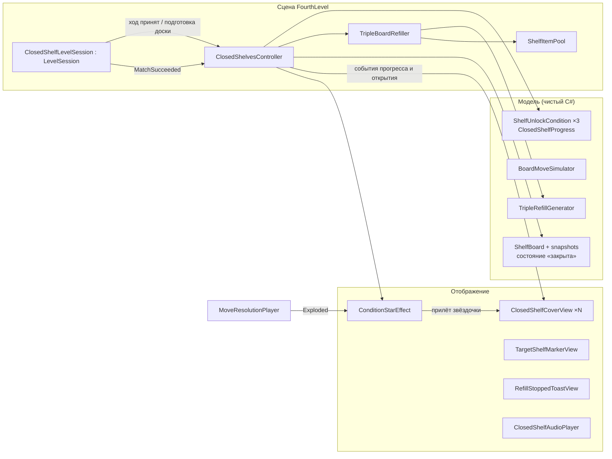

# План реализации закрытых полок (сцена FourthLevel)

**Дата:** 2026-09-21
**Статус:** этапы 1–8 реализованы (2026-09-27). Остались плейтест и оценка FPS на нём (замер в браузере отложен: локально без Yandex SDK сборка не доходит до уровней). Endless открывается после уровня 12. По итогам тестирования: флажок целевой полки заменён объёмной подсветкой (заливка у задней стенки + рамка по переднему краю), на бирке — силуэт полки того же цвета; подсказки при первой встрече вида условия, на уровне 13 — подсказка про бесконечное пополнение; **условие «обмены с матчем» удалено** (уровень 15: вместо него «собрать 6 глобусов + 6 шкатулок», уровень 16: «4 матча на полке 12»). Разделы ниже, где упоминаются обмены, описывают первую версию.
**Основание:** `docs/2026-09-21-closed-shelves-design.md` (сценарий и визуальные решения), макет «Закрытые полки — макет анимаций», доска «Выбранный вариант».

Перед началом исполнитель проверяет актуальные код, сцены, сериализованные ссылки и `git status`, ничего не откатывает и не форматирует вне задачи. Код без комментариев, небольшие ответственности, точные имена, KISS и SOLID без лишних абстракций, как в предыдущих планах.

---

## 0. Зафиксированные решения

| Тема | Решение |
|---|---|
| Сцена | `FourthLevel.unity`: 14 настенных полок `Prop_WallShelf_08` по 3 колонки, 42 колонки (раздел 13) |
| Цель уровня | Открыть все закрытые полки и очистить доску |
| Пополнение | Пока выполнены не все условия, на открытые полки подкладываются новые предметы **только полными тройками** |
| Таймер | Остаётся: поражение по времени, звёзды по активному времени через существующие `CountdownTimer` и `LevelStarCalculator` |
| Условия открытия | 1) собрать предметы нескольких типов; 2) сделать N матчей на отмеченной соседней полке; 3) сделать N обменов, которые дают матч |
| Накладка | Серая дымка, паутина, пылинки |
| Табличка | Бирка на нитке: иконка в кольце прогресса и счёт |
| Засчитывание | Три звёздочки за матч, по одной от предмета |
| Открытие | Бирка падает, волна смывает дымку слева направо, облачка пыли, вспышка, предметы выскакивают по колонкам |

---

## 1. Что переиспользуем и чего не дублируем

| Уже есть | Как используется | Что меняется |
|---|---|---|
| `GameSession`: волны матчей, каскады, `PrepareBoardAfterMove`, `HandleMatchRegistered`, `MatchSucceeded` | Без изменений. Точки расширения уже есть | — |
| `LevelSession`: таймер, результат, звёзды, `RunEnded`, `SessionStarted` | Базовый класс для новой сессии | Не меняется |
| `CountdownTimer`, `LevelStarCalculator`, `LevelRunResult`, `LevelResultRecorder`, `GameProgressRepository` | Поражение, звёзды, сохранение результата уровня 13+ | — |
| HUD, `CampaignTimerView`, `LevelResultView`, `LevelUiController`, пауза | Работают через `LevelSession`; подкласс сессии им подходит | — |
| `TimedLevelDefinition` + `TimedLevelBuilder` + редакторный генератор и валидатор | Стартовая раскладка открытых полок по-прежнему заранее генерируется и доказуемо решаема | Поддержка закрытых полок (раздел 5) |
| `ShelfBoard`, `BoardMoveSimulator`, `BoardStateSnapshot` | Единая модель ходов для рантайма, подсказки, генератора и бота | Состояние «закрыта» (раздел 3) |
| `MoveSuggestionProvider`, `IdleMovePrompt`, ввод (`ShelfDropTargetResolver`) | Автоматически не предлагают закрытые полки: они идут через `ShelfBoard.CanPickUp/CanMove` | Одна общая проверка доступности полки |
| `MoveResolutionPlayer` | Анимация матча и точка взрыва — старт звёздочек | Событие «взрыв произошёл» |
| `ShelfItemPool`, `GenerationBatch` из Endless | Пополнение без `Instantiate` на каждый предмет | Общий материализатор вместо копии кода |
| `EndlessLayoutGenerator` | **Не переиспользуется.** Он выбирает тип каждого предмета отдельно и не держит кратность трём, а для финала это обязательно. Endless не трогаем | — |
| Служебная блокировка `ShelfBoard.LockShelf` | **Не переиспользуется** для закрытых полок: это блокировка на время анимации волны, у неё другой срок жизни и другие правила (например, при ней отключается подсказка) | — |

Шаблоны, которые вводятся намеренно:
- **Стратегия** для трёх видов условий (раздел 7): у видов разный счёт и разное состояние, а `switch` по виду размазал бы логику по нескольким местам.
- **Наследование сессии** по образцу `EndlessSession`: 12 существующих уровней не получают ни одной новой ветки кода.

---

## 2. Обзор архитектуры



**Роли:**
- **Модель** знает, какие полки закрыты, как считаются условия и как генерируются тройки. Она не зависит от MonoBehaviour, поэтому её же использует редакторный бот для баланса.
- **`ClosedShelfLevelSession`** добавляет к `LevelSession` две точки: регистрацию принятого хода и пополнение перед следующим ходом.
- **`ClosedShelvesController`** связывает модель со сценой: зачёт условий, запуск открытия, материализация содержимого, остановка пополнения.
- **Отображение** получает события, показывает прогресс с задержкой на полёт звёздочек и само сообщает, когда анимация открытия дошла до нужной точки.

---

## 3. Изменения модели

### 3.1. Состояние «закрыта» в снимках

`ShelfStateSnapshot` получает флаг `IsOpen`. Конструктор с одним аргументом остаётся и создаёт открытую полку, поэтому весь существующий код не меняется.

```csharp
public ShelfStateSnapshot(IReadOnlyList<ColumnStateSnapshot> columns) : this(columns, true) { }
public ShelfStateSnapshot(IReadOnlyList<ColumnStateSnapshot> columns, bool isOpen)
public bool IsOpen { get; }
```

`BoardStateSnapshot.EmptyColumnCount` считает **только колонки открытых полок**. Правило `BoardMoveSimulation.IsAllowed` («последнюю пустую колонку нельзя занять без матча») при этом начинает правильно работать с закрытыми полками без отдельной правки. `ItemCount` не меняется: закрытые полки пусты.

`BoardMoveSimulator`:
- `TrySimulate` возвращает `false`, если источник или цель находятся на закрытой полке;
- `ReplaceColumn` и `Resolve` пересоздают полку с тем же `IsOpen`.

`BoardStateFingerprint`:
- в `CreateKey` к ключу закрытой полки добавляется маркер `C`;
- в `CreateHash` маркер добавляется **только для закрытых полок**. Хэши вариантов 12 существующих уровней остаются прежними, перегенерация не нужна.

### 3.2. `ShelfBoard`

Новое множество закрытых полок живёт рядом со служебной блокировкой, но отдельно от неё:

```csharp
public bool HasClosedShelves { get; }
public bool IsShelfClosed(Shelf shelf)
public bool IsShelfAvailable(Shelf shelf)
public void CloseShelf(Shelf shelf)
public void OpenShelf(Shelf shelf)
```

- `CloseShelf` допустим только для пустой полки, иначе исключение.
- `IsShelfAvailable` = `isActiveAndEnabled && !IsShelfLocked && !IsShelfClosed`. Её используют `CanPickUp`, `TrySimulateMove` и `ShelfDropTargetResolver` вместо трёх повторённых сейчас проверок.
- `CreateSnapshot` передаёт `IsOpen` в снимок полки.
- **`IsCleared` = нет закрытых полок и все полки пусты.** Это единственное изменение, которое нужно для правила «нельзя закончить уровень, пока не открыты все полки»: `LevelSession.HandleBoardSettled` и `FinishRun` уже опираются на `ShelfBoard.IsCleared`.

### 3.3. Матч знает свою полку

`MatchResolution` получает свойство `Shelf`. `Shelf.TryResolveMatch` передаёт `this`. Это нужно для условия «матчи на отмеченной полке» и для зачёта обменов. Перед изменением сигнатуры конструктора найти все его вызовы. В просмотренном коде он вызывается только из `Shelf.TryResolveMatch`.

### 3.4. Ход знает, сколько матчей он даст

`ShelfBoard.TryMove` уже симулирует ход и выбрасывает результат (`out _`). Результат нужно сохранить и передать в `MoveOutcome`:

```csharp
public int ExpectedMatchCount { get; }
```

Симуляция детерминирована и совпадает с тем, что потом разыграет `GameSession`. Поэтому по `IsSwap && ExpectedMatchCount > 0` можно заранее понять, что обмен даст матч (раздел 7.3).

### 3.5. Симуляция перечисляет матчи

`BoardMoveSimulation` получает список `Matches` (индекс полки, тип, размер). `MatchCount` остаётся свойством и равен `Matches.Count`. Список нужен редакторному боту, чтобы засчитывать условия без объектов сцены.

---

## 4. Данные уровня

### 4.1. `TimedLevelDefinition`

Три новых поля. Для уровней 1–12 списки пустые, поведение прежнее:

```csharp
[SerializeField] private List<ClosedShelfDefinition> _closedShelves = new List<ClosedShelfDefinition>();
[SerializeField] private ShelfRefillSettings _refillSettings;

public IReadOnlyList<ClosedShelfDefinition> ClosedShelves => _closedShelves;
public ShelfRefillSettings RefillSettings => _refillSettings;
public bool HasClosedShelves => _closedShelves.Count > 0;
```

Отдельный тип определения уровня не вводим: `LevelEntry`, `LevelStarCalculator`, `CampaignTimerView` и сохранения завязаны на `TimedLevelDefinition`, и его расширение дешевле и честнее параллельной иерархии.

### 4.2. `ClosedShelfDefinition`

Плоский сериализуемый класс с видом условия. Полиморфная сериализация через `[SerializeReference]` в Unity 2022.3 требует собственного инспектора для выбора типа, а для трёх видов это лишнее.

```csharp
[Serializable]
public sealed class ClosedShelfDefinition
{
    [SerializeField, Min(0)] private int _shelfIndex;
    [SerializeField] private ShelfUnlockConditionKind _condition;
    [SerializeField] private List<ItemRequirement> _requiredItems = new List<ItemRequirement>();
    [SerializeField, Min(0)] private int _targetShelfIndex;
    [SerializeField, Min(1)] private int _requiredCount = 1;
    [SerializeField, Min(3)] private int _revealedGroupCount = 3;
}

public enum ShelfUnlockConditionKind { CollectItems, MatchesOnShelf, SwapMatches }

[Serializable]
public sealed class ItemRequirement
{
    [SerializeField] private ItemType _type;
    [SerializeField, Min(3)] private int _count = 3;
}
```

| Поле | Используется в |
|---|---|
| `_requiredItems` | `CollectItems`: 1–3 типа, количество кратно 3 |
| `_targetShelfIndex` | `MatchesOnShelf`: открытая полка, не сама закрытая |
| `_requiredCount` | `MatchesOnShelf` (матчи), `SwapMatches` (обмены с матчем) |
| `_revealedGroupCount` | Сколько троек появится на полке при открытии, кратно 3 (раздел 6.3) |

Порядок в списке задаёт порядок полок в HUD и обучении.

### 4.3. `ShelfRefillSettings` (ScriptableObject, один на главу)

| Поле | Стартовое значение | Смысл |
|---|---:|---|
| `_hiddenItemThreshold` | 18 | Пополнять, когда предметов за передним рядом меньше порога (как `RefillThresholdItemCount` в Endless) |
| `_groupsPerRefill` | 4 | Сколько троек добавить за раз |
| `_conditionTypeWeight` | 1.6 | Множитель веса типов, нужных невыполненным условиям «собрать» |
| `_maximumTriplePerShelf` | 2 | Сколько предметов одной тройки можно положить на одну полку |

Резерв пустых колонок берётся из существующего `TimedLevelDefinition.EmptyColumnCount`, максимальная глубина — из `TimedLevelLayoutRules.MaximumColumnDepth`. Эти значения не дублируются.

### 4.4. Закрытость в раскладке варианта

`TimedLevelShelfLayout` получает `[SerializeField] private bool _isClosed`. `TimedLevelVariant.CreateLayout` создаёт снимки с этим флагом. Вариант описывает себя сам: `TimedLevelBuilder` при материализации закрывает нужные полки через `ShelfBoard.CloseShelf`, и никакой другой код не должен об этом помнить. Для существующих ассетов поле по умолчанию `false`.

### 4.5. Иконки предметов

`ShelfItemCatalog.Entry` получает `Sprite _icon`. Каталог уже единственный источник «тип → префаб», иконка ложится туда же. Иконки делаются один раз редакторной утилитой `ItemIconBaker`: камера, RenderTexture и прозрачный фон, 256×256 на каждый префаб из `Assets/Prefabs/Items`, результат в `Assets/Sprites/UI/Items/`. Иконки полки и обмена для двух других условий рисуются отдельно.

---

## 5. Стартовая раскладка: генератор и валидатор

Стартовая раскладка открытых полок генерируется тем же пайплайном, что и для 12 уровней: 12 проверенных вариантов с решением. Это даёт детерминированный старт, сиды для отладки и неизменный `TimedLevelBuilder`.

| Файл | Изменение |
|---|---|
| `TimedLevelGenerationInput` | Список индексов закрытых полок |
| `TimedLevelLayoutGenerator` | `FindReverseMoves` пропускает закрытые полки как источник и цель; `CountEmptyColumns` не считает их колонки; `CreateSnapshot` ставит флаги. `CanReplaySolution` работает через симулятор, который сам отклонит ход в закрытую полку |
| `TimedLevelVariantGenerator` | Передаёт индексы из определения, пишет `_isClosed` в `WriteLayout` |
| `TimedLevelValidator` | Новые проверки ниже |
| `TimedLevelLayoutRules.GeneratorVersion` | **Не повышается.** Без закрытых полок генератор выдаёт те же раскладки, а повышение версии заставило бы перегенерировать и перебалансировать 12 уровней |

**Новые проверки `TimedLevelValidator`:**
- индексы закрытых полок уникальны и существуют; закрыта хотя бы одна полка и не все;
- у каждой полки сцены вместимость 3 (на этом держится обоснование из раздела 6.4);
- `CollectItems`: 1–3 требования, типы из `ItemGroups` уровня, количество больше 0 и кратно 3;
- `MatchesOnShelf`: целевая полка существует, открыта и не совпадает с закрытой;
- `_requiredCount > 0`, `_revealedGroupCount` больше 0 и кратно 3;
- `RefillSettings` задан тогда и только тогда, когда есть закрытые полки;
- в каждом варианте флаги `_isClosed` совпадают с определением, закрытые полки пусты, `EmptyColumnCount` посчитан по открытым полкам.

---

## 6. Пополнение тройками

### 6.1. `TripleRefillGenerator` (чистый C#)

**Вход:** `BoardStateSnapshot` с флагами, типы уровня, счётчики нужных условиям типов, `ShelfRefillSettings`, резерв пустых колонок, `System.Random`.
**Выход:** `GenerationBatch`, куда добавляется конструктор от `BoardStateSnapshot` рядом с существующим от `BoardSnapshot`.

**Когда пополнять** (`ShouldRefill`): есть невыполненные условия, и предметов за передним рядом на открытых полках меньше `_hiddenItemThreshold`. Решение принимается одним методом, который вызывают и рантайм, и бот.

**Как выбрать тип тройки:**
1. База как в Endless: `1 / (1 + число предметов типа на доске)`, чтобы типы не перекашивало.
2. Типы, нужные невыполненным условиям «собрать», получают множитель `_conditionTypeWeight`.
3. **Жёсткое правило достижимости:** если нужного типа на доске меньше, чем осталось собрать, в этой порции будет хотя бы одна его тройка.

**Куда положить три предмета:**
1. Кандидаты — колонки **открытых непустых** полок глубиной меньше `MaximumColumnDepth`. Предмет **добавляется в конец очереди** (за видимыми рядами). Передний ряд не меняется, поэтому мгновенный матч невозможен, а резерв пустых колонок не расходуется.
2. Последний предмет колонки не должен совпадать по типу с добавляемым: правило «без соседних одинаковых» из валидатора кампании соблюдается и здесь.
3. Три предмета тройки — в три разные колонки, не больше `_maximumTriplePerShelf` на одну полку. Иначе тройка может выйти на передний ряд одной полки одновременно и сыграть сама.
4. Приоритет — самые мелкие колонки, при равенстве случайный выбор.
5. Если непустых колонок меньше трёх (почти пустая доска), разрешено класть в пустые колонки сверх резерва `EmptyColumnCount` с проверкой, что передний ряд полки не станет матчем. Проверка та же, что в `EndlessLayoutGenerator.ChooseType`.

**Инвариант:** после каждой порции число предметов каждого типа на доске кратно 3. Бот проверяет это на каждом шаге.

### 6.2. Материализация без дублирования

Сейчас `EndlessBoardRefiller.Materialize` — единственное место «батч → предметы из пула → колонки». Его тело выносится в общий статический метод, и Endless начинает им пользоваться без изменения поведения:

```csharp
public static class GenerationBatchMaterializer
{
    public static IReadOnlyList<Shelf> Append(ShelfBoard board, GenerationBatch batch, ShelfItemPool pool)
}
```

Метод возвращает изменённые полки. Новый код обновляет вид **только этих полок** через `shelf.View.Refresh()`, а не `ShelfBoard.InitializeViews()`, иначе сбросится анимация выскакивания на открывающейся полке.

### 6.3. Содержимое открывшейся полки

`TripleRefillGenerator.CreateRevealedShelf(capacity: 3, groupCount, ...)` раскладывает тройки латинским квадратом по блокам из трёх разных типов:

```
колонка 0: A B C | D E F
колонка 1: B C A | E F D
колонка 2: C A B | F D E
```

- Ни один ряд не состоит из одного типа, мгновенного матча нет.
- Каждая тройка целиком на этой полке, поэтому инвариант кратности сохраняется.
- Между блоками проверяется, что стыкующиеся предметы в колонке разного типа.
- Типы выбираются теми же весами, но без бонуса условий: условия этой полки уже выполнены.

### 6.4. Почему в финале не бывает тупика (набросок)

После выполнения всех условий пополнение останавливается, и доску нужно доиграть. Рассуждение опирается на три факта:
- все полки сцены вместимостью 3;
- количество каждого типа кратно 3;
- обмен любых двух передних предметов разного типа разрешён всегда.

Дальше два случая:
1. **Пустых колонок меньше двух.** Тогда занято не меньше 41 колонки и передних предметов не меньше 41. Типов не больше 8, значит у какого-то типа не меньше 6 передних предметов. Двумя обменами их можно собрать на одной заполненной полке и получить матч.
2. **Пустых колонок две и больше.** Любой передний предмет можно переложить в пустую колонку и открыть то, что за ним. Добраться до трёх одинаковых и собрать их обменами можно всегда, а кратность трём гарантирует, что последняя тройка каждого типа полная.

Это набросок, а не формальное доказательство. Отдельный предохранитель в рантайме не нужен, но бот (раздел 11.2) проверяет утверждение на тысячах прогонов. Если тупики всё же найдутся, вернуться к предохранителю из дизайн-документа: бесплатная временная колонка.

---

## 7. Условия открытия (чистый C#)

### 7.1. Типы

```csharp
public readonly struct MatchInfo
{
    public int ShelfIndex { get; }
    public ItemType Type { get; }
    public int ItemCount { get; }
}

public readonly struct ConditionCredit
{
    public int SlotIndex { get; }
    public int Amount { get; }
    public int StarCount { get; }
}

public abstract class ShelfUnlockCondition
{
    public abstract IReadOnlyList<ConditionSlot> Slots { get; }
    public bool IsCompleted { get; }
    public abstract IReadOnlyList<ConditionCredit> RegisterMatch(MatchInfo match, bool isSwapCredit);
}
```

`ConditionSlot` — одна ячейка таблички: вид иконки (тип предмета, полка, обмен), требуемое и текущее значение, единица (предметы или матчи). У «собрать» столько ячеек, сколько типов, у остальных одна.

`MatchInfo` не содержит объектов сцены. Контроллер переводит `MatchResolution` в `MatchInfo` (индекс полки через `ShelfBoard.Shelves`), бот берёт его из `BoardMoveSimulation.Matches`.

### 7.2. Правила счёта

| Условие | Засчитывается | Звёздочки | Счёт на табличке |
|---|---|---|---|
| `CollectItemsCondition` | Матч нужного типа: `+ItemCount`, но не больше остатка | По одной на засчитанный предмет (обычно 3; 1–2, если остаток меньше) | +1 на каждую прилетевшую звёздочку, формат «7/12» |
| `ShelfMatchesCondition` | Матч на целевой полке: `+1` | 3 | +1 с последней звёздочкой, формат «2/4» |
| `SwapMatchesCondition` | Первый матч от обмена, который дал матч: `+1` | 3 | +1 с последней звёздочкой |

**Общие правила:**
- Один матч может засчитаться нескольким условиям сразу. Две полки ждут мячей — обе получают прогресс. Каждое засчитанное условие получает свои звёздочки.
- Прогресс не сбрасывается и не отнимается. Ошибки только откладывают выполнение, как требует спокойная игра.
- Каскадные матчи считаются как обычные.
- Комбо, очки и бонусы на условия не влияют.

### 7.3. Зачёт обменов без доступа к волнам `GameSession`

1. `ClosedShelfLevelSession.HandleMoveAccepted` передаёт `MoveOutcome` контроллеру.
2. Если `IsSwap && ExpectedMatchCount > 0`, в `ClosedShelfProgress` создаётся ожидающий зачёт с полками хода (`AffectedShelves`).
3. Первый `MatchSucceeded` на одной из этих полок снимает ожидание и засчитывается как `isSwapCredit = true`. Звёздочки летят от этого матча.

Полки хода заблокированы, пока идёт их волна, поэтому следующий ход не может задеть те же полки. Ожидающие зачёты разных ходов не пересекаются, и путаницы нет.

### 7.4. `ClosedShelfProgress`

Чистый класс, который владеет списком закрытых полок и их условиями:
- состояние полки: `Closed → Revealing → Open`;
- `RegisterMove`, `RegisterMatch` возвращают список зачётов по полкам;
- `IsRefillActive` = есть невыполненное условие;
- `PriorityTypes` — остатки для «собрать».

Его вызывают контроллер и бот, поэтому правила счёта существуют в одном месте.

---

## 8. Рантайм

### 8.1. `ClosedShelfLevelSession : LevelSession`

```csharp
public sealed class ClosedShelfLevelSession : LevelSession
{
    [SerializeField] private ClosedShelvesController _closedShelves;

    protected override void HandleMoveAccepted(MoveOutcome move)
    {
        base.HandleMoveAccepted(move);
        _closedShelves.RegisterMove(move);
    }

    protected override void PrepareBoardAfterMove(Action completed)
    {
        if (State == LevelState.Playing)
            _closedShelves.PrepareBoard();

        completed?.Invoke();
    }
}
```

**Важно:** в подклассе нельзя объявлять `Start`, `OnEnable`, `OnDisable`. Unity вызывает магический метод самого производного типа, и приватные методы `LevelSession` перестанут вызываться (отвалится подписка на `Timer.Expired`). Инициализацию контроллер делает сам по `SessionStarted`.

В сцене компонент `LevelSession` заменяется на `ClosedShelfLevelSession` сменой скрипта. Имена полей совпадают, ссылки сохраняются. Ссылки других компонентов на тип `LevelSession` остаются валидными.

### 8.2. `ClosedShelvesController`

**Зависимости** (сериализованные): `ClosedShelfLevelSession`, `ShelfBoard`, `TripleBoardRefiller`, префабы `ClosedShelfCoverView` и `TargetShelfMarkerView`, `ConditionStarEffect`, `ClosedShelfAudioPlayer`.

**Жизненный цикл:**
1. `SessionStarted`:
   - проверить, что закрытые в `ShelfBoard` полки совпадают с определением;
   - создать `ClosedShelfProgress`;
   - поставить накладки на якоря закрытых полок и маркеры на целевые полки;
   - подписаться на `MatchSucceeded`.
2. `MatchSucceeded` при `State == Playing` или `Ending`:
   - перевести матч в `MatchInfo`, передать в прогресс;
   - на каждый зачёт выпустить событие `ProgressCredited(полка, матч, зачёты)`;
   - полки, у которых условие стало выполненным, перевести в `Revealing` и выпустить `RevealRequested(полка)`.
3. `PrepareBoard` (из сессии, когда все волны завершены): если `IsRefillActive` и `ShouldRefill`, сгенерировать порцию, материализовать и обновить изменённые полки.
4. `Reveal(полка)` вызывает накладка, когда волна дошла до конца:
   - сгенерировать содержимое;
   - материализовать в колонки закрытой полки и обновить её вид;
   - вернуть список предметов для анимации появления.
5. `Open(полка)` вызывает накладка после анимации появления:
   - `ShelfBoard.OpenShelf`;
   - состояние `Open`;
   - событие `ShelfOpened`;
   - если открыты все — событие `AllShelvesOpened` для тоста.

**Почему открытие не идёт через `PrepareBoardAfterMove`:** пока идёт подготовка, `GameSession` запрещает ходы (`_isPreparing`), а открытие длится около 1,5 с и не должно блокировать игру. Материализация в закрытую полку безопасна в любой момент: полка не участвует ни в одной волне, её нельзя выбрать ни источником, ни целью, а содержимое без матчей по построению.

### 8.3. Пограничные случаи

| Ситуация | Поведение |
|---|---|
| Время вышло во время открытия | `LevelSession` уходит в `Ending` → `Lost`: полка ещё закрыта, `IsCleared == false`. Накладка по `StateChanged` останавливает анимацию и не вызывает `Reveal` и `Open` |
| Доска очищена, а последняя полка ещё открывается | `IsCleared == false`, победы нет. После появления предметов игра продолжается |
| Условие выполнено в `Ending` (каскад после нуля) | Засчитывается, но открытие не запускается |
| Пауза | Таймер и анимации стоят: все твины на масштабированном времени (без `SetUpdate(true)`), частицы тоже |
| Рестарт | Перезагрузка сцены, твины привязаны через `SetLink(gameObject)` |
| Подсказка и `IdleMovePrompt` | Не предлагают закрытые полки через `IsShelfAvailable`; изменений не требуют |
| Попытка бросить предмет на закрытую полку | Ход отклоняется как сейчас, плюс обратная связь (раздел 9.7) |

---

## 9. Визуал и анимации

### 9.1. Подготовка сцены

- **`ClosedShelfCoverAnchor`** на каждой полке FourthLevel: центр, размер (`Vector2`) и поворот фронтальной плоскости полки, плюс точка подвеса бирки. Якорь стоит на всех 14 полках, потому что четыре уровня главы закрывают разные полки.
- **Слой `ClosedShelfCover`** для коллайдеров накладок (обратная связь при отказе). В маску `ShelfDropTargetResolver` слой не входит.
- **`ShelfItemPool`** в сцене (в ThirdLevel его нет).
- **`ClosedShelfLevelSession`, `ClosedShelvesController`, `TripleBoardRefiller`, `ConditionStarEffect`, `ClosedShelfAudioPlayer`** — один объект `ClosedShelves` рядом с `LevelSession`.
- **`RefillStoppedToastView`** в HUD-канвасе.

### 9.2. Префаб `ClosedShelfCover`

```
ClosedShelfCover (ClosedShelfCoverView, BoxCollider на слое ClosedShelfCover)
├── DustOverlay        (MeshRenderer, quad, материал ShelfDustCover)
├── CobwebLeft         (SpriteRenderer)
├── CobwebRight        (SpriteRenderer, зеркально)
├── Motes              (ParticleSystem, петля)
├── Puff               (ParticleSystem, разовый выброс)
├── RevealFlash        (SpriteRenderer, glow.png, аддитивный)
└── TagPivot           (точка подвеса, idle-покачивание)
    ├── Thread         (SpriteRenderer или LineRenderer)
    └── TagCanvas      (Canvas World Space, CanvasGroup)
        ├── Background (Image: кремовая #FFF3DC, золотая кайма #E2A33D, тень #A85A2A)
        ├── Glow       (Image, скрыт; включается на финале)
        └── Slots      (HorizontalLayoutGroup, 1–3 ConditionSlotView)
            └── ConditionSlotView
                ├── RingBackground (Image, #E8D6B4)
                ├── RingFill       (Image Filled Radial360, #F4A72C, Origin Top)
                ├── Icon           (Image: иконка предмета / полки / обмена)
                └── Count          (TMP_Text «3/12», шрифт HUD)
```

Размер кладётся по якорю: quad растягивается на `size` якоря с запасом 4–8 %. Бирка фиксированного мирового размера, ширина растёт с числом ячеек.

### 9.3. Шейдер `Custom/ShelfDustCover` (Built-in RP)

Проект на встроенном конвейере (`m_CustomRenderPipeline: 0`), поэтому пишется простой unlit-шейдер по образцу `ShelfItemOutline.shader`: Transparent, `ZWrite Off`, `Blend SrcAlpha OneMinusSrcAlpha`.

| Свойство | Значение | Назначение |
|---|---|---|
| `_Color` | (0.50, 0.46, 0.42, 0.62) | Серая дымка |
| `_NoiseTex`, `_NoiseScale` | зерно пыли | Неоднородность |
| `_Reveal` | 0 → 1 | Граница волны по `uv.x`: левее границы прозрачно |
| `_EdgeSoftness` | 0.04 | Мягкость границы |
| `_BandColor` | (1, 0.96, 0.86, 0.9) | Светлая полоса на границе |
| `_BandWidth` | 0.12 | Ширина полосы |

`_Reveal` анимируется через `MaterialPropertyBlock` и `DOTween.To`. Материал на каждую накладку не клонируется.

### 9.4. Бирка и звёздочки

**Покачивание в покое:** `TagPivot` вращается по Z ±3°, 2,6 с, `Ease.InOutSine`, `LoopType.Yoyo`.

**Звёздочка (`ConditionStarView`, пул внутри `ConditionStarEffect`):**
- `SpriteRenderer` со звездой (`LevelStarShine-512`), мировой размер около 0,12;
- дочерний аддитивный glow;
- `TrailRenderer`: 0,18 с, ширина 0,05 → 0, золотой градиент.

**Старт.** `MoveResolutionPlayer` получает событие `Exploded(MatchResolution match, Vector3 effectPosition)`, которое вызывается в `PlayExplosion` до удаления предметов. `ConditionStarEffect` держит словарь «матч → ожидающие зачёты» из `ProgressCredited` и запускает звёздочки при `Exploded` того же матча. Позиция старта `effectPosition` уже смещена к камере, звёзды не прячутся в полке.

**Полёт** (последовательность DOTween на звёздочку):

| Параметр | Значение |
|---|---|
| Задержка i-й звёздочки | `i × 0,09 с` |
| Путь | `DOPath` CatmullRom: старт → середина + `up × 0,35` + `cameraRight × боковое смещение` → ячейка таблички |
| Боковые смещения | +0,28 / −0,22 / +0,10 (в макете +72 / −58 / +26 px) |
| Длительность | 0,55 с, `Ease.InOutSine` |
| Масштаб | 0,4 → 1,1 за первые 12 %, → 0,7 к концу |
| Вращение | Z +220° за полёт |
| Цель | Мировая позиция `RectTransform` нужной ячейки (канвас в мире, пересчёт не нужен) |

**Прилёт:**
1. ячейка: счёт +1 (для счёта в предметах) или +1 на последней звёздочке матча;
2. `RingFill.fillAmount` твином 0,25 с, `Ease.OutQuad`;
3. «пружинка» бирки: 1 → 1,18 → 1 за 0,22 с;
4. звон с ростом высоты (раздел 9.8).

**Отображение отстаёт от модели.** Модель засчитывает сразу, бирка показывает только прилетевшее. Накладка считает звёздочки в полёте для своей полки и начинает открытие, когда их ноль.

### 9.5. Открытие

| Шаг | Время от начала | Что происходит |
|---|---:|---|
| 1 | 0,00 | Финал бирки: 1 → 1,26 → 1 → 1,2 → 1,08 за 0,42 с, `Glow` проявляется, аккорд |
| 2 | 0,40 | Бирка отрывается: вниз на 0,35, поворот 18°, `CanvasGroup` 1 → 0 за 0,45 с, `Ease.InQuad`; нить исчезает |
| 3 | 0,40 | Волна: `_Reveal` 0 → 1 за 0,7 с, `Ease.InOutSine`; паутина `DOFade` 0 + `DOScale` 0,6 + подъём 0,05 за 0,4 с; `Motes.Stop()` |
| 4 | 0,40–0,74 | `Puff`: 4 облачка со сдвигом 0,12 с, 0,65 с жизни, размер 0,3 → 1,7, альфа 0,9 → 0; звук пыли |
| 5 | 1,10 | `controller.Reveal(shelf)` → предметы материализуются с масштабом 0; `RevealFlash` 0 → 1 → 0 за 0,45 с |
| 6 | 1,10–1,56 | Выскакивание передних предметов: scale 0 → 1, 0,32 с, `Ease.OutBack` (overshoot 1,4), задержка 0,07 с по колонкам; превью второго ряда через 0,1 с после фронта; «поп» на каждый |
| 7 | ≈1,6 | `controller.Open(shelf)`, накладка выключается и уходит в пул |

Две полки открываются одновременно — вторая стартует на 0,3 с позже. Последняя полка: вспышка 0,6 с вместо 0,45 и другая нота аккорда, затем тост.

### 9.6. Маркер целевой полки

`TargetShelfMarkerView` — лента с флажком на верхнем бруске целевой полки, цвет из набора ярких тёплых оттенков. Тот же цвет — у каймы иконки «полка» на бирке, чтобы связь читалась без текста.
- При каждом засчитанном матче на целевой полке маркер слегка подпрыгивает (0,2 с).
- После выполнения условия маркер исчезает (0,3 с).

### 9.7. Обратная связь при отказе

`ShelfItemDragController` получает событие `DropRejected(Vector2 screenPosition)` в ветке `EndDrag`, где ход не принят. `ClosedShelfDropFeedback` делает `Physics.Raycast` по слою `ClosedShelfCover` и при попадании вызывает у накладки:
- `DOPunchPosition(right × 0,04, 0,35 с, 8, 0,6)`;
- «пружинку» бирки;
- мягкий звук «тук».

В `ShelfDropTargetResolver` и в правилах ходов ничего не меняется.

### 9.8. Звук

`ClosedShelfAudioPlayer` устроен по образцу `MatchAudioPlayer`: `AudioSource.PlayOneShot`, выход в SFX-группу микшера, громкость регулирует `AudioSettingsService`.

| Событие | Клип | Параметры |
|---|---|---|
| Прилёт звёздочки | Колокольчик | `pitch = 2^(шаг/12)`, шаг = засчитано на полке, максимум +12 |
| Условие выполнено | Аккорд из 2–3 нот | — |
| Волна | Шелест или «пуф» пыли | — |
| Выскакивание предмета | Мягкий «поп» | pitch 0,95–1,1 случайно |
| Отказ | Глухой «тук» | Громкость 0,5 |

### 9.9. Тост «Пополнение остановлено»

`RefillStoppedToastView` в HUD: плашка #3A1C11 с каймой #E2A33D, текст через `LanguageYG` (RU «Новых предметов больше не будет», EN «No more new items», TR — переводчику). Выезд сверху 0,35 с, 2 с на экране, уход 0,3 с. Анимации UI на `SetUpdate(true)`, как у остальных элементов HUD.

### 9.10. Обучение на первом уровне главы

`ClosedShelfIntroHint` по образцу `InitialMatchHintController` (поле `_levelNumber = 13`):
- при старте сессии бирки по очереди «прыгают» с интервалом 0,3 с;
- у первой бирки на 3 с появляется пузырёк с текстом RU «Выполните условие, чтобы открыть полку» (EN/TR через `LanguageYG`);
- пузырёк скрывается при первом перетаскивании.

---

## 10. Меню, каталог, сохранения, локализация

- **Уровни 13–16:** `LevelEntry_13..16` (сцена `FourthLevel`) и `TimedLevel_13..16` добавляются в конец `MainLevelCatalog`. Прогресс и открытие уровней работают без изменений (`IsUnlocked` смотрит на предыдущий уровень).
- **Карточки меню:** `LevelSelectionController` требует, чтобы карточек было столько же, сколько уровней в каталоге. В сетку `MainMenu` нужно вручную добавить 4 `LevelCardButton` (UI собирается в редакторе, раскладка сериализована) и связать их по порядку.
- **Build Settings:** `FourthLevel.unity` добавляется в `EditorBuildSettings` (сейчас её там нет).
- **Сохранения:** новых полей нет, результаты уровней 13–16 пишутся по номеру, как у остальных.
- **Endless (нужно решение):** `AreAllLevelsCompleted` начнёт требовать уровни 13–16. Игроки, прошедшие 12 уровней, **потеряют доступ к Endless**, а экран результата уровня 12 начнёт вести на уровень 13. Рекомендую открывать Endless по прохождению уровня 12: поле `_endlessUnlockLevelNumber` в `LevelProgressService` и метод `IsEndlessUnlocked`, которым пользуются `LevelSelectionController` и `EndlessModeCardView`. Экран результата уровня 16 ведёт в Endless, это уже делает `LevelUiController` для последнего уровня каталога.
- **Локализация:** две новые строки (тост, пузырёк обучения). Табличка состоит только из цифр и иконок и не требует перевода.

---

## 11. Проверки и инструменты

### 11.1. Редакторная валидация

Расширить `TimedCampaignValidation` (без новых фреймворков, в стиле текущих проверок):
1. **Регресс 12 уровней:** хэши вариантов не изменились, решения проигрываются.
2. **Уровни 13–16:** проверки `TimedLevelValidator`, проигрывание решений стартовых раскладок с закрытыми полками.
3. **Модель:**
   - ход в закрытую полку и из неё отклоняется;
   - `EmptyColumnCount` не считает закрытые колонки;
   - `ShelfBoard.IsCleared == false` при закрытой пустой полке.
4. **Генератор троек:** 10 000 порций на случайных досках — кратность 3, нет матча в переднем ряду, нет соседних одинаковых, глубина не больше 8, резерв пустых колонок не тронут.
5. **Латинский квадрат:** нет матча ни в одном ряду для всех `_revealedGroupCount`.

### 11.2. Бот баланса `ClosedShelfLevelSimulation`

Чистый C# в редакторе на `BoardMoveSimulator`, `TripleRefillGenerator` и `ClosedShelfProgress`: те же правила, что в рантайме.

**Политики:**
- **«Не смотрит на условия»:** ход с матчем (включая обмены), иначе случайный допустимый ход.
- **«Следит за условиями»:** из ходов с матчем выбирает тот, что даёт зачёт; иначе ход, который готовит нужный тип или целевую полку; иначе как первая политика.

**Отчёт на уровень** (1000 прогонов на политику):
- число ходов до открытия каждой полки;
- доля открытых полок к лимиту ходов;
- число ходов до победы;
- доля тупиков в финале;
- нарушения инварианта.

Лимит ходов = лимит времени / средние секунды на ход. Секунды на ход берутся из плейтестов текущей кампании (по `LevelRunResult`: время / число групп).

**Критерии баланса:**
- «не смотрит на условия» открывает к лимиту не больше половины полок;
- «следит за условиями» открывает все с запасом не меньше 30 % лимита;
- тупиков 0 на 1000 прогонов;
- нарушений инварианта 0.

### 11.3. Play Mode и WebGL

- Дополнить `TimedCampaignPlayModeValidation` уровнями 13–16: запуск, рестарт, переход дальше, проигрыш по времени, победа с открытием всех полок.
- Сборка через `TimedCampaignWebGlBuild`. Смотреть частоту кадров при открытии двух полок одновременно и при каскаде с тремя засчитанными условиями (до 9 звёздочек сразу).

### 11.4. Плейтест

5–8 новых игроков, уровни 12 → 13 → 14. Смотреть:
- понимают ли условие без текста;
- пытаются ли класть на закрытую полку после первого уровня главы;
- замечают ли тост;
- время уровня и долю побед с первой попытки.

Цели по победам — из ГДД: первый уровень сцены не ниже 80 %.

---

## 12. Этапы работ

| # | Этап | Содержание | Готово, когда |
|---|---|---|---|
| 1 | Модель | Разделы 3.1–3.5, `IsShelfAvailable` в резолвере | Регресс 12 уровней зелёный, проверки модели 11.1.3 проходят |
| 2 | Данные и генерация | Разделы 4, 5; `ItemIconBaker` | Для `TimedLevel_13` генерируются 12 вариантов с закрытой полкой, валидатор зелёный |
| 3 | Тройки и условия | Разделы 6, 7; общий материализатор, Endless переведён на него | Проверки 11.1.4–5 проходят, Endless-забег ведёт себя как раньше |
| 4 | Бот | Раздел 11.2 | Отчёт по черновым параметрам уровней 13–16 |
| 5 | Рантайм | Раздел 8, сцена FourthLevel с серыми накладками (плоский полупрозрачный quad, число вместо бирки) | Уровень 13 играется от старта до победы и поражения, пополнение останавливается |
| 6 | Визуал и звук | Раздел 9 | Тайминги совпадают с таблицей 9.5, пауза замораживает всё, отказ читается |
| 7 | Контент и меню | Раздел 10, уровни 13–16, обучение, локализация | Карточки в меню, критерии бота выполнены, решение по Endless принято |
| 8 | Проверка | 11.3, 11.4, обновление ГДД | WebGL-сборка, плейтест, калибровка времени |

Этапы 1–4 не трогают сцену и визуал. Их можно проверять в редакторе без Play Mode.

---

## 13. Стартовые параметры глав (для калибровки ботом)

Индексы полок FourthLevel по списку `ShelfBoard` (стороны — как видит игрок; полки стоят в нишах физических `Prop_WallShelf_08`, слоты на дне ниши с шагом 0,328):

| Индекс | Полка |
|---:|---|
| 0–3 | LeftTowerRow_1..4 (левая стойка, сверху вниз) |
| 4–6 | CenterLeftRow_1..3 (центр, левая секция, сверху вниз) |
| 7–9 | CenterRightRow_1..3 (центр, правая секция, сверху вниз) |
| 10–13 | RightTowerRow_1..4 (правая стойка, сверху вниз) |

| Уровень | Закрытые полки и условия | Стартовые группы | Лимит / 2★ / 3★ |
|---|---|---:|---|
| 13 | 10: собрать 9 мячей | 22 | 2:30 / 2:00 / 1:30 |
| 14 | 10: 6 мячей + 6 мишек; 13: 3 матча на полке 12 | 20 | 2:50 / 2:15 / 1:45 |
| 15 | 0: 3 обмена с матчем; 3: 4 матча на полке 2 | 20 | 3:00 / 2:25 / 1:55 |
| 16 | 10: 6 ламп + 6 растений + 3 игрушки; 3: 4 матча на полке 2; 13: 4 обмена с матчем | 18 | 3:20 / 2:40 / 2:05 |

- Всем закрытым полкам: `_revealedGroupCount = 3`, `EmptyColumnCount = 3`.
- Все 8 типов предметов с уровня 13, как в ThirdLevel.
- Цифры — стартовая точка для бота. Их цель — порядок величины: 2–3,5 минуты на уровень, около 10–12 минут на главу вместе с повторами.

---

## 14. Риски и открытые вопросы

| Риск / вопрос | Что делаем |
|---|---|
| Endless закроется для игроков, прошедших 12 уровней | Нужно решение, рекомендация в разделе 10 |
| Условие «собрать» выполняется само из-за частого типа | Бот, `_conditionTypeWeight`, размер требования |
| Условие «обмен с матчем» непонятно новичкам | Появляется только с уровня 15, иконка стрелок обмена; при провале плейтеста — пузырёк обучения на уровне 15 |
| Звёздочки от каскада с несколькими зачётами создают шум | До 9 звёздочек за матч — проверка на WebGL; при необходимости ограничить до 3 на матч суммарно |
| Иконки из запечённых рендеров плохо читаются на бирке | Сразу проверить на 1600×900; при необходимости нарисовать вручную |
| Набросок про отсутствие тупиков неверен в редком случае | Бот покажет; резервный план — бесплатная временная колонка |
| Сериализация `_isClosed` меняет ассеты уровней 1–12 при пересохранении | Поле со значением по умолчанию не меняет хэши; при случайном пересохранении перезапустить регресс 11.1.1 |

---

## 15. Файлы

**Новые:**
- `Assets/Scripts/ClosedShelves/ClosedShelfLevelSession.cs`
- `Assets/Scripts/ClosedShelves/ClosedShelvesController.cs`
- `Assets/Scripts/ClosedShelves/ClosedShelfProgress.cs`
- `Assets/Scripts/ClosedShelves/Conditions/ShelfUnlockCondition.cs`, `CollectItemsCondition.cs`, `ShelfMatchesCondition.cs`, `SwapMatchesCondition.cs`, `ConditionSlot.cs`, `ConditionCredit.cs`, `MatchInfo.cs`
- `Assets/Scripts/ClosedShelves/Config/ClosedShelfDefinition.cs`, `ItemRequirement.cs`, `ShelfUnlockConditionKind.cs`, `ShelfRefillSettings.cs`
- `Assets/Scripts/ClosedShelves/Refill/TripleRefillGenerator.cs`, `TripleBoardRefiller.cs`
- `Assets/Scripts/Endless/Generation/GenerationBatchMaterializer.cs`
- `Assets/Scripts/View/ClosedShelves/ClosedShelfCoverAnchor.cs`, `ClosedShelfCoverView.cs`, `ConditionSlotView.cs`, `ConditionStarEffect.cs`, `ConditionStarView.cs`, `TargetShelfMarkerView.cs`, `ClosedShelfDropFeedback.cs`, `RefillStoppedToastView.cs`, `ClosedShelfIntroHint.cs`
- `Assets/Scripts/Audio/ClosedShelfAudioPlayer.cs`
- `Assets/Shaders/ShelfDustCover.shader`
- `Assets/Editor/ClosedShelves/ClosedShelfLevelSimulation.cs`, `ItemIconBaker.cs`
- `Assets/Prefabs/ClosedShelves/ClosedShelfCover.prefab`, `ConditionStar.prefab`, `TargetShelfMarker.prefab`
- `Assets/Levels/Menu/LevelEntry_13..16.asset`, `Assets/Levels/Timed/TimedLevel_13..16.asset`, `Assets/Levels/ClosedShelves/ShelfRefillSettings.asset`
- Спрайты: иконки предметов, иконки полки и обмена, паутина, зерно пыли. Аудио: 5 клипов (раздел 9.8)

**Изменяемые:**
- Модель: `ShelfStateSnapshot`, `BoardStateSnapshot`, `BoardMoveSimulator`, `BoardMoveSimulation`, `BoardStateFingerprint`, `ShelfBoard`, `Shelf`, `MatchResolution`, `MoveOutcome`
- Ввод и анимация: `ShelfDropTargetResolver`, `ShelfItemDragController` (событие `DropRejected`), `MoveResolutionPlayer` (событие `Exploded`)
- Данные и генерация: `TimedLevelDefinition`, `TimedLevelShelfLayout`, `TimedLevelVariant`, `ShelfItemCatalog`, `TimedLevelValidator`, `TimedLevelBuilder` (закрытие полок из раскладки), `TimedLevelGenerationInput`, `TimedLevelLayoutGenerator`, `TimedLevelVariantGenerator`, `GenerationBatch`
- Endless: `EndlessBoardRefiller` (переход на общий материализатор)
- Проверки: `TimedCampaignValidation`, `TimedCampaignPlayModeValidation`
- Прогресс: `LevelProgressService`, `LevelSelectionController`, `EndlessModeCardView` — если принято решение по Endless
- Сцены и настройки: `FourthLevel.unity`, `MainMenu.unity`, `MainLevelCatalog.asset`, `EditorBuildSettings.asset`
- Документация: `docs/GDD.md` после реализации
