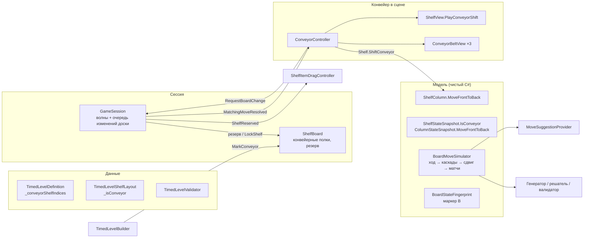

# План реализации: конвейеры (уровни кампании 17–20, сцена FifthLevel)

**Дата:** 2026-09-28
**Статус:** этапы 0–2 выполнены 29.09 (ветка `feature/conveyors`, эталон генератора записан, глубина превью в `ShelfView`, сцена FifthLevel и паспорт места). Код механики пока не менялся.

**Отклонения, принятые на этапе 2:** конвейеры стоят на верхних трёх досках стойки `rack` (нижняя пустая); стойка сужена до 90 %, настенные полки уже (масштаб 2.8) и ближе к центру; шаг лент 0.42, обычных полок 0.31; камера (0, 3.12, 2.86), наклон 18°; свет затемнён, добавлен прожектор `RackWorkLamp`. Ось `+X` места смотрит влево на экране (см. паспорт).
**Основание:** набросок «Конвейеры: уровни кампании 17–20», бриф сцены «Подготовь главу „Конвейеры“ к работе», анализ кода проекта на 28.09.
**Исполнитель:** Claude Code в репозитории `DruggingStuff` (Unity 2022.3.62f2, Built-in RP, DOTween, Unity MCP).
**Образец оформления и решений:** `docs/plans/2026-09-21-closed-shelves-implementation.md`.

---

## 0. Как работать с этим планом

1. Перед каждым этапом перечитать разделы 1–5 и раздел своего этапа целиком. Разделы 1 и 2 обязательны всегда.
2. Этапы выполняются строго по порядку: 0 → 1 → … → 8. Этап 7 (Blender) можно отложить, если Blender MCP недоступен: этапы 1–6 и 8 от него не зависят, пока в сцене стоят заглушки.
3. Этап закончен, только когда выполнены все пункты «Готово, когда». Частично сделанный этап не закрывается.
4. В каждом этапе есть **стоп-точки**. В них исполнитель останавливается, показывает результат (скриншот, отчёт, список изменений) и ждёт ответа пользователя.
5. После этапа исполнитель пишет короткий отчёт по шаблону из приложения Б и делает коммит (раздел 1.1).
6. Если реальный код расходится с этим планом (переименованный класс, другой порядок вызовов), исполнитель не подгоняет код под план. Он описывает расхождение и предлагает, как поправить план. Важные решения согласуются с пользователем.

### Глоссарий

| Термин | Значение |
|---|---|
| Действие | Принятый ход игрока: перенос в пустую колонку или обмен передних предметов (`GameSession.TryStartMove`) |
| Волна | `ResolutionWave` в `GameSession`: операции над полками одного действия, включая все его каскады |
| Конвейерное место | Одна из трёх полок `ConveyorRow_1..3` в сцене FifthLevel (индексы 8, 9, 10) |
| Активная лента / конвейерная полка | Конвейерное место, включённое данными уровня. Только такие полки сдвигаются |
| Сдвиг | Одновременный перенос переднего предмета каждой колонки активной полки в конец этой же колонки |
| Запрос на изменение доски | Элемент очереди в `GameSession`: какие полки затронуты и какую операцию выполнить. Сейчас единственный вид — сдвиг лент |
| Резерв | Блокировка полок запроса через `ShelfBoard.LockShelf` на время ожидания и выполнения сдвига |

---

## 1. Правила для исполнителя

### 1.1. Общие

- Перед началом: `git status`. Чужие незакоммиченные изменения не трогать, не откатывать и не коммитить без спроса. Если рабочая копия грязная, сообщить пользователю и спросить, как быть.
- Работа идёт в ветке `feature/conveyors`. Один коммит на этап (можно несколько внутри этапа). Сообщение коммита: `Conveyors: этап N — <суть>`. Push только по просьбе пользователя.
- Не форматировать и не переименовывать ничего вне задачи. Не менять порядок `using`, отступы и стиль в строках, которые не относятся к задаче.
- Сцены, префабы и ассеты менять **через Unity Editor** (Unity MCP), а не правкой YAML. Ручная правка `.unity`/`.asset` допустима только для однострочных исправлений при закрытом редакторе, и об этом нужно упомянуть в отчёте.
- Новые ассеты создавать в редакторе, чтобы Unity сгенерировала `.meta` и GUID. Никогда не копировать `.meta` вручную.
- Перед правкой сцены убедиться, что в редакторе нет несохранённых изменений. После правки сохранить сцену и проверить консоль на ошибки.
- Данные уровней 1–16 (`TimedLevel_01..16`) **не перегенерировать и не пересохранять**. Если ассет случайно пересохранился, запустить валидацию кампании и указать это в отчёте.
- `TimedLevelLayoutRules.GeneratorVersion` не повышать: иначе потребуется перегенерация всех 16 уровней.

### 1.2. Код

Требования пользователя, обязательные для всего кода этой работы:
- корректность, понятность, простота, поддерживаемость; принятые в C# и Unity соглашения;
- **без комментариев в коде**; понятность достигается именами и декомпозицией;
- имена однозначно передают назначение, без сокращений и слишком общих слов (`Manager`, `Helper`, `Data2` и т.п.);
- SOLID, ООП и KISS там, где они реально улучшают решение. Никаких интерфейсов, слоёв и паттернов «на вырост». Если паттерн используется, это нужно указать в отчёте этапа;
- исправлять причину, а не симптом;
- стиль соседнего кода: `[SerializeField] private`, проверки зависимостей через исключения, `sealed` для листовых классов, DOTween с `SetLink`.

Технические правила проекта:
- В наследниках `GameSession`/`LevelSession` нельзя объявлять `Start`, `OnEnable`, `OnDisable`, `Update`: Unity вызовет только метод самого производного типа, и логика базового класса отвалится. В этой работе новых наследников сессии нет (раздел 4).
- Анимации игрового поля идут на масштабированном времени: **без** `SetUpdate(true)`, иначе пауза их не остановит. `SetUpdate(true)` только для UI, как в HUD.
- Материал на объект не клонировать. Анимируемые свойства материала менять через `MaterialPropertyBlock`.
- У декоративных объектов (рама, заглушка, модель ленты) не должно быть коллайдеров: они могут перехватить клик по предмету.

### 1.3. Инструменты

- **Unity MCP** (пакет `com.coplaydev.unity-mcp` уже в `Packages/manifest.json`) нужен для всех этапов со сценой. На этапе 0 проверить, что он подключён (`/mcp`) и видит открытый проект. Если не видит, остановиться и попросить пользователя открыть проект и включить MCP-мост в Unity.
- **Blender MCP** нужен только на этапе 7. Условие и порядок подключения описаны в разделе 6, этап 7.0. Внешние библиотеки ассетов через Blender MCP (Poly Haven, Sketchfab, Poly Pizza, Hyper3D, Hunyuan) не использовать: модель строится своим скриптом, чтобы не возникало вопросов с лицензией и стилем.
- Меню проверок уже есть и расширяется в этой работе:
  - `Tools/Timed Levels/Validate Campaign` — полная проверка в редакторе;
  - `Tools/Timed Levels/Validate Gameplay Changes` — быстрая проверка модели и данных;
  - `Tools/Timed Levels/Validate Play Mode Route` — прохождение кампании в Play Mode;
  - сборка WebGL — `TimedCampaignWebGlBuild`.

### 1.4. Когда остановиться и спросить

- Валидация кампании падает **до** начала изменений (базовая линия не зелёная).
- Эталонные хэши генератора для уровней без конвейеров изменились (этап 0 и этап 5).
- Генератор не набирает 12 вариантов для уровня 17–20 даже после шагов из этапа 5.5.
- Нужно изменить публичное поведение, которое здесь не описано: правила хода, результат, сохранения, меню.
- Blender MCP недоступен в начале этапа 7.
- Все стоп-точки, перечисленные в этапах.

### 1.5. Чего не делать

- Не заводить отдельный тип полки под конвейер. Конвейерное место — это обычный `Shelf` плюс точка крепления модели.
- Не заводить наследника сессии, набор интерфейсов для «изменений доски» и заготовки под конвейерный Endless.
- Не менять порядок `ShelfBoard._shelves` и `Shelf._columnViews` в FifthLevel после генерации вариантов 17–20.
- Не смешивать в одной сцене полки разной вместимости и не расставлять предметы в сцене руками.
- Не совмещать закрытые полки и конвейеры на одном уровне. Закрытые полки остаются только на уровнях 13–16.
- Не импортировать `.blend` в Unity: в `Assets` попадает только экспортированный FBX.

---

## 2. Правила механики (норматив)

Каждое правило имеет номер. Проверки в разделе 7 ссылаются на эти номера.

| № | Правило |
|---|---|
| R1 | После **каждого принятого действия, которое вызвало хотя бы один матч**, все активные конвейерные полки сдвигаются **один раз**. Два матча от одного обмена и последующие каскады дают один сдвиг. Действие без матча сдвига не вызывает |
| R2 | У каждой конвейерной полки три независимые ленты, по одной на колонку. Все ленты всех активных полок сдвигаются одновременно: передний предмет колонки переходит в её конец. Колонка с 0 или 1 предметом не меняется |
| R3 | Сдвиг выполняется **после** всех матчей и каскадов своего действия. Матчи, возникшие от сдвига, разыгрываются с обычными очками и комбо, но нового сдвига не вызывают |
| R4 | Два параллельных действия с матчами создают два запроса на сдвиг. Запросы выполняются по очереди; между сдвигами полностью доигрываются матчи, возникшие от предыдущего сдвига |
| R5 | Во время ожидания и выполнения сдвига заблокированы только конвейерные полки этого сдвига. Остальные свободные полки доступны игроку |
| R6 | Если игрок тащит предмет с полки, которую резервирует сдвиг, перетаскивание завершается: предмет возвращается на место. Бросить предмет на зарезервированную полку нельзя |
| R7 | Пауза останавливает анимацию сдвига и продвижение очереди. Перезапуск отменяет ожидающие запросы |
| R8 | Общий таймер кампании работает как сейчас: пороги дают звёзды, истечение лимита означает поражение. Уже принятые действия и их сдвиги доигрываются до определения результата. Победа не объявляется, пока очередь не пуста |
| R9 | Сдвиг не создаёт и не уничтожает предметы |
| R10 | Подсказка оценивает действие вместе со сдвигом и не предлагает ход, пока сдвиг ожидает выполнения или выполняется |

Следствие R2: колонка конвейера не может стать глубже, чем была в начале уровня. Перенос кладёт предмет только в пустую колонку, обмен не меняет количество. Поэтому ограничение глубины в 3 предмета достаточно проверить в стартовой раскладке.

---

## 3. Что уже есть в проекте (анализ на 28.09)

| Место | Состояние | Что это значит для работы |
|---|---|---|
| `GameSession` | Действие создаёт одну волну `ResolutionWave` по `outcome.AffectedShelves`. Операции волны блокируют свои полки (`LockShelf`), матчи и каскады разыгрываются в `Update`. `PrepareBoardAfterMove` и `SettleBoard` вызываются, когда операций нет | Связь «действие → волна» уже есть, нужно добавить флаги «волна действия» и «был матч». Очередь встраивается в `Update` |
| `LevelSession` | `HandleTimerExpired` → `BeginEnding`; результат определяется, когда `IsBoardSettled`. `IsResolvingMove = !IsBoardSettled` | Если `IsBoardSettled` учитывает очередь, R8 выполняется без правок `LevelSession` |
| `ShelfBoard` | Служебные блокировки `_lockedShelves`, закрытые полки `_closedShelves`, `IsShelfAvailable`, `CreateSnapshot`, `TrySimulateMove` (дважды строит снимок одинаковым кодом) | Добавить набор конвейерных полок по образцу закрытых. Построение снимка полки вынести в один метод |
| `ShelfStateSnapshot` | Флаг `IsOpen`; симулятор пересоздаёт полки через `new ShelfStateSnapshot(columns, shelf.IsOpen)` | Новый флаг легко потерять при пересоздании. Нужен один метод копирования с флагами (раздел 5.2) |
| `BoardMoveSimulator` | `TrySimulate`: ход → `Resolve` (все матчи и каскады). `ResolveMatches` — только матчи | Сдвиг встраивается после `Resolve` |
| `BoardStateFingerprint` | `CreateKey` сортирует колонки внутри полки и полки между собой; `CreateHash` сохраняет порядок, маркер `C` только для закрытых полок | Добавить маркер конвейера по той же схеме: хэши уровней 1–16 не меняются |
| `TimedLevelLayoutGenerator` | Обратное построение: на каждый тип группы «обратный ход» дописывает тип в начало колонок. Прямое воспроизведение решения (`CanReplaySolution`) требует ровно 1 матч на ход | Добавить отмену сдвига перед каждым обратным ходом (раздел 5.7). Прямое воспроизведение уже есть и станет проверкой R1–R3 |
| `TimedLevelVariantGenerator` | 24 кандидата, отбор ±10 % от медианы, 12 вариантов, запись в ассет через `SerializedObject` | Писать флаг конвейера, добавить фильтр стартовой раскладки и пункт меню |
| `TimedLevelVariantRecolorer` | Перекраска вариантов уровней 1–12 по сохранённому решению | Не поддерживает сдвиг. Для конвейерных уровней должен явно отказываться |
| `MoveSuggestionProvider` | Ранжирует ходы по `simulation.MatchCount`. Возвращает `false`, если есть заблокированные полки или анимации предметов | Когда симулятор учитывает сдвиг, R10 выполняется ранжированием. Блокировка очереди закрывает «старое состояние лент» (раздел 5.6) |
| `ShelfItemDragController` | `CancelDrag()` возвращает предмет, `HandleStateChanged` отменяет перетаскивание вне `Playing` | Для R6 достаточно подписаться на событие резерва |
| `ShelfView` | `RefreshDepth`: все предметы глубже первого получают одну позу `_previewOffset`, виден только второй | Этап 1 (бриф сцены, шаг 1) |
| `Assets/Scenes/FifthLevel.unity` | **Уже существует**: копия FourthLevel без полок. `ShelfBoard._shelves` содержит 14 пустых ссылок (как у 14 полок FourthLevel). В сцене остались `ClosedShelfLevelSession`, `ClosedShelvesController`, `RefillStoppedToastView`, `ClosedShelfIntroHint`, `ClosedShelfDropFeedback`, `ConditionStarEffect`, `ClosedShelfAudioPlayer`, `ShelfItemPool`. Крышек, маркеров и пропавших скриптов нет. `_fallbackLevel` указывает на `LevelEntry_13` | Этап 2 начинается с решения, дорабатывать эту копию или пересоздать сцену из ThirdLevel (стоп-точка) |
| `EditorBuildSettings` | FifthLevel не добавлена | Этап 3 |
| `MainLevelCatalog`, `MainMenu` | 16 уровней, 16 карточек `LevelCardView`. `LevelSelectionController` требует равное число карточек и уровней | Этап 3: +4 уровня и +4 карточки |
| `LevelProgressService` | Endless открывается прохождением уровня 12 (`_endlessUnlockLevelNumber`) | Не меняется. Экран результата уровня 20 поведёт в Endless автоматически, как последний в каталоге |
| `TimedCampaignValidation` | `ExpectedLevelCount = 16`; закрытые полки проверяются для 13–16 и FourthLevel | Этап 3: 20 уровней; этапы 4–6: проверки конвейеров |
| `blender_mcp_addon.py` в корне репозитория | Аддон «MCP for Blender» 1.7, панель `View3D > Sidebar > MCP for Blender`, кнопка «Connect to Claude» | Этап 7.0 |
| `.mcp.json` | `{"mcpServers": {}}` | На 29.09 Blender MCP и Unity MCP уже доступны в Claude Code из пользовательских настроек. Сервер в `.mcp.json` добавляется только по этапу 7.0, если инструменты пропали |
| `.gitattributes` | `*.blend` хранится в Git LFS | Перед коммитом `.blend` проверить `git lfs install` |

---

## 4. Зафиксированные решения

| Тема | Решение | Почему |
|---|---|---|
| Где хранится признак конвейера | Список индексов в `TimedLevelDefinition` **и** флаг `_isConveyor` в раскладке варианта (`TimedLevelShelfLayout`). Валидатор сверяет их | Так же сделаны закрытые полки: вариант описывает себя сам, и `TimedLevelBuilder` просто повторяет раскладку |
| Флаг в модели | `ShelfStateSnapshot.IsConveyor`; `ShelfBoard` хранит набор конвейерных полок, как набор закрытых | Симулятор, генератор, подсказка и рантайм работают по одним правилам без передачи списков индексов |
| Сдвиг в симуляторе | `TrySimulate`: ход → `Resolve` → если был матч и есть конвейеры, один сдвиг → `Resolve` без повторного сдвига | Одна последовательность для генератора, решателя, валидатора, подсказки и проверки рантайма |
| Очередь сдвигов | Общая очередь «запросов на изменение доски» в `GameSession`. Запрос = список полок + делегат, который меняет модель, запускает анимацию и сообщает о завершении | Сессия не знает о конвейерах. Будущий таймерный контроллер вызывает тот же публичный метод. Новые интерфейсы не нужны |
| Кто создаёт запрос | `ConveyorController` подписан на событие `GameSession.MatchingMoveResolved` | Не нужен наследник `LevelSession`, а значит, не возникает ловушки с `Start`/`OnEnable` |
| Когда создаётся запрос | Когда волна действия полностью доиграла каскады и в ней был матч | Прямое следствие R1 и R3. Запросы в очереди одинаковые, поэтому порядок постановки совпадает с порядком действий по смыслу |
| Когда полки резервируются | Сразу, как запрос стал первым в очереди: каждая его полка блокируется, как только на ней нет операции. Сдвиг стартует, когда зарезервированы все полки, с них никто не тащит и на них нет анимаций | Резерв «по мере освобождения» не даёт игроку бесконечно откладывать сдвиг, а остальные полки остаются свободными (R5) |
| Перетаскивание с резервируемой полки | Сессия поднимает `ShelfReserved(shelf)`. Контроллер перетаскивания отменяет перетаскивание, если оно с этой полки, и гасит покачивание цели | R6 без новых зависимостей: сессия не знает о вводе |
| Ключ поиска `CreateKey` | **Отличие от наброска.** Не отказываться от сортировки, а добавить маркер `B` для конвейерных полок. Полки одного вида и колонки внутри полки по-прежнему сортируются | Проблема из наброска — перепутать конвейерную полку с обычной — закрывается маркером. Перестановка двух конвейерных полок или колонок внутри полки действительно даёт равнозначное состояние: все ленты сдвигаются вместе, а матч не зависит от порядка колонок. Решатель сохраняет сокращение симметрий. Если проверки этапа 4 покажут обратное, перейти на ключ с позициями |
| Хэш `CreateHash` | Маркер `B` дописывается только к конвейерным полкам | Хэши уровней 1–16 не меняются |
| Смежность одинаковых типов | На конвейерных колонках проверяется **циклически**: последний предмет тоже не равен первому | Циклическое правило не меняется при сдвиге. Стартовая раскладка проходит обычную проверку валидатора, а после сдвигов одинаковые предметы не встают друг за другом |
| Глубина конвейерной колонки | Не больше 3 (`TimedLevelLayoutRules.MaximumConveyorColumnDepth`) | Читаемость: видны все три предмета (передний и два превью) |
| Стартовое заполнение лент | Каждая колонка каждой активной ленты в стартовой раскладке непустая, и хотя бы у одной колонки ленты 2+ предмета | Сдвиг заметен с первого матча, резерв пустых колонок остаётся на обычных полках для манёвра |
| Анимация предметов при сдвиге | Новый переход в `ShelfView` рядом с `Advance`: `PlayConveyorShift(duration, completed)` | `ShelfView` уже владеет позами, превью и отменой переходов. Отдельный компонент дублировал бы расчёт поз |
| Анимация ленты | `ConveyorBeltView` на `ConveyorMount`: прокрутка текстуры ленты и роликов, вид «лента включена / выключена» | Визуал модели отделён от предметов. До появления модели компонент работает с заглушкой |
| Выключенное место | На неактивном месте ленты и ролики скрыты, видна `IdleDeck` — простая доска в той же раме | По брифу место должно выглядеть как обычная полка, а статичная лента обещала бы движение, которого нет |
| Конец сдвига для логики | Колбэк завершения вызывается, когда закончились анимации предметов **и** лент всех изменённых полок | Требование наброска: визуал подтверждает окончание сдвига |
| Обучение на уровне 17 | Отдельного UI нет: одна лента в центре, заметные шевроны, первые ходы сразу приводят к сдвигу. Пузырёк по образцу `ClosedShelfIntroHint` добавляется, только если его попросит плейтест | Набросок не требует UI; лишний текст — лишняя локализация |
| Звук сдвига | Опционально: один клип через SFX-группу микшера по образцу `MatchAudioPlayer`, если клип есть. Отсутствие клипа не блокирует этап | Не расширяет объём работы |

**Намеренно используемые шаблоны** (указать в отчётах этапов):
- **Очередь команд** в упрощённом виде: запрос на изменение доски — объект с полками и делегатом-операцией. Без интерфейса: вид запроса пока один.
- **Наблюдатель** через события C#: `MatchingMoveResolved`, `ShelfReserved`, `ConveyorController.ShiftStarted/ShiftCompleted`.

---

## 5. Архитектура

### 5.1. Обзор



### 5.2. Модель

**Колонка (рантайм):**
```csharp
public bool MoveFrontToBack()
```
В `ShelfColumn`. Если предметов меньше двух, возвращает `false` и ничего не меняет. Иначе переносит `_items[0]` в конец и возвращает `true`. `ShelfItem.Column` не меняется: предмет остаётся в той же колонке.

**Полка (рантайм):**
```csharp
public bool ShiftConveyor()
```
В `Shelf`. Вызывает `MoveFrontToBack` у каждой колонки и возвращает `true`, если изменилась хотя бы одна. Метод не проверяет, конвейерная ли полка: это решает вызывающий код (`ConveyorController`).

**Снимки:**
- `ColumnStateSnapshot.MoveFrontToBack()` возвращает новый снимок; для 0–1 предмета возвращает этот же экземпляр.
- `ShelfStateSnapshot`:
  - новый конструктор `(columns, isOpen, isConveyor)`; существующие конструкторы сохраняются и передают `isConveyor: false`;
  - свойство `IsConveyor`;
  - `WithColumns(IReadOnlyList<ColumnStateSnapshot> columns)` создаёт полку с теми же флагами;
  - `ShiftConveyor()` возвращает полку со сдвинутыми колонками.
  - **Правило:** во всём симуляторе и генераторе полки пересоздаются только через `WithColumns`. Все вызовы `new ShelfStateSnapshot(columns, shelf.IsOpen)` в `BoardMoveSimulator` заменить на него. Найти их поиском по коду, а не по памяти. На 28.09 конструктор снимка вызывается в `BoardMoveSimulator`, `Shelf`, `TimedLevelVariant`, `TimedLevelLayoutGenerator`, `TimedLevelVariantGenerator`, `TimedLevelVariantRecolorer`, `TimedCampaignValidation`, `ClosedShelfLevelSimulation` (`ApplyBatch` пересоздаёт полку из существующей). Каждый вызов нужно просмотреть: где полка пересоздаётся из существующей, использовать `WithColumns`; где создаётся с нуля, передать флаг явно.
- `BoardStateSnapshot.HasConveyors`.
- `BoardMoveSimulator.ShiftConveyors(BoardStateSnapshot board)` — публичный снимочный эквивалент сдвига: все полки с `IsConveyor` сдвигаются, остальные не меняются, матчи **не** разыгрываются.

**Симуляция хода** (`BoardMoveSimulator.TrySimulate`):
```
перенос или обмен
→ Resolve: все матчи и каскады на всех полках (как сейчас)
→ если matches.Count > 0 и на доске есть конвейеры:
     сдвиг всех конвейерных полок
     → Resolve ещё раз; найденные матчи добавляются в тот же список, сдвига больше нет
→ BoardMoveSimulation
```
`BoardMoveSimulation` получает:
- `ConveyorsShifted` (bool) — был ли сдвиг;
- `MatchCountAfterShift` (int) — сколько матчей дал сдвиг.

`MatchCount` остаётся общим числом матчей. `AffectedShelfIndexes` включает конвейерные полки, если был сдвиг. `ResolveMatches` (используется для заблокированных полок в `ShelfBoard.TrySimulateMove`) **не** сдвигает.

**Отпечаток** (`BoardStateFingerprint`):
- `CreateKey`: маркер полки `C` для закрытой, `B` для конвейерной (`[B…]`), затем сортировка как сейчас;
- `CreateHash`: перед `[` дописывается `B`, только если полка конвейерная. Для обычных полок строка и хэш не меняются.

**`ShelfBoard`:**
```csharp
public bool HasConveyors { get; }
public IReadOnlyList<Shelf> ConveyorShelves { get; }
public bool IsConveyor(Shelf shelf)
public void MarkConveyor(Shelf shelf)
```
- `ConveyorShelves` — в порядке `_shelves`.
- `MarkConveyor` бросает исключение, если полки нет на доске, она закрыта, уже отмечена или её вместимость не 3.
- Построение снимка полки вынести в один приватный метод `CreateShelfSnapshot(Shelf)` (открыта / конвейер). Использовать его в `CreateSnapshot` и `TrySimulateMove`; сейчас там два одинаковых выражения.
- `Shelf.CreateSnapshot(bool isOpen = true, bool isConveyor = false)`.

### 5.3. Данные уровня

`TimedLevelDefinition`:
```csharp
[SerializeField] private List<int> _conveyorShelfIndices = new List<int>();
public IReadOnlyList<int> ConveyorShelfIndices => _conveyorShelfIndices;
public bool HasConveyors => _conveyorShelfIndices.Count > 0;
```

`TimedLevelShelfLayout`: `[SerializeField] private bool _isConveyor;`, свойство `IsConveyor`, параметр конструктора. `TimedLevelVariant` передаёт флаг в обе стороны: при создании из снимка и в `CreateLayout`. Для существующих ассетов поле по умолчанию `false`, хэши не меняются.

`TimedLevelLayoutRules.MaximumConveyorColumnDepth = 3`.

`TimedLevelBuilder.Materialize`: после раскладки полки вызвать `_shelfBoard.MarkConveyor(shelf)`, если `layout.Shelves[i].IsConveyor`. Порядок относительно `CloseShelf` не важен: валидатор запрещает совмещение.

**Новые проверки `TimedLevelValidator`:**

| Где | Проверка |
|---|---|
| `ValidateDefinition` | Индексы конвейеров неотрицательны и не повторяются. `HasConveyors && HasClosedShelves` запрещено |
| `ValidateBoard` | Индексы меньше числа полок. У конвейерных полок вместимость 3. Грубая проверка ёмкости: предметов не больше, чем `конвейерные колонки × MaximumConveyorColumnDepth + (прочие колонки − EmptyColumnCount) × MaximumColumnDepth` |
| `ValidateVariantLayout` | Флаг `IsConveyor` каждой полки совпадает с определением. Глубина конвейерных колонок ≤ 3. Все колонки активной ленты непусты, хотя бы у одной 2+ предмета. Циклическая смежность на конвейерных колонках: последний ≠ первому при глубине ≥ 2 |

Сообщения исключений писать в стиле соседних строк валидатора (английский, с именем ассета и номером варианта).

### 5.4. Очередь изменений доски в `GameSession`

**Новые публичные члены:**
```csharp
public delegate void BoardChange(Action completed);
public event Action MatchingMoveResolved;
public event Action<Shelf> ShelfReserved;
public bool HasPendingBoardChanges { get; }
public void RequestBoardChange(IReadOnlyList<Shelf> shelves, BoardChange change);
```

**Изменения внутренних типов:**
- `ResolutionWave`: `bool IsMove` (создана действием игрока в `TryStartMove`) и `bool HasMatch`.
- `ShelfOperation`: ссылка на свою волну `Wave`. В `PlayMatch` выставляется `operation.Wave.HasMatch = true`.
- Новый приватный `BoardChangeRequest`: `Shelves`, `Change`, множество `Reserved`, флаг `IsRunning`.
- `Queue<BoardChangeRequest> _boardChanges`.

**`RequestBoardChange`:**
- проверяет аргументы: полки есть, не повторяются, принадлежат доске, `change != null`;
- в состояниях `Won`/`Lost` запрос игнорирует; в `Playing`, `Paused`, `Ending` ставит в очередь;
- выставляет `_needsSettlement = true`;
- если запрос стал первым, сразу резервирует свободные полки (см. ниже). Так нет ни одного кадра, когда запрос ждёт, а полки не заблокированы.

**Порядок в `Update`** (ранний выход по `!_needsSettlement || _isPreparing || Paused` сохраняется):
```
1. Разыграть волны (существующий цикл).
   Когда волна удаляется: если wave.IsMove && wave.HasMatch → MatchingMoveResolved.
2. AdvanceBoardChanges():
   request = первый в очереди; если его нет или он IsRunning — выход
   для каждой ещё не зарезервированной полки запроса:
       если на ней нет операции (_operations) → LockShelf, добавить в Reserved, ShelfReserved(shelf)
   если зарезервированы не все — выход
   если _dragSource на одной из полок, у их предметов есть ItemAnimations
       или shelf.View.IsAnimating — выход
   IsRunning = true; запомнить _generation
   request.Change(() => {
       если сессия уничтожена или поколение сменилось — выход
       снять запрос из очереди, UnlockShelf для всех его полок
       CreateWave(request.Shelves) (IsMove = false), все операции IsReady = true
   })
3. Если есть операции, перетаскивание, анимации предметов или очередь не пуста — выход.
4. Подготовка и SettleBoard — как сейчас.
```
- Колбэк `Change` может прийти синхронно, внутри вызова. Код должен это выдерживать: `IsRunning` выставляется до вызова, запрос снимается только в колбэке.
- Волна сдвига — обычная волна. Её матчи идут через `PlayMatch`: `MatchSucceeded`, очки, комбо. Но `IsMove = false`, поэтому новый сдвиг она не вызывает (R3).
- Следующий запрос не начнёт сдвиг, пока волна предыдущего держит конвейерные полки (R4).

**`IsBoardSettled`** дополняется `&& _boardChanges.Count == 0`. Этого достаточно для R8: `LevelSession.HandleTimerExpired` и `HandleBoardSettled` уже опираются на `IsBoardSettled`.

**`CancelOperations`** дополнительно: для зарезервированных полок первого запроса `shelf.View.Cancel()` и `UnlockShelf`; очистить очередь. Колбэк отменённого сдвига отсекается проверкой поколения (R7).

**Инвариант, который проверяется тестом:** `HasPendingBoardChanges ⇒ ShelfBoard.HasLockedShelves`. Полки первого запроса либо заняты волной, либо зарезервированы, либо заблокированы волной сдвига. Поэтому `MoveSuggestionProvider` без изменений не выдаёт подсказку по старому состоянию лент (R10).

**Что сознательно не меняется:** `LevelSession`, `EndlessSession`, `TutorialSession`, `ClosedShelfLevelSession`. На уровнях без конвейеров событие `MatchingMoveResolved` никто не слушает, и поведение прежнее.

### 5.5. Конвейер в сцене

**`ConveyorController`** (`Assets/Scripts/Conveyor/ConveyorController.cs`) — один объект в FifthLevel.

Зависимости: `LevelSession _session`, `ShelfBoard _shelfBoard`, `List<ConveyorBeltView> _beltViews`, `float _shiftDuration = 0.45f`.

```csharp
public bool IsShifting { get; }
public event Action ShiftStarted;
public event Action ShiftCompleted;
public void RequestShift();
```
- `OnEnable`/`OnDisable`: подписка на `_session.SessionStarted` и `_session.MatchingMoveResolved`.
- `SessionStarted`: для каждого `ConveyorBeltView` вызвать `SetRunning(_shelfBoard.IsConveyor(view.Shelf))`. Проверить, что у каждой конвейерной полки доски ровно одна `ConveyorBeltView`, иначе исключение.
- `MatchingMoveResolved` → `RequestShift()`.
- `RequestShift()`: если на доске нет конвейеров — ничего. Иначе `_session.RequestBoardChange(_shelfBoard.ConveyorShelves, PlayShift)`. Метод публичный: через него позже сможет работать таймерный контроллер.
- `PlayShift(Action completed)`:
  1. Для каждой конвейерной полки запомнить движущиеся колонки: `Count >= 2`.
  2. Изменить модель: `shelf.ShiftConveyor()`.
  3. Для изменённых полок запустить `shelf.View.PlayConveyorShift(_shiftDuration, …)` и `beltView.PlayShift(movingColumns, _shiftDuration, …)`.
  4. Когда завершились все анимации, вызвать `ShiftCompleted` и `completed()`. Если ничего не изменилось — сразу `completed()` без анимации.

**`ShelfView.PlayConveyorShift(float duration, Action completed)`** — третий переход рядом с `Refresh` и `Advance`, в той же `_transition`: поддерживает `IsAnimating` и `Cancel`. Модель к моменту вызова уже сдвинута.
- Для каждой колонки с 2+ предметами:
  - предметы `1..n-1` (бывшие второй и далее) перемещаются на одну позу вперёд;
  - новый передний сразу получает `ShowFront` и масштаб к 1;
  - бывший передний (теперь последний) идёт по пути `DOLocalPath` (CatmullRom): передняя поза → вниз на `_conveyorReturnDrop` → назад под лентой → поза последнего. На 30–35 % пути он переключается на превью-материал своей глубины, масштаб — к масштабу этой глубины.
- Длительность одна для всех колонок, ease `InOutSine`.
- По завершении вызывается `Refresh()` для точной финальной позы и видимости, затем `completed`.
- Поле `[SerializeField] private Vector3 _conveyorReturnDrop` (по умолчанию ноль, на обычных полках не используется) задаётся в сцене под просвет из паспорта места.

**`ConveyorBeltView`** (`Assets/Scripts/View/Conveyor/ConveyorBeltView.cs`) — на корне модели в `ConveyorMount`.

Поля:
- `Shelf _shelf`;
- `List<Renderer> _belts` — 3 штуки, индекс равен индексу колонки;
- `List<Transform> _rollers` с индексом ленты — тип записи `ConveyorRoller { Transform, int Lane }`;
- `GameObject _idleDeck`;
- `float _beltStepUv` — смещение UV за один сдвиг;
- `float _rollerStepDegrees`.

Методы:
- `SetRunning(bool isRunning)`: включает ленты и ролики или `_idleDeck`;
- `PlayShift(IReadOnlyList<int> lanes, float duration, Action completed)`: `DOTween.To` по смещению UV через `MaterialPropertyBlock` (`_MainTex_ST` или свойство шейдера ленты) и поворот роликов нужных лент. Масштабированное время, `SetLink(gameObject)`.
- Пока модели нет (этапы 2–6), списки пусты, а `_idleDeck` — заглушка или пусто. Компонент корректно работает и завершает `PlayShift` по таймеру длительности.

### 5.6. Ввод, подсказка, промпт

- `ShelfItemDragController` подписывается на `_levelSession.ShelfReserved`: всегда `_swapHoverView.Stop()`; если `_sourceColumn.Shelf == shelf`, то `CancelDrag()`. Возврат предмета идёт через существующий `ShelfItemDragMover.Cancel` → `ItemAnimations.Return`. Сдвиг дождётся окончания возврата (5.4, шаг 2).
- Бросок на зарезервированную полку отклоняется существующими проверками `IsShelfAvailable` в `ShelfDropTargetResolver` и `ShelfBoard.TrySimulateMove`.
- `MoveSuggestionProvider` не меняется. Ранжирование по `simulation.MatchCount` учитывает матчи от сдвига, инвариант из 5.4 закрывает старое состояние. Проверки — в разделе 7.
- `IdleMovePrompt` уже требует `IsBoardSettled` и гасит промпт при смене доступности.
- `HintBonusEffect` останавливает показ при `DragStarting`. Сдвиг возникает только после действия, а действие начинается с перетаскивания, поэтому показ подсказки не пересекается со сдвигом. Для будущего таймерного сдвига это не так — вписано в риски.

### 5.7. Генератор: обратное построение со сдвигом

Сейчас обратный шаг для группы типа `X`: выбрать пустую колонку `T.c` и колонку-источник `S`, дописать `X` в начало остальных колонок `T` и в начало `S`. Прямое действие «передний из `S` в `T.c`» даёт ровно один матч на `T`.

С конвейерами прямое действие — это «ход → матч → сдвиг». Значит, обратный шаг начинается с отмены сдвига:

```
TryAddGroups(columns = состояние ПОСЛЕ прямого действия этой группы, groupIndex):
    если все группы размещены → проверить резерв пустых и стартовые требования к лентам
    UndoConveyorShift(columns)         // последний предмет каждой конвейерной колонки → в начало
    если на любой полке есть матч → RedoConveyorShift; return false
    moves = FindReverseMoves(...)       // лимит глубины 3 на конвейерных колонках
    отфильтровать автоматический матч и смежность (на конвейерах циклически)
    для каждого хода: Prepend → рекурсия → RemoveGroup
    RedoConveyorShift(columns)
    return false
```

Почему это корректно:
- Отмена сдвига — обратная перестановка, поэтому прямой сдвиг из `Y` даёт ровно исходное состояние.
- Проверка «нет матча после отмены» гарантирует две вещи. После матча на `T` каскада нет (фронты `T` в `Y` без матча). Других матчей до сдвига тоже нет.
- Отсутствие матчей после сдвига гарантировано тем, что прошлое состояние на предыдущем шаге рекурсии уже проверено как стабильное.
- Циклическая смежность не меняется при сдвиге. Поэтому стартовая раскладка проходит обычную проверку валидатора.
- Первый обратный шаг начинается с пустой доски, где отмена сдвига ничего не делает. Последнее действие решения очищает доску, и сдвиг пустых лент ничего не меняет.

Итоговая проверка остаётся прежней: `CanReplaySolution` прямо воспроизводит решение через симулятор (уже со сдвигом) и требует ровно 1 матч на ход и пустую доску в конце. Любая ошибка обратного построения отсеивается здесь.

Отмена сдвига и проверка «нет матча после отмены» выполняются **только если у уровня есть конвейерные индексы**. Для уровней без конвейеров ветка не исполняется вовсе. Без конвейерных индексов `UndoConveyorShift` ничего не делает, и порядок вызовов `System.Random` не меняется. Поэтому генератор выдаёт для старых уровней те же раскладки. Это проверяется эталоном из этапа 0.

---

## 6. Этапы работ

Сводка:

| # | Этап | Результат | Зависит от |
|---|---|---|---|
| 0 | Подготовка и базовая линия | Ветка, зелёная валидация, эталон генератора, проверка MCP | — |
| 1 | Глубина видимости в `ShelfView` | Превью трёх предметов в очереди, старые сцены без изменений | 0 |
| 2 | Сцена FifthLevel | 11 полок, 3 конвейерных места с заглушками, паспорт места | 1 |
| 3 | Каркас уровней 17–20 и меню | 20 уровней в каталоге и меню, уровни 17–20 играются без конвейеров | 2 |
| 4 | Модель и данные конвейера | Сдвиг в модели и симуляторе, флаги в данных, валидатор | 3 |
| 5 | Генератор и варианты 17–20 | 48 проверенных вариантов с конвейерами | 4 |
| 6 | Рантайм | Очередь в `GameSession`, `ConveyorController`, анимация предметов, ввод, Play Mode | 5 |
| 7 | Модель в Blender и подключение в Unity | Low-poly лента в трёх местах, анимация ленты | 2 (паспорт), 6 (анимация); Blender MCP |
| 8 | Баланс, приёмка, документация | Ручное прохождение, WebGL, GDD | 6, желательно 7 |

---

### Этап 0. Подготовка и базовая линия

**Задачи**
1. `git status`, `git log -5`. Если есть незакоммиченные изменения — стоп-точка: показать список и спросить пользователя.
2. Создать ветку `feature/conveyors`.
3. Проверить Unity MCP: видит проект, открыта нужная версия (2022.3.62f2), консоль без ошибок компиляции.
4. Запустить `Tools/Timed Levels/Validate Campaign`. Ожидается `TIMED_CAMPAIGN_VALIDATION_PASS`. Иначе — стоп-точка.
5. **Эталон генератора.** Добавить редакторную утилиту `Assets/Editor/TimedLevels/TimedLevelGeneratorRegression.cs` с двумя пунктами меню:
   - `Tools/Timed Levels/Record Generator Baseline` — для каждого уровня 1–16 открыть его сцену, сгенерировать раскладку для сидов `номер × 100000 + 1..3` и записать хэши (сид, на котором генератор бросил исключение, записывается как отказ и тоже сравнивается) в `Assets/Editor/TimedLevels/Regression/generator-baseline.json`;
   - `Tools/Timed Levels/Check Generator Baseline` — повторить генерацию и сравнить. При расхождении исключение со списком уровней и сидов.
   Записать эталон **до** любых изменений модели и генератора и закоммитить JSON.
6. Проверить наличие Blender MCP (`/mcp`). Результат записать в отчёт; на этом этапе не блокирует.
7. Проверить `git lfs version` (нужен для `.blend` на этапе 7).

**Готово, когда:** ветка создана, базовая валидация зелёная, эталон записан и `Check Generator Baseline` проходит на неизменённом коде.

---

### Этап 1. Глубина видимости в `ShelfView` (бриф, шаг 1)

Меняется только `Assets/Scripts/View/Shelf/ShelfView.cs`. Больше ничего в `Assets/Scripts` не трогать.

**Задачи**
1. Поля:
   - `[SerializeField, Min(1)] private int _visibleDepth = 2;` — сколько позиций очереди видно, включая переднюю. Значение по умолчанию 2 сохраняет вид существующих сцен;
   - `[SerializeField, Range(0.1f, 1f)] private float _depthScaleFactor = 1f;` — множитель масштаба на каждый шаг вглубь;
   - `[SerializeField] private Material _farPreviewMaterial;` — материал для глубины 2 и дальше; если не задан, используется `_previewMaterial`.
2. `RefreshDepth`: поза предмета с индексом `index` — `_previewOffset * index`, масштаб — `_depthScaleFactor ^ index`. Превью показывается, пока `index < _visibleDepth`, иначе `Hide()`, как сейчас.
3. `SetPose` принимает масштаб. `Refresh` и `Advance` для переднего предмета по-прежнему ставят масштаб 1.
4. Модель, генератор, решатель, ввод и подсказку не трогать: позиции превью в них не участвуют, а коллайдеры превью выключает `ShelfItemPresentation`.

**Проверки**
- Скриншоты ThirdLevel и FourthLevel через Unity MCP до и после правки совпадают.
- `Validate Campaign` зелёная. Перегенерация уровней 1–16 не требуется.

**Готово, когда:** выполнены проверки, а в отчёте есть пара скриншотов «до/после».

---

### Этап 2. Сцена FifthLevel (бриф, шаг 2)

**2.0. Стоп-точка: что делать с текущей сценой.** `FifthLevel.unity` уже существует как копия FourthLevel без полок (раздел 3). Исполнитель:
1. делает скриншот и список корневых объектов;
2. перечисляет найденные остатки закрытых полок;
3. спрашивает пользователя: **(а)** дорабатывать текущую копию (по умолчанию, если пользователь уже менял в ней мебель или свет) или **(б)** пересоздать сцену копией ThirdLevel.

При варианте (а):
- заменить скрипт `ClosedShelfLevelSession` на `LevelSession` на том же объекте: общие сериализованные поля сохранятся;
- удалить `ClosedShelvesController`, `RefillStoppedToastView`, `ClosedShelfIntroHint`, `ClosedShelfDropFeedback`, `ConditionStarEffect`, `ClosedShelfAudioPlayer`, маркеры целевых полок;
- заменить 14 пустых ссылок `ShelfBoard._shelves` на 11 полок по 2.2;
- удалить `ShelfItemPool`, если на него больше никто не ссылается (проверить поиском GUID скрипта в сцене);
- проверить, что в сцене нет пропавших скриптов.

**2.1. Композиция «Цех игрушек».** 11 полок по 3 колонки, всего 33 колонки, у всех вместимость 3.
- Слева стеллаж: 4 полки сверху вниз. Справа стеллаж: 4 полки сверху вниз.
- По центру вертикальная стойка: 3 места под конвейер друг над другом.
- Колонки идут вдоль полки слева направо, очередь каждой колонки уходит в глубину, от игрока. Ленты не ставятся вертикально.
- Геометрия по мотивам ThirdLevel: полки примерно в x от −1.6 до 1.8 и y от 0.66 до 2.65, шаг между колонками 0.27–0.40. Конвейеры в центре по x, стеллажи по краям.
- Между ярусами конвейеров оставить просвет: снизу — под петлю возврата предмета, сверху — чтобы соседний ярус не закрывал очередь.

**2.2. Порядок `ShelfBoard._shelves`** — часть контракта данных, после этапа 5 не меняется:

| Индексы | Полки |
|---|---|
| 0–3 | `LeftRackRow_1..4` (сверху вниз) |
| 4–7 | `RightRackRow_1..4` (сверху вниз) |
| 8–10 | `ConveyorRow_1..3` (сверху вниз) |

**2.3. Требования движка к каждой полке** (иначе `Shelf.Initialize` бросит исключение):
- `_columnViews`: ровно 3 `ShelfColumnView`, слева направо;
- `_view`: `ShelfView` этой же полки; `ShelfView._columns` — те же объекты в том же порядке;
- у `ShelfColumnView` заданы `_itemAnchor` (пустой Transform в передней позиции, предмет ставится с `localPosition = 0`) и `_dropCollider` (коллайдер зоны броска на слое `ShelfSlot`).

**2.4. Очередь и превью.**
- `ShelfView._previewOffset` — вектор от переднего предмета ко второму, направленный в глубину. Он же задаёт шаг: поза предмета `k` равна `_previewOffset * k`.
- Конвейерные полки: ось очереди наклонена на 10–15° вверх, `_visibleDepth = 3`, `_depthScaleFactor` около 0.85, дальний материал глуше ближнего.
- Обычные полки: `_visibleDepth = 2`, остальные настройки как в ThirdLevel.
- `_previewMaterial` — тот же, что в ThirdLevel.
- На каждой конвейерной полке третий предмет не уходит в заднюю стенку рамы и не наезжает на ярус выше. Проверить с самым крупным префабом из `ShelfItemCatalog`: временно поставить его в редакторе и удалить, не сохраняя.

**2.5. Конвейерные места.** Каждое место — одинаковый по габаритам узел `ConveyorRow_N`:
- сама полка (`Shelf`, `ShelfView`, три `ShelfColumnView`), как у обычных;
- дочерний пустой объект `ConveyorMount` — точка, куда встанет модель ленты. Его положение, поворот и масштаб одинаковы относительно своей полки во всех трёх местах, чтобы одна модель подошла без подгонки;
- оси `ConveyorMount`: `+Z` — направление движения ленты «вперёд», к камере, противоположно `_previewOffset`; `+Y` — нормаль к поверхности ленты; `+X` — вдоль колонок слева направо. Наклон очереди задаётся поворотом `ConveyorMount`, модель потом строится плоской;
- в `ConveyorMount` поставить заглушку: плоская рама по ширине трёх колонок с заметной рамкой из примитивов. У примитивов удалить коллайдеры;
- все три места делаются всегда. Выключенное место выглядит как обычная полка с рамой, а не как дыра в мебели.

**2.6. Связи в инспекторе** — структура и ссылки как в ThirdLevel:
- `ShelfBoard._shelves` — 11 полок в порядке 2.2;
- `LevelSession`: `_shelfBoard`, `_moveResolutionPlayer`, `_levelBuilder`, `_levelSelection`, `_fallbackLevel` (задаётся на этапе 3), `_timer`, `_scoreSystem`;
- `TimedLevelBuilder._shelfBoard` — тот же `ShelfBoard`;
- `ShelfItemDragController._levelSession` — `LevelSession` сцены;
- `ShelfColumnRaycaster`: `_camera`, `_columnLayerMask` (слой `ShelfSlot`);
- `ShelfItemDragMover`: `_camera`, `_dragRoot`;
- `MoveResolutionPlayer`: `_matchEffectPrefab`, `_resolutionRoot`, `_camera`, `_matchAudioPlayer`;
- HUD: `CampaignTimerView._levelSession`, `LevelUiController._levelSession`, `MoveSuggestionProvider._shelfBoard`, `IdleMovePrompt`, подсказка — как в ThirdLevel.

**2.7. Паспорт посадочного места.** Через Unity MCP снять размеры в пространстве `ConveyorMount` и записать в `Art/Blender/Conveyor/mount-passport.md` по шаблону приложения А. Это единственный источник размеров для этапа 7.

**Стоп-точка:** скриншоты сцены в 1280×720 и 1600×900 и паспорт места показать пользователю до перехода к этапу 3.

**Готово, когда:**
- в редакторе `ShelfBoard.Initialize()` проходит (проверочный вызов через Unity MCP или валидацию);
- 11 полок × 3 колонки, порядок совпадает с 2.2;
- в сцене нет пропавших скриптов, предметов и компонентов закрытых полок;
- паспорт заполнен, пользователь одобрил композицию.

---

### Этап 3. Каркас уровней 17–20 и меню

Цель — к началу работы над механикой получить согласованную кампанию из 20 уровней. Уровни 17–20 временно играются без конвейеров.

**Задачи**
1. Создать `Assets/Levels/Timed/TimedLevel_17..20.asset`: пункт меню `Game/Level/Timed Level Definition` или дублирование `TimedLevel_12` в редакторе с последующей очисткой `_variants` и `_closedShelves`. Параметры из раздела 8: время, группы, `_emptyColumnCount = 3`, `_itemCatalog` как у 13–16. `_refillSettings` пустой.
2. Создать `Assets/Levels/Menu/LevelEntry_17..20.asset`: номер, `_sceneName = FifthLevel`, определение, `_available = 1`.
3. Добавить их в конец `MainLevelCatalog`.
4. `MainMenu`: добавить 4 карточки уровня (как существующие `LevelCardView`) и связать их по порядку в `LevelSelectionController._cards`. Проверить, что сетка или прокрутка вмещает 20 карточек в 1280×720 и 1600×900. Стоп-точка, если раскладку меню нужно менять заметно.
5. `FifthLevel`: `LevelSession._fallbackLevel = LevelEntry_17`. `LevelSession` сверяет сцену уровня с загруженной и падает при несовпадении.
6. `EditorBuildSettings`: добавить `Assets/Scenes/FifthLevel.unity` после FourthLevel.
7. Сгенерировать варианты 17–20 существующим генератором (`Generate Selected Definition` по каждому ассету). Это временные варианты без конвейеров; на этапе 5 они будут заменены.
8. `TimedCampaignValidation`:
   - `ExpectedLevelCount = 20`;
   - `ValidateClosedShelfLevelData`: уровни 17–20 без закрытых полок;
   - новая проверка: уровни 17–20 ссылаются на `FifthLevel`, остальные — не на неё.

**Проверки**
- `Validate Campaign` зелёная на 20 уровнях.
- `Validate Play Mode Route` проходит все 20 уровней.
- Вручную в FifthLevel: уровень 17 строится, предметы появляются на всех полках, перетаскивание работает на всех 11 полках, превью не перехватывает клики, HUD, пауза и экран результата работают как в ThirdLevel.
- Экран результата уровня 16 ведёт на 17, уровня 20 — в Endless.

**Готово, когда:** все проверки выполнены.

---

### Этап 4. Модель и данные конвейера

Реализовать разделы 5.2 и 5.3. Сцену и рантайм не трогать.

**Задачи**
1. `ShelfColumn.MoveFrontToBack`, `Shelf.ShiftConveyor`, `Shelf.CreateSnapshot(isOpen, isConveyor)`.
2. Снимки: `ColumnStateSnapshot.MoveFrontToBack`, `ShelfStateSnapshot.IsConveyor/WithColumns/ShiftConveyor`, `BoardStateSnapshot.HasConveyors`.
3. `BoardMoveSimulator`: пересоздание полок только через `WithColumns`, публичный `ShiftConveyors`, сдвиг в `TrySimulate`. `BoardMoveSimulation.ConveyorsShifted`, `MatchCountAfterShift`.
4. `BoardStateFingerprint`: маркер `B` в ключе и хэше.
5. `ShelfBoard`: конвейерные полки и общий `CreateShelfSnapshot`.
6. Данные: `TimedLevelDefinition._conveyorShelfIndices`, `TimedLevelShelfLayout._isConveyor`, передача флага в `TimedLevelVariant`, `TimedLevelLayoutRules.MaximumConveyorColumnDepth`.
7. `TimedLevelValidator` — проверки из 5.3.
8. `TimedLevelBuilder` — `MarkConveyor`.
9. Проверки в `TimedCampaignValidation`: новый метод `ValidateConveyorModel()` вызывается из `Run` и `RunGameplayChanges`. Кейсы:

| Код | Кейс | Ожидание | Правило |
|---|---|---|---|
| M1 | Рантайм-колонка из 0, 1, 2, 3 предметов (временные `GameObject` с `ShelfItem`, удалить после проверки) | `[]→[]`, `[A]→[A]`, `[A,B]→[B,A]`, `[A,B,C]→[B,C,A]`; `Column` у предметов не меняется | R2, R9 |
| M2 | Снимочный сдвиг тех же колонок | Совпадает с M1 по типам | R2 |
| M3 | Перенос с одним матчем на доске с конвейером | `ConveyorsShifted`, конвейер сдвинут один раз | R1 |
| M4 | Ход без матча | Сдвига нет | R1 |
| M5 | Обмен, дающий два матча | Ровно один сдвиг | R1 |
| M6 | Матч с каскадом, где сдвиг до каскада дал бы другой результат | Каскад разыгран до сдвига | R3 |
| M7 | Сдвиг создаёт матч; второй сдвиг создал бы ещё один | Матч от сдвига засчитан, второго сдвига нет, `MatchCountAfterShift == 1` | R3 |
| M8 | Лента с пустой и одиночной колонками | Эти колонки не меняются | R2 |
| M9 | Все кейсы выше | `ItemCount` до − 3 × `MatchCount` = `ItemCount` после | R9 |
| M10 | Одинаковое содержимое: обычная и конвейерная полка | Разные ключ и хэш | — |
| M11 | Две конвейерные полки с разным содержимым поменяли местами | Одинаковый ключ, разные хэши | — |
| M12 | Доска без конвейеров | `ConveyorsShifted == false`, результат совпадает с прежним (сохранённые решения 1–16 проигрываются с 1 матчем на ход) | — |
| M13 | `ShelfBoard.MarkConveyor` на закрытой, чужой, повторной полке | Исключение | — |
| M14 | Определения с ошибками: повтор индекса, выход за границы, конвейер плюс закрытые полки | `TimedLevelValidator` бросает исключение | — |

**Проверки**
- `Validate Campaign` зелёная. Хэши вариантов 1–16 проходят проверку в `ValidateForRuntime` без перегенерации.
- `Check Generator Baseline` зелёная.
- Уровни 17–20 пока без конвейерных индексов: их раскладки без флагов проходят валидатор.

**Готово, когда:** выполнены проверки и все кейсы M1–M14.

---

### Этап 5. Генератор и варианты 17–20

**Задачи**
1. `TimedLevelGenerationInput.ConveyorShelfIndices`; заполняется из определения в `TimedLevelLayoutGenerator.GenerateWithSolution(definition, …)`.
2. `TimedLevelLayoutGenerator` по разделу 5.7:
   - `UndoConveyorShift` и `RedoConveyorShift` над `List<ItemType>[][]`;
   - проверка «нет матча ни на одной полке» после отмены;
   - `CanPrepend`: лимит `MaximumConveyorColumnDepth` для конвейерных колонок, и у источника, и у колонок целевой полки;
   - `WouldCreateAdjacentDuplicate`: на конвейерных колонках дополнительно сравнивать с последним предметом;
   - `CreateSnapshot` ставит `isConveyor`;
   - в конце построения — стартовые требования к лентам (раздел 4).
3. `TimedLevelVariantGenerator`:
   - `WriteLayout` пишет `_isConveyor`;
   - пункт меню `Tools/Timed Levels/Generate Conveyor Levels` по образцу `Generate Closed Shelf Levels`;
   - отбор кандидатов по стартовым требованиям до подсчёта медианы.
4. `TimedLevelVariantRecolorer` и `TimedLevelLayoutMaterializer`: для определений с конвейерами — исключение «not supported for conveyor levels».
5. `TimedLevelSolver` не меняется: ключ с маркером уже различает конвейеры.
6. Проставить `_conveyorShelfIndices` в `TimedLevel_17..20` по разделу 8 и сгенерировать варианты.

**5.5. Если вариантов меньше 12.** Действовать по порядку и после каждого шага пробовать снова:
1. Для конвейерных уровней поднять `MaximumSeedAttempts` (например, до 30 000) отдельной константой.
2. Добавить в `CompareReverseMoves` для конвейерных уровней мягкое предпочтение ходов, которые заполняют неглубокие колонки лент.
3. Проверять стартовые требования к лентам заранее, а не только после размещения всех групп: отсекать ветку, если оставшихся групп не хватит, чтобы заполнить пустые колонки лент. Сейчас требования проверяются только в листе поиска, поэтому лимит `MaximumConstructionNodeCount` может уходить на заведомо безнадёжные ветки.
4. **Стоп-точка:** показать статистику отказов по причинам (матч после отмены сдвига, глубина, стартовые требования, воспроизведение, разброс сложности) и предложить пользователю, что ослабить. Молча ослаблять правила нельзя.

Для статистики отказов генератор возвращает причину отказа внутри редакторного кода (перечисление), а не текст.

**Проверки**
- `Check Generator Baseline` зелёная: уровни без конвейеров генерируются как раньше.
- У каждого из уровней 17–20 не меньше 12 вариантов; `ValidateForRuntime` проходит.
- `ValidateSolution` воспроизводит все 48 решений до пустой доски: 1 матч на ход, сдвиг после каждого хода, 0 матчей от сдвига.
- По каждому варианту: число предметов по типам после каждого хода уменьшается ровно на матч (R9).
- В отчёт: медиана ходов по уровням, число отбракованных кандидатов по причинам.

**Готово, когда:** выполнены проверки.

---

### Этап 6. Рантайм

Реализовать разделы 5.4–5.6. Модель ленты ещё не нужна: работают заглушки.

**Задачи**
1. `GameSession`: флаги волны, событие `MatchingMoveResolved`, очередь, резерв, `ShelfReserved`, `IsBoardSettled`, `CancelOperations` (раздел 5.4).
2. `ShelfView.PlayConveyorShift` и поле `_conveyorReturnDrop` (раздел 5.5).
3. `ConveyorController` и `ConveyorBeltView` (раздел 5.5). `ConveyorBeltView` с пустыми списками.
4. `ShelfItemDragController`: подписка на `ShelfReserved` (раздел 5.6).
5. Сцена FifthLevel: объект `Conveyor` с `ConveyorController`, по `ConveyorBeltView` в каждом `ConveyorMount` (поле `_shelf` — своя полка), `_conveyorReturnDrop` у трёх конвейерных `ShelfView` по паспорту места.
6. `TimedCampaignPlayModeValidation` — сценарии ниже.

**Сценарии Play Mode** (автоматические, в `TimedCampaignPlayModeValidation`):

| Код | Сценарий | Проверка | Правило |
|---|---|---|---|
| P1 | Прохождение 17–20 по сохранённому решению с ожиданием `IsBoardSettled` после каждого хода | Хэш `ShelfBoard.CreateSnapshot()` после каждого хода равен хэшу состояния из симулятора | R1–R3 |
| P2 | Каждый сдвиг | Число предметов на доске на `ShiftStarted` и `ShiftCompleted` одинаковое | R9 |
| P3 | Между ходом с матчем и концом сдвига каждый кадр | `MoveSuggestionProvider.TryGetSuggestion` возвращает `false`; `HasPendingBoardChanges ⇒ HasLockedShelves` | R10 |
| P4 | Два соседних хода решения, которые не касаются друг друга и конвейеров, без ожидания | Два сдвига; итоговое состояние совпадает с последовательной симуляцией | R4 |
| P5 | Пауза, когда `IsShifting` | 10 кадров снимок доски и позиции предметов лент не меняются, после `Resume` сдвиг завершается | R7 |
| P6 | Перезапуск при непустой очереди | Сцена перезагружается без исключений, новая сессия `Playing`, очередь пуста | R7 |
| P7 | Истечение таймера при непустой очереди (по образцу проверки поражения уровня 13) | Результат приходит после завершения сдвига и его матчей. Если доска очищена — победа | R8 |
| P8 | Начатое перетаскивание с конвейерной полки при резерве | Перетаскивание отменено, предмет вернулся, сдвиг выполнен после возврата | R6 |

**Сценарные раскладки.** Для кейсов, которых нет в решениях (одиночная и пустая колонка, обмен с двумя матчами, каскад, матч от сдвига), проверка Play Mode создаёт в памяти `TimedLevelDefinition` и `LevelEntry` через `ScriptableObject.CreateInstance` и `SerializedObject`. Каждая раскладка содержит один вариант с решением на 11 полках FifthLevel. Эти ассеты выбираются через `LevelSelectionState` и на диск не сохраняются. Ожидаемые исходы — те же, что в M3–M8.

**Ручная проверка** (стоп-точка с видео или GIF через Unity Recorder, пакет уже подключён):
- заглушки: порядок событий «матч → лента → матчи от ленты» читается;
- перетаскивание с обычной полки во время сдвига работает;
- бросок на ленту во время сдвига отклоняется с возвратом предмета.

**Готово, когда:** P1–P8 и сценарные раскладки проходят, `Validate Campaign` и `Validate Play Mode Route` зелёные, уровни 1–16 и Endless ведут себя как раньше (прогон маршрута Play Mode и короткий ручной забег Endless).

---

### Этап 7. Модель конвейера в Blender и подключение в Unity

#### 7.0. Подключение Blender MCP (условие начала этапа)

Этап начинается, только если в Claude Code доступны инструменты Blender MCP (`get_scene_info`, `execute_blender_code`, `get_viewport_screenshot`). **Если инструменты уже доступны** (на 29.09 так и есть — сервер подключён в пользовательских настройках), шаги 4–6 пропустить: сервер в `.mcp.json` не добавлять, иначе появится второй сервер Blender. Достаточно шагов 1–3 (аддон в Blender подключён) и вызова `get_scene_info`. Если инструментов нет, исполнитель просит пользователя выполнить шаги ниже и ждёт.

1. Blender 3.0 или новее установлен.
2. В Blender: `Edit → Preferences → Add-ons → Install…` → файл `blender_mcp_addon.py` из корня репозитория → включить «Interface: MCP for Blender».
3. В 3D Viewport: боковая панель (`N`) → вкладка «MCP for Blender» → «Connect to Claude». Порт по умолчанию — из поля панели; менять только при конфликте.
4. Установлен `uv`, например `winget install astral-sh.uv`.
5. Добавить сервер в проект: `claude mcp add --scope project blender -- uvx blender-mcp`. На Windows при ошибке запуска: `claude mcp add --scope project blender -- cmd /c uvx blender-mcp`. Запись появится в `.mcp.json`; её закоммитить.
6. Перезапустить Claude Code, проверить `/mcp` и вызвать `get_scene_info`.
7. Телеметрию аддона не включать. Внешние библиотеки ассетов не использовать (раздел 1.3).

#### 7.1. Проверка осей

До моделирования сделать тестовый экспорт:
1. В Blender три стрелки разного цвета вдоль +X, +Y, +Z плюс куб со смещением.
2. Экспорт FBX с настройками из 7.5.
3. Импорт в Unity во временную папку `Assets/_ConveyorAxisTest/`.
4. Через Unity MCP записать, куда смотрит каждая стрелка.
5. Записать соответствие осей Blender → Unity в `Art/Blender/Conveyor/README.md`.
6. Удалить временную папку.

Ожидание, которое нужно подтвердить или опровергнуть: при экспорте «Forward −Z, Up Y» и включённом в Unity «Bake Axis Conversion» направление Blender `−Y` становится Unity `+Z`. Строить модель по **проверенному** соответствию, а не по этому ожиданию.

#### 7.2. Источник модели

Всё лежит вне `Assets`, Unity это не импортирует:
- `Art/Blender/Conveyor/build_conveyor_belt.py` — параметрический скрипт, который строит модель с нуля по размерам из паспорта. Выполняется через Blender MCP. Это главный источник: модель можно пересобрать при изменении сцены;
- `Art/Blender/Conveyor/ConveyorBelt.blend` — сохранённый результат (Git LFS);
- `Art/Blender/Conveyor/README.md` — параметры, соответствие осей, настройки экспорта, как пересобрать;
- `Art/Blender/Conveyor/mount-passport.md` — паспорт места (этап 2).

#### 7.3. Требования к модели

**Состав и имена** — имена попадут в Unity, их использует `ConveyorBeltView`:

| Объект | Назначение |
|---|---|
| `ConveyorBelt` | Корень. Начало координат совпадает с `ConveyorMount` |
| `Frame` | Общая рама: боковины, перемычки между лентами, стойки. Статичная, один меш |
| `Belt_0`, `Belt_1`, `Belt_2` | Три отдельные ленты; индекс = колонка слева направо, если смотреть из камеры. Замкнутая петля: верх, скругления на роликах, низ |
| `Roller_0_Front`, `Roller_0_Back`, … | Ролики, по два на ленту. Опорная точка — на оси вращения, ось вдоль X |
| `IdleDeck` | Простая доска поверх лент для выключенного места |
| `LaneFront_0..2` | Пустые объекты: где стоит передний предмет каждой ленты. Нужны для проверки посадки |

**Размеры** — из паспорта места:
- шаг лент = шаг колонок; ширина ленты = шаг − зазор 0.02–0.03;
- длина верхней ветви покрывает три позиции очереди плюс поля спереди и сзади;
- высота петли снизу вписывается в просвет под ярусом и оставляет место для пути возврата предмета;
- рама не выходит за габарит места и не перекрывает очередь яруса выше.

**Направление движения:** шевроны на ленте указывают вперёд, к камере, по оси `+Z` места. Шевроны делаются текстурой, чтобы прокрутка UV двигала их вместе с лентой.

**Ограничения low-poly для WebGL:**
- вся модель не больше 1 500 треугольников;
- не больше 3 материалов: рама, ленты с текстурой шевронов, ролики;
- без модификаторов при экспорте (применить), без анимаций, без костей, без камер и ламп.

**Текстура ленты:** небольшая (128×256 или меньше), бесшовная по V, генерируется в скрипте Blender. Копия в `Assets/Textures/Conveyor/ConveyorBelt.png`, импорт с `Wrap Mode = Repeat`.

**Стиль:** палитра и шейдер как у мебели ThirdLevel/FifthLevel. Перед выбором цветов посмотреть через Unity MCP материал полки в сцене. Лента тёмная, шевроны светлые и тёплые. Рама в тон стеллажей.

**Стоп-точка:** скриншоты вьюпорта Blender (`get_viewport_screenshot`) спереди, сбоку и с ракурса камеры игры показать пользователю до экспорта.

#### 7.4. Проверка модели в Blender

- Масштаб применён (`Apply Scale`), у корня единичная трансформация.
- Нормали наружу, нет вырожденных граней.
- UV лент идут вдоль направления движения, остальные UV не пересекаются.
- Число треугольников в отчёте.

#### 7.5. Экспорт FBX

- Путь: `Assets/Models/Conveyor/ConveyorBelt.fbx`.
- Только иерархия `ConveyorBelt`; типы объектов `Empty`, `Mesh`.
- `Apply Scalings: FBX Units Scale`, `Forward: -Z`, `Up: Y`; `Apply Transform` выключен, если 7.1 подтвердил вариант с «Bake Axis Conversion».
- `Apply Modifiers` вкл., `Bake Animation` выкл., `Smoothing: Face`, текстуры не встраивать.

#### 7.6. Импорт и подключение в Unity

1. Настройки импорта:
   - `Scale Factor 1`, `Convert Units` вкл., `Bake Axis Conversion` по результату 7.1;
   - `Import BlendShapes/Visibility/Cameras/Lights` выкл., `Read/Write` выкл., `Generate Colliders` выкл.;
   - `Rig: None`, `Import Animation` выкл.;
   - материалы переназначить на `Assets/Materials/Conveyor/ConveyorFrame.mat`, `ConveyorBelt.mat`, `ConveyorRoller.mat`.
2. Префаб `Assets/Prefabs/Conveyor/ConveyorBelt.prefab`: модель плюс `ConveyorBeltView` со связанными `_belts`, `_rollers`, `_idleDeck`. Поле `_shelf` задаётся на экземпляре в сцене.
3. В каждом `ConveyorMount` удалить заглушку и поставить экземпляр префаба с единичной локальной трансформацией. Перенести в экземпляр ссылку `_shelf` и заменить ссылку в `ConveyorController._beltViews`.
4. **Проверка посадки** через Unity MCP для всех трёх мест:
   - `LaneFront_i` отстоит от `_itemAnchor` колонки `i` не больше чем на 5 мм;
   - направление `−Z` места отличается от направления `_previewOffset` в мире не больше чем на 1°;
   - третий предмет очереди стоит на ленте и не пересекает раму и ярус выше.
   Если не проходит — поправить параметры скрипта и пересобрать, а не двигать модель в сцене.
5. Подобрать `_beltStepUv` и `_rollerStepDegrees`: за один сдвиг шеврон проходит расстояние, равное шагу очереди, а ролик поворачивается на `шаг / радиус`.
6. `_conveyorReturnDrop` в `ShelfView` конвейерных полок: путь возврата идёт под верхней ветвью ленты и не пересекает раму.

**Готово, когда:**
- модель стоит во всех трёх местах;
- на уровне 17 работает только лента 9, остальные показывают `IdleDeck`; на уровне 20 работают все три;
- сдвиг выглядит единым движением ленты и предметов, пауза замораживает и то, и другое;
- число вызовов отрисовки FifthLevel выросло не больше чем на 15 относительно заглушек (Stats или Frame Debugger);
- пользователь одобрил видео сдвига.

---

### Этап 8. Баланс, приёмка, документация

**Задачи**
1. Ручное прохождение 17–20. Каждый уровень минимум 3 раза, записать время и число ходов. Оценить:
   - видимость переднего и следующего предметов;
   - ясность порядка «матч → сдвиг → матч от сдвига»;
   - пороги звёзд.
   Предложить корректировку времени (стоп-точка: значения меняет пользователь).
2. Проверить меню, результат и сцену в 1280×720 и 1600×900: конвейеры не упираются в края, верхний ярус не уходит под таймер.
3. Сборка WebGL через `TimedCampaignWebGlBuild`. Проверить в браузере FifthLevel: плавность сдвига трёх лент, счётчик вызовов отрисовки (превью добавляют примерно по одному видимому объекту на колонку), отсутствие ошибок в консоли.
4. Финальный прогон `Validate Campaign`, `Check Generator Baseline`, `Validate Play Mode Route`.
5. Обновить `docs/GDD.md`:
   - в разделе 3 — правило конвейера;
   - в разделе 5 — таблицы уровней 13–20 со сценами и временем;
   - в разделе 6 — генерация с обратным сдвигом;
   - в разделе 16 — ссылка на этот план.
6. Обновить статус этого плана и отметить отклонения от него.

**Готово, когда:** все проверки раздела 7 отмечены, пользователь принял уровни.

---

## 7. Матрица проверок и приёмка

«Сим» — проверки модели и симулятора в редакторе (этап 4–5), «PM» — автоматический Play Mode (этап 6), «Руч.» — ручная проверка.

| Требование из наброска | Сим | PM | Руч. |
|---|---|---|---|
| Одиночный матч → один сдвиг | M3 | P1 | ✓ |
| Обмен с двумя матчами → один сдвиг | M5 | сценарная раскладка | ✓ |
| Каскад до сдвига | M6 | сценарная раскладка | |
| Матч от сдвига без повторного сдвига | M7 | сценарная раскладка | ✓ |
| Пустая и одиночная колонка | M8 | сценарная раскладка | |
| Два перекрывающихся действия | | P4 | ✓ |
| Пауза во время сдвига | | P5 | ✓ |
| Перезапуск с ожидающими запросами | | P6 | ✓ |
| Истечение таймера во время очереди сдвигов | | P7 | ✓ |
| Перетаскивание с резервируемой полки | | P8 | ✓ |
| 48 решений до полной очистки | этап 5 | P1 (по одному варианту на уровень) | |
| Сдвиг не создаёт и не уничтожает предметы | M1, M9 | P2 | |
| Подсказка не предлагает ход по старому состоянию лент | | P3 | ✓ |
| Подсказка учитывает сдвиг | M3/M7 через `MatchCount` | | ✓ |
| Уровни 1–16 без перегенерации | M12, `ValidateForRuntime`, эталон генератора | маршрут Play Mode | |
| Закрытые полки только на 13–16 | этап 3 | | |
| Видимость переднего и следующего предмета, порядок событий, пороги звёзд | | | этап 8 |
| Меню, результат, 1280×720, 1600×900, WebGL | | | этап 8 |

**Вне этой работы:** конвейерный Endless, его таймер, пополнение и отдельный рекорд. Для них готов `ConveyorController.RequestShift()`, который позже сможет вызывать таймерный контроллер.

---

## 8. Стартовые параметры уровней 17–20

Индексы полок FifthLevel — раздел 6, этап 2.2. Конвейерные места: 8 — верхнее, 9 — среднее, 10 — нижнее.

| Уровень | Конвейеры (индексы) | Предметов | Типы | Группы по типам | 3★ / 2★ / лимит | Смысл |
|---|---|---:|---|---|---|---|
| 17 | 9 | 48 | Ball, Bear, Plant, Lamp, MapBall, Beauty | 3, 3, 3, 3, 2, 2 | 1:20 / 1:50 / 2:25 | Возврат предмета в конец очереди на одной, самой заметной ленте |
| 18 | 8, 9 | 54 | + Toy | 3, 3, 3, 3, 2, 2, 2 | 1:40 / 2:15 / 2:55 | Взаимодействие двух лент |
| 19 | 9, 10 | 60 | все 8 | 3, 3, 3, 3, 2, 2, 2, 2 | 1:55 / 2:35 / 3:20 | Раскладка сложнее, правило то же |
| 20 | 8, 9, 10 | 66 | все 8 | 3, 3, 3, 3, 3, 3, 2, 2 | 2:10 / 2:55 / 3:40 | Три ленты |

- Во всех четырёх уровнях `_emptyColumnCount = 3`; глубина конвейерных колонок не больше 3.
- Какие типы получают 3 группы, а какие 2, — стартовое предложение. Порядок групп внутри уровня генератор выбирает сам.
- Время — старт для тестирования, а не итоговый баланс.

---

## 9. Риски и открытые вопросы

| Риск / вопрос | Что делаем |
|---|---|
| Параллельные действия: лента сдвигается «не от того хода», и это неочевидно игроку | Плейтест этапа 8. Если путает — лёгкий сигнал на ленте в момент постановки запроса (подсветка шевронов), без изменения правил |
| Отмена перетаскивания раздражает | Резерв начинается только после каскадов действия, поэтому окно короткое. Если плейтест покажет проблему — ждать отпускания перетаскивания с таймаутом 1 с, затем отменять |
| Генератор не набирает 12 вариантов из-за стартовых требований к лентам | Раздел 5.5 этапа 5, решение об ослаблении принимает пользователь |
| Ключ решателя с маркером вместо позиций | Проверки M10–M11. При сомнении — позиционный ключ только для конвейерных уровней |
| Флаг `IsConveyor` теряется при пересоздании снимка | Единственный путь пересоздания — `WithColumns`; M3–M8 падают при потере флага |
| Рантайм расходится с симулятором | P1 сравнивает хэш после каждого хода. Для перекрывающихся действий совпадение ожидается только с последовательной симуляцией (P4) |
| Три видимых предмета на ленте ухудшают читаемость или производительность WebGL | Масштаб и материал глубины (этап 1), счётчик вызовов отрисовки (этапы 7–8) |
| Статичная доска `IdleDeck` на выключенном месте выглядит чужеродно | Стоп-точка этапа 7; альтернатива — статичная лента без шевронов |
| Blender MCP недоступен | Этапы 1–6 и 8 идут на заглушках; этап 7 ждёт подключения |
| Оси при экспорте FBX | Обязательная проверка осей 7.1 до моделирования |
| Случайное пересохранение ассетов 1–16 добавит `_isConveyor: 0` | Хэши не меняются; при пересохранении перезапустить валидацию и упомянуть в отчёте |
| Будущий таймерный сдвиг пересечётся с показом подсказки и промптом | Вне этой работы. При реализации Endless останавливать `HintPresenter` на `ShelfReserved` |
| FifthLevel уже содержит работу пользователя | Стоп-точка 2.0 до любых правок сцены |

---

## 10. Файлы

**Новые**
- `Assets/Scripts/Conveyor/ConveyorController.cs`
- `Assets/Scripts/View/Conveyor/ConveyorBeltView.cs` (с вложенной сериализуемой записью `ConveyorRoller` или отдельным файлом рядом)
- `Assets/Editor/TimedLevels/TimedLevelGeneratorRegression.cs`, `Assets/Editor/TimedLevels/Regression/generator-baseline.json`
- `Assets/Levels/Timed/TimedLevel_17..20.asset`, `Assets/Levels/Menu/LevelEntry_17..20.asset`
- `Assets/Models/Conveyor/ConveyorBelt.fbx`, `Assets/Textures/Conveyor/ConveyorBelt.png`, `Assets/Materials/Conveyor/*.mat`, `Assets/Prefabs/Conveyor/ConveyorBelt.prefab`
- `Art/Blender/Conveyor/build_conveyor_belt.py`, `ConveyorBelt.blend`, `README.md`, `mount-passport.md`

**Изменяемые**
- Модель: `ShelfColumn`, `Shelf`, `ShelfBoard`, `ColumnStateSnapshot`, `ShelfStateSnapshot`, `BoardStateSnapshot`, `BoardMoveSimulator`, `BoardMoveSimulation`, `BoardStateFingerprint`
- Сессия и ввод: `GameSession`, `ShelfItemDragController`
- Вид: `ShelfView`
- Данные: `TimedLevelDefinition`, `TimedLevelShelfLayout`, `TimedLevelVariant`, `TimedLevelLayoutRules`, `TimedLevelValidator`, `TimedLevelBuilder`
- Редактор: `TimedLevelGenerationInput`, `TimedLevelLayoutGenerator`, `TimedLevelVariantGenerator`, `TimedLevelVariantRecolorer`, `TimedLevelLayoutMaterializer`, `TimedCampaignValidation`, `TimedCampaignPlayModeValidation`
- Сцены и настройки: `FifthLevel.unity`, `MainMenu.unity`, `MainLevelCatalog.asset`, `EditorBuildSettings.asset`, `.mcp.json`
- Документация: `docs/GDD.md`, этот план

**Не меняются:** `LevelSession`, `EndlessSession`, `TutorialSession`, `ClosedShelfLevelSession`, `MoveSuggestionProvider`, `HintPresenter`, `IdleMovePrompt`, `LevelProgressService`, `LevelSelectionController`, данные уровней 1–16.

---

## Приложение А. Паспорт посадочного места (шаблон)

Все значения в метрах и градусах, в локальном пространстве `ConveyorMount`, если не сказано иное. Заполняется на этапе 2.7, используется на этапе 7.

| Параметр | Значение | Как измерено |
|---|---|---|
| Позиции `_itemAnchor` колонок 0, 1, 2 | | `InverseTransformPoint` от мировых позиций |
| Шаг колонок | | разность x соседних якорей |
| Вектор шага очереди (`_previewOffset` в пространстве места) | | |
| Угол наклона очереди к горизонтали | | |
| Длина очереди до третьего предмета включительно (с габаритом самого крупного предмета) | | |
| Самый крупный предмет каталога: габариты | | `Renderer.bounds` префаба |
| Свободный просвет под поверхностью ленты | | до верхней точки яруса ниже или полки стойки |
| Свободный просвет над третьим предметом | | до нижней точки яруса выше |
| Допустимый габарит рамы по x | | до соседних стеллажей |
| Одинаковость трёх мест | да/нет | сравнение локальных трансформаций `ConveyorMount` относительно полок |

## Приложение Б. Шаблон отчёта по этапу

```
Этап N — <название>: готово / не готово
Что сделано: 3–6 пунктов
Решения и шаблоны: какие и почему (если есть)
Отклонения от плана: что и почему (или «нет»)
Проверки: список с результатом (PASS/FAIL), числа (варианты, медианы, треугольники, draw calls)
Файлы: новые / изменённые
Коммит: <хэш> <сообщение>
Вопросы к пользователю: (если есть)
```
