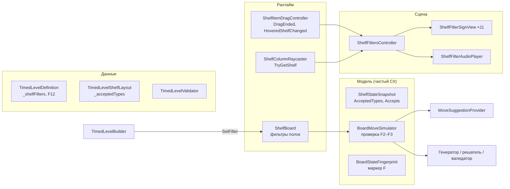

# План реализации: полка-фильтр (глава 2, уровни 6–10, сцена ThirdLevel)

**Дата:** 2026-10-04
**Статус (2026-10-08):** этапы 0–7 выполнены (7.4 — этапом 3 плана `2026-10-06-campaign-chapters-implementation.md`: уровни главы 2 в каталоге на позициях 6–10, песочница и `Generate Filter Chapter` удалены), этап 8 заменён этапом 7 плана `docs/plans/2026-10-07-filter-box-rule-implementation.md` (правило «коробки»: правило F6 заменено на F13–F15, минимум фильтровых ходов убран). Код и проверки по плану коробки и доработки по ревью выполнены; приёмка (проверка сборки в браузере, ручное прохождение 6–10, пороги времени, плейтест) открыта. Этап 9 выполнен 2026-10-08 (ветка `feature/filter-conveyor`), осталось пороги времени уровня 20 и плейтест. Подробности — в разделе «Ход выполнения» ниже.
**Основание:** `docs/2026-10-04-chapters-and-filter-shelf.md` (решения по главам и фильтру), анализ кода проекта на 04.10.
**Исполнитель:** Claude Code в репозитории `DruggingStuff` (Unity 2022.3.62f2, Built-in RP, DOTween, Unity MCP).
**Образец оформления и решений:** `docs/plans/2026-09-28-conveyors-implementation.md`.
**Связанный план (пишется отдельно):** перестройка кампании по главам и меню уровней. От него зависит только этап 7 этого плана (раздел 0.1).

---

## Ход выполнения

Ветка `feature/shelf-filters`.

| # | Этап | Состояние | Коммит |
|---|---|---|---|
| 0 | Подготовка и базовая линия | Готово | `5dabfc6` |
| 1 | Модель и данные фильтра | Готово | `d605c66` |
| 2 | Генератор | Готово | `c0323a7` |
| 3 | Офлайн-боты | Готово | `926b23e` |
| 4 | Ввод и отклик | Готово | `89f51b2` |
| 5 | Табличка: арт, анимации, звук | Готово | `0c4186c` |
| 6 | Подсказка, песочница, проверки Play Mode | Готово | `09ce9b5` |
| 7 | Уровни главы 2 | Готово; 7.4 выполнен этапом 3 плана перестройки кампании (2026-10-07) | `593390b` |
| 8 | Баланс, приёмка, документация | Заменён этапом 7 плана коробки; код и проверки готовы, приёмка открыта | `2e68f97`, `9f90237` |
| 9 | Фильтр на уровне с конвейерами | Готово; пороги времени уровня 20 и плейтест открыты | `3156649`, `cff6841`, `5b8d465`, `35ec04d`, `f0c276a` |

### Принятые решения

- **F10 (правило последней пустой колонки):** не меняется. Боты на пробном уровне и на всех уровнях главы 2 — 0% тупиков, состояние «остались только отфильтрованные пустые колонки» не встретилось ни разу.
- **Р2 (лунки):** не делаем. Полупрозрачные предметы уже означают «стоят в очереди за передним», бледная иконка в пустой колонке читалась бы так же.
- **Размер таблички:** иконка 0,085 единицы мира (≈20/25/30 px при 720/900/1080). Ориентир 40 px недостижим без перекрытия верхушек предметов полки ниже; размер оставлен по решению пользователя.
- **Вид таблички:** тёмная подложка `#3A1C11` (по просьбе пользователя — для контраста иконок), золотая кайма `#E2A33D`, два гвоздика `#B9803F`.
- **Тексты подсказки** RU/EN/TR из этапа 6 утверждены без правок.
- **Полки-фильтры главы 2** (подтверждены пользователем): ур. 6 — полка 5: Ball; ур. 7 — 5: Bear, 8: Lamp; ур. 8 — 4: Ball+Toy, 6: Plant; ур. 9 — 1: MapBall, 6: Bear+Beauty, 9: Lamp; ур. 10 — 5: Ball+Bear+Toy, 8: Plant+Lamp+Beauty.

### Отклонения от плана

- **`MaximumAcceptedTypeCount`** живёт в `ShelfStateSnapshot` (модель не зависит от конфигурации уровня), `TimedLevelLayoutRules` ссылается на него.
- **Генератор, раздел 5.5 шаг 5.** Добавлен критерий «источник — колонка фильтра с допустимым фронтом»: без него второй фильтровый ход блокировался проверкой соседних дубликатов, и 30 из 30 кандидатов отсеивались по `FilterUsage`. Оба фильтровых предпочтения действуют, только пока в решении меньше `MinimumFilteredMoveCount` фильтровых ходов (минимум передаётся во вход генератора): иначе предпочтение «цель — фильтр» забирало почти все группы на фильтры и уровни 8–10 не генерировались. Эталон уровней без фильтров не изменился.
- **Боты, этап 3.** Доля очистки за 300 ходов у всех конфигураций 100%, поэтому критерии сравнивались по среднему числу ходов до очистки. В ботах исправлены два артефакта: бережливый бот гонял предмет внутри фильтра, случайные ходы почти всегда были обменами.
- **Этап 4.** Префаб `ShelfFilterSign.prefab` создан сразу (на этапе 5 менялся только его вид). Каталог иконок берётся из определения текущего уровня, а не из поля сцены. При поднятии мусора со своего фильтра табличка не качается. Тип перетаскиваемого предмета контроллер помнит до следующего перетаскивания: `DragEnded` приходит раньше `DropRejected`.
- **Этап 6.** Подсказка прячется по старту таймера (он запускается первым ходом): события хода в `GameSession` нет, а сессия по плану не меняется. Из `ClosedShelfIntroHint` вынесены общие `LocalizedHintText` и `HintBubblePlacement`; поведение подсказки закрытых полок не изменилось. `TimedLevelVariantGenerator.WriteVariants` стал публичным.
- **Этап 7.** Уровни главы 2 не входят в каталог, поэтому для них добавлены пункты `Validate Filter Chapter` и `Filter Chapter Bot Report`. Песочница `Play Filter Level/1..5` работает на ассетах `LevelEntry_C2_01..05`.

### Результаты проверок

- Этап 2, пробное определение: 24 кандидата, все в пределах ±10% от медианы 16 ходов; фильтровых ходов 2–3; мусор на фильтре в 24 из 24 раскладок.
- Этап 6: `Validate Filter Play Mode` (P1–P6), `Validate Campaign`, `Validate Play Mode Route` — PASS.
- Этап 7: по 12 вариантов на уровень, медианы ходов 16/17/18/19/20, фильтровых ходов 2/3/4/5/6; `Validate Filter Chapter`, `Check Generator Baseline`, `Validate Gameplay Changes` — PASS.
- Боты на уровнях главы 2: тупиков 0%. Бережливый бот с фильтром быстрее жадного на 7–16 ходов; жадному фильтр почти не мешает (от −2 до +2 хода к контролю). Фильтр сейчас скорее возможность, чем препятствие — проверить на плейтесте этапа 8; рычаги: больше отфильтрованных пустых колонок, `_shuffleSwapCount`, более жёсткие наборы типов.

### Осталось

- ~~**7.4:** включение `LevelEntry_C2_01..05` в каталог.~~ Выполнено этапом 3 плана перестройки кампании (2026-10-07).
- **Этап 8** заменён этапом 7 плана `2026-10-07-filter-box-rule-implementation.md`. Сделано: документы, финальные проверки, таблички в 1920×1080, 1600×900, 1280×720 и 4:3, сборка WebGL (до доработок по ревью). Осталось:
  - пересобрать WebGL после `9f90237` и проверить в браузере: таблички, отклик, звук, консоль;
  - глазами в Play Mode проверить, что круги под иконками подпрыгивают вместе с иконками (пункт 4 ревью);
  - перезапустить `Validate Play Mode Route` и `Validate Conveyor Play Mode` (последний прогон до доработок генератора и ревью);
  - пороги времени 6–10: сейчас стартовые, а минимум ходов вырос с 16–20 до 17/19/21/22/24 (значения задаёт Михаил);
  - ручное прохождение 6–10 и плейтест (Михаил).
- **Этап 9** выполнен (итоги в конце раздела этапа 9). Осталось: пороги времени уровня 20 (сейчас 1:30 / 1:50 / 2:00 при минимуме 37 ходов вместо 34), ручное прохождение уровня 20 и плейтест.

---

## 0. Как работать с этим планом

1. Перед каждым этапом перечитать разделы 1–5 и раздел своего этапа целиком. Разделы 1 и 2 обязательны всегда.
2. Этапы выполняются по порядку: 0 → 1 → … → 8. Этап 9 (фильтр на уровне с конвейерами) необязательный и выполняется только по отдельной просьбе пользователя.
3. Этап закончен, только когда выполнены все пункты «Готово, когда». Частично сделанный этап не закрывается.
4. В этапах есть **стоп-точки**. В них исполнитель останавливается, показывает результат (скриншот, отчёт, числа) и ждёт ответа пользователя.
5. После этапа исполнитель пишет короткий отчёт по шаблону из приложения А и делает коммит (раздел 1.1).
6. Если реальный код расходится с этим планом, исполнитель не подгоняет код под план. Он описывает расхождение и предлагает правку плана. Важные решения согласуются с пользователем.

### 0.1. Зависимость от перестройки кампании

- Этапы 0–6 не требуют перестройки каталога. Механика проверяется на сценарных раскладках в памяти и в «песочнице» (этап 6.4).
- Варианты уровней главы 2 генерируются с сидами по их **итоговым** номерам 6–10 (этап 7.2). Поэтому их можно сгенерировать до перестройки каталога, и после неё перегенерация не понадобится.
- Включение уровней главы 2 в каталог, перенумерация остальных уровней, миграция сохранений и меню по главам — задачи плана перестройки кампании. Этап 7.4 этого плана выполняется после этапа «каталог по главам» того плана. Если его ещё нет, исполнитель останавливается после этапа 7.3.

### Глоссарий

| Термин | Значение |
|---|---|
| Полка-фильтр, фильтр | Полка, на которую можно положить только предметы допустимых типов |
| Допустимые типы | Набор из 1–3 типов предметов, заданный полке на весь уровень |
| Мусор | Предметы недопустимого типа, которые лежат на фильтре с начала уровня. Их можно забирать, класть обратно нельзя |
| Отфильтрованная пустая колонка | Пустая колонка полки-фильтра |
| Универсальная пустая колонка | Пустая колонка обычной открытой полки |
| Фильтровый ход | Ход канонического решения, цель которого лежит на полке-фильтре |
| Табличка | Видимая в мире этикетка на кромке полки-фильтра с иконками допустимых типов |
| Песочница | Пункт меню редактора, который запускает уровень, ещё не включённый в каталог |

---

## 1. Правила для исполнителя

### 1.1. Общие

- Перед началом: `git status`. Чужие незакоммиченные изменения не трогать, не откатывать и не коммитить без спроса. Если рабочая копия грязная, сообщить пользователю и спросить, как быть.
- Работа идёт в ветке `feature/shelf-filters`. Один коммит на этап (можно несколько внутри этапа). Сообщение коммита: `Filters: этап N — <суть>`. Push только по просьбе пользователя.
- Не форматировать и не переименовывать ничего вне задачи. Не менять порядок `using`, отступы и стиль в строках, которые не относятся к задаче.
- Сцены, префабы и ассеты менять **через Unity Editor** (Unity MCP), а не правкой YAML. Ручная правка `.unity`/`.asset` допустима только для однострочных исправлений при закрытом редакторе, и об этом нужно упомянуть в отчёте.
- Новые ассеты создавать в редакторе, чтобы Unity сгенерировала `.meta` и GUID. Никогда не копировать `.meta` вручную.
- Перед правкой сцены убедиться, что в редакторе нет несохранённых изменений. После правки сохранить сцену и проверить консоль.
- Данные существующих уровней (`TimedLevel_01..20`) **не перегенерировать и не пересохранять**. Если ассет случайно пересохранился, запустить валидацию кампании и указать это в отчёте.
- `TimedLevelLayoutRules.GeneratorVersion` не повышать: иначе потребуется перегенерация всех уровней.
- Каталог `MainLevelCatalog` и карточки меню в этом плане не трогать до этапа 7.4.

### 1.2. Код

Требования пользователя, обязательные для всего кода этой работы:
- корректность, понятность, простота, поддерживаемость; принятые в C# и Unity соглашения;
- **без комментариев в коде**; понятность достигается именами и декомпозицией;
- имена однозначно передают назначение, без сокращений и слишком общих слов (`Manager`, `Helper`, `Data2` и т.п.);
- SOLID, ООП и KISS там, где они реально улучшают решение. Никаких интерфейсов, слоёв и паттернов «на вырост». Если паттерн используется, это нужно указать в отчёте этапа;
- исправлять причину, а не симптом;
- стиль соседнего кода: `[SerializeField] private`, проверки зависимостей через исключения, `sealed` для листовых классов, DOTween с `SetLink`.

Технические правила проекта:
- В наследниках `GameSession`/`LevelSession` нельзя объявлять `Start`, `OnEnable`, `OnDisable`, `Update`. В этой работе новых наследников сессии нет.
- Анимации игрового поля (табличка — объект мира) идут на масштабированном времени: **без** `SetUpdate(true)`, иначе пауза их не остановит.
- Материал на объект не клонировать. Анимируемые свойства материала менять через `MaterialPropertyBlock`; у `SpriteRenderer` допустимо менять `color`.
- У таблички и её частей не должно быть коллайдеров: они могут перехватить клик по предмету или бросок в колонку.

### 1.3. Инструменты

- **Unity MCP** нужен для всех этапов со сценой. На этапе 0 проверить, что он подключён и видит открытый проект. Если не видит, остановиться и попросить пользователя открыть проект и включить MCP-мост в Unity.
- Меню проверок уже есть и расширяется в этой работе:
  - `Tools/Timed Levels/Validate Campaign` — полная проверка в редакторе;
  - `Tools/Timed Levels/Validate Gameplay Changes` — быстрая проверка модели и данных;
  - `Tools/Timed Levels/Validate Play Mode Route` — прохождение кампании в Play Mode;
  - `Tools/Timed Levels/Check Generator Baseline` — эталон генератора;
  - сборка WebGL — `TimedCampaignWebGlBuild`.

### 1.4. Когда остановиться и спросить

- Валидация кампании или эталон генератора падают **до** начала изменений.
- Эталонные хэши генератора для уровней без фильтров изменились (этапы 1, 2 и далее).
- Генератор не набирает 12 вариантов для уровня главы 2 даже после шагов из этапа 7.3.
- Нужно изменить публичное поведение, которое здесь не описано: правила хода для уровней без фильтров, результат, сохранения, меню.
- Все стоп-точки, перечисленные в этапах.

### 1.5. Чего не делать

- Не заводить отдельный тип полки под фильтр. Фильтр — это свойство обычной полки в модели и данных уровня.
- Не заводить наследника сессии и интерфейсы для «правил полок».
- Не совмещать фильтры и закрытые полки на одном уровне. Не ставить фильтр на конвейерную полку.
- Не менять порядок `ShelfBoard._shelves` и `Shelf._columnViews` в ThirdLevel после генерации вариантов главы 2.
- Не расставлять предметы в сцене руками.
- Не добавлять тестовые свойства и методы в игровые классы только ради проверок. Проверки опираются на публичное состояние, которое нужно игре.

---

## 2. Правила механики (норматив)

Каждое правило имеет номер. Проверки в разделе 7 ссылаются на эти номера.

| № | Правило |
|---|---|
| F1 | У полки-фильтра непустой набор допустимых типов, от 1 до 3. Набор не меняется в течение уровня |
| F2 | Перенос предмета в пустую колонку фильтра разрешён, только если тип предмета допустимый |
| F3 | Обмен разрешён, только если каждый предмет, который оказывается на полке-фильтре, допустим для неё. Проверяются обе стороны обмена |
| F4 | Предметы на фильтре, включая мусор, забираются по обычным правилам: перенос в пустую колонку и обмен на другой полке, если там нет своего ограничения |
| F5 | Перемещения внутри одной полки-фильтра подчиняются тем же F2–F3: мусор нельзя переложить в соседнюю колонку той же полки |
| F6 | Матч, каскады, очки и комбо работают как без фильтра |
| F7 | В стартовой раскладке на фильтре могут лежать любые типы. Автоматических матчей на старте нет, как сейчас |
| F8 | Подсказка и промпт бездействия не предлагают запрещённых ходов. Это следует из F2–F3: они выбирают ходы через симулятор |
| F9 | Отказ виден до отпускания предмета: в начале перетаскивания несовместимые таблички тускнеют; при наведении на несовместимый фильтр табличка качается; после отпускания предмет возвращается, табличка вздрагивает, звучит мягкий отказ |
| F10 | Правило «последнюю пустую колонку нельзя занять без матча» (`BoardMoveSimulation.IsAllowed`) в первой версии не меняется. Решение о смене принимается по результатам ботов (этап 3) |
| F11 | Каноническое решение каждого варианта соблюдает F2–F3. Это гарантирует генератор и подтверждает прямое воспроизведение решения через симулятор |
| F12 | На старте каждого варианта не меньше заданного числа отфильтрованных пустых колонок, а в каноническом решении не меньше заданного числа фильтровых ходов |

Следствие F2 и F5: для проверки хода не важно, совпадает ли полка-источник с полкой-целью. Проверяется только «какой предмет на какой полке окажется».

---

## 3. Что уже есть в проекте (анализ на 04.10)

| Место | Состояние | Что это значит для работы |
|---|---|---|
| `ShelfStateSnapshot` | Флаги `IsOpen`, `IsConveyor`; все пересоздания полки идут через `WithColumns`, который сохраняет флаги | Добавить набор допустимых типов. `WithColumns` и `ShiftConveyor` должны его сохранять |
| `BoardMoveSimulator.TrySimulate` | Проверяет границы, открытость полок, пустой источник, обмен одинаковыми. Затем ход, каскады, сдвиг конвейеров | Проверка F2–F3 встраивается сразу после определения `isSwap`, до изменения полок |
| `BoardMoveSimulation.IsAllowed` | `IsSwap \|\| MatchCount > 0 \|\| EmptyColumnCount > 0` | В первой версии не меняется (F10) |
| `ShelfBoard` | Наборы `_closedShelves`, `_conveyorShelves`, общий `CreateShelfSnapshot(Shelf)`; `TrySimulateMove` пересоздаёт заблокированные полки через `ResolveMatches` | Добавить словарь фильтров по образцу конвейеров. `CreateShelfSnapshot` передаёт набор типов |
| `Shelf.CreateSnapshot(isOpen, isConveyor)` | Строит снимок из рантайм-колонок | Добавить параметр набора типов |
| `BoardStateFingerprint` | В `CreateKey` маркер `C`/`B` и сортировка; в `CreateHash` маркеры только для особых полок | Маркер фильтра с набором типов. Хэши уровней без фильтров не меняются |
| `TimedLevelDefinition` | Закрытые полки, `_conveyorShelfIndices`, `_shuffleSwapCount` | Добавить список фильтров и два числа для F12 |
| `TimedLevelShelfLayout`, `TimedLevelVariant` | Флаги `_isClosed`, `_isConveyor` передаются в обе стороны | Добавить `_acceptedTypes` по той же схеме |
| `TimedLevelValidator` | Проверки определения, доски и варианта; конвейеры — отдельным методом | Добавить проверки фильтров отдельными методами |
| `TimedLevelBuilder.Materialize` | Закрывает полки и отмечает конвейеры по раскладке | Ставит фильтры по раскладке |
| `TimedLevelLayoutGenerator` | Обратное построение; группы ставятся через `FindReverseMoves` → фильтры автоматического матча и смежности → перемешивание → сортировка. Есть обратные обмены (`_shuffleSwapCount`, `TryApplyShuffleSwap`) | Фильтр допустимых типов для обратного хода и для обратного обмена; бюджет отфильтрованных пустых колонок; мягкое предпочтение (раздел 5.5) |
| `TimedLevelVariantGenerator` | Сиды `номер × 100000 + 1..`; 24 кандидата, отбор ±10% от медианы, 12 вариантов; статистика отказов `CandidateRejection`; `GenerateForDefinition(definition, sceneName, levelNumber)` публичный | Новые причины отказа; генерация главы 2 до перестройки каталога через `GenerateForDefinition` |
| `TimedLevelSolver` | Решатель на `BoardMoveSimulator` | Учтёт фильтр сам, когда его учтёт симулятор и ключ |
| `MoveSuggestionProvider` | Перебирает ходы в пустые колонки через `ShelfBoard.TrySimulateMove` | Учтёт фильтр сам (F8) |
| `ShelfDropTargetResolver` | Цель броска: прямое попадание в колонку или ближайшая подходящая колонка ближайшей полки; подходящая = `ShelfBoard.CanMove` | Запрещённая цель отсекается сама. Для отклика нужен отдельный запрос «над какой полкой указатель», без проверки хода |
| `ShelfItemDragController` | События `DragStarting(ShelfItem)`, `InteractionOccurred`, `DropRejected(Vector2)`; покачивание цели обмена через `ShelfSwapHoverView` | Добавить события `DragEnded` и `HoveredShelfChanged(Shelf)`. Покачивание на запрещённом обмене не включится само: оно опирается на `TryGetColumn` |
| `ShelfItemCatalog.Entry.Icon` | Иконки предметов уже есть (запекаются `ItemIconBaker`, используются на бирках закрытых полок) | Табличка берёт иконки отсюда |
| `ClosedShelfAudioPlayer` | Есть клип отказа `_rejectClip` | Тот же клип переиспользуется в маленьком аудиоплеере фильтров |
| `ClosedShelfIntroHint` | Одноразовая подсказка с пузырём на первом уровне механики, тексты RU/EN/TR | Образец для подсказки фильтра |
| `ConveyorModelValidation`, `ConveyorPlayModeValidation` | Проверки механики вынесены в отдельные файлы | По образцу: `ShelfFilterModelValidation`, `ShelfFilterPlayModeValidation` |
| Сцена `ThirdLevel` | `ShelfBoard._shelves`: 11 полок по 3 колонки (`UpperLeftLongRow_Left`, `UpperLeftLongRow_Right`, `UpperLeftShortRow`, `UpperRightTopRow`, …), 33 колонки. Сейчас на ней уровни 9–12 | Матч из 3 предметов, как в главе 1 и в главах 3–4. Старые уровни 9–12 снимаются планом перестройки, сцена переходит к главе 2. Индексы полок 0–10 в порядке `ShelfBoard._shelves` |
| Сцена `SecondLevel` | 5 полок по 4 колонки | В этом плане не используется: оставлена для будущей главы |
| `GameProgressData.Levels` | Прогресс хранится по `LevelNumber` | Перенумерация уровней — задача плана перестройки (миграция сохранений). В песочнице прогресс пишется под номерами 6–10 в редакторе, это допустимо |

---

## 4. Зафиксированные решения

| Тема | Решение | Почему |
|---|---|---|
| Имена в модели | `AcceptedTypes`, `IsFiltered`, `Accepts(ItemType)` | Читается как правило: `shelf.Accepts(ItemType.Lamp)` |
| Хранение набора | Список типов, нормализованный в конструкторе снимка: без повторов, по возрастанию | Детерминированные ключ и хэш, простое сравнение с определением |
| Флаг в модели | `ShelfStateSnapshot.AcceptedTypes`; `ShelfBoard` хранит фильтры по полкам | Симулятор, генератор, решатель, подсказка и рантайм работают по одним правилам |
| Где задаётся фильтр | Список `ShelfFilterDefinition` в `TimedLevelDefinition` **и** набор типов в раскладке варианта. Валидатор сверяет их | Так же сделаны закрытые полки и конвейеры: вариант описывает себя сам |
| Перемещение внутри полки | Те же правила F2–F3 (F5) | Одно правило без исключений проще объяснить и проверить |
| Правило последней пустой колонки | Без изменений в первой версии (F10) | Каноническое решение его не затрагивает. Влияет только на свободу игрока, поэтому решение — по ботам |
| Совмещение | Запрещено с закрытыми полками и на конвейерной полке. Фильтр и конвейер на разных полках одного уровня — разрешено, но только этап 9 | Пополнение закрытых полок кладёт предметы без учёта фильтра; сочетание с лентой на одной полке пока не нужно |
| Генератор | Фильтр типа для обратного хода и обратного обмена, бюджет отфильтрованных пустых колонок, мягкое предпочтение только при наличии фильтров | Для уровней без фильтров порядок вызовов `System.Random` не меняется — эталон совпадает |
| F12 в данных | Два поля определения: `_filteredEmptyColumnCount`, `_minimumFilteredMoveCount`. Валидатор проверяет их по варианту и сохранённому решению | Пассивность механики ловится данными, а не на глаз |
| Табличка | `ShelfFilterSignView` на точке `FilterSignAnchor` каждой полки сцены. Иконки из `ShelfItemCatalog` | Одна точка крепления на полку, данные уровня решают, показывать ли табличку |
| Отклик | Контроллер `ShelfFiltersController` подписан на события `ShelfItemDragController` | Ввод и сессия ничего не знают о табличках |
| Новые события ввода | `DragEnded` и `HoveredShelfChanged(Shelf)` в `ShelfItemDragController`; `TryGetShelf` в `ShelfColumnRaycaster` | Минимум изменений во вводе, без новых зависимостей |
| Звук | Маленький `ShelfFilterAudioPlayer` с одним клипом отказа (тот же ассет, что у закрытых полок), через SFX-группу микшера | В ThirdLevel нет плеера закрытых полок; один клип не требует общей абстракции |
| Названия ассетов главы 2 | `TimedLevel_C2_01..05.asset`, `LevelEntry_C2_01..05.asset` | Не конфликтуют со старыми `TimedLevel_06..10`, пока те не сняты планом перестройки |

**Намеренно используемый шаблон:** наблюдатель через события C# (`DragStarting`, `DragEnded`, `HoveredShelfChanged`, `DropRejected`, `SessionStarted`). Указать в отчётах этапов 5–6.

---

## 5. Архитектура

### 5.1. Обзор



### 5.2. Модель

**`ShelfStateSnapshot`:**
```csharp
public IReadOnlyList<ItemType> AcceptedTypes { get; }
public bool IsFiltered => AcceptedTypes.Count > 0;
public bool Accepts(ItemType type)
public ShelfStateSnapshot(IReadOnlyList<ColumnStateSnapshot> columns, bool isOpen, bool isConveyor, IReadOnlyList<ItemType> acceptedTypes)
```
- Существующие конструкторы сохраняются и передают пустой набор.
- Конструктор нормализует набор: без повторов, по возрастанию. Бросает исключение, если фильтр задан закрытой или конвейерной полке, или если типов больше `TimedLevelLayoutRules.MaximumAcceptedTypeCount` (3).
- `Accepts`: `true`, если полка не фильтр или тип есть в наборе.
- `WithColumns` передаёт набор. `ShiftConveyor` идёт через `WithColumns` и сохранит его автоматически.

**`BoardMoveSimulator.TrySimulate`** — сразу после вычисления `isSwap` и проверки обмена одинаковыми:
```
targetShelf = board.Shelves[target.ShelfIndex]
sourceShelf = board.Shelves[source.ShelfIndex]
если !targetShelf.Accepts(фронт источника) → false
если isSwap и !sourceShelf.Accepts(фронт цели) → false
```
`ResolveMatches` и `ShiftConveyors` не меняются: они не кладут предметы на полки.

**`BoardStateFingerprint`:**
- `CreateKey`: к маркеру полки добавляется `F<типы через точку>|` для фильтра, например `[F0.3|(1,)(2,)…]`. Сортировка колонок и полок — как сейчас. Фильтры с разными наборами — разные полки.
- `CreateHash`: перед `[` дописывается `F<типы через точку>` только для фильтров. Для остальных полок строка и хэш не меняются.

**`ShelfBoard`:**
```csharp
public bool HasFilters { get; }
public bool IsFiltered(Shelf shelf)
public IReadOnlyList<ItemType> GetAcceptedTypes(Shelf shelf)
public bool Accepts(Shelf shelf, ItemType type)
public void SetFilter(Shelf shelf, IReadOnlyList<ItemType> acceptedTypes)
```
- Хранение: `Dictionary<Shelf, IReadOnlyList<ItemType>>`.
- `SetFilter` бросает исключение, если полки нет на доске, она закрыта, конвейерная, уже фильтр, или набор пустой.
- `CreateShelfSnapshot(Shelf)` передаёт набор в `Shelf.CreateSnapshot(isOpen, isConveyor, acceptedTypes)`.
- `GetAcceptedTypes` для обычной полки возвращает пустой список.

**`Shelf.CreateSnapshot(bool isOpen = true, bool isConveyor = false, IReadOnlyList<ItemType> acceptedTypes = null)`.**

**`TimedLevelLayoutRules`:** `public const int MaximumAcceptedTypeCount = 3;`

### 5.3. Данные уровня

Новый сериализуемый класс `Assets/Scripts/Level/Config/ShelfFilterDefinition.cs`:
```csharp
[Serializable]
public sealed class ShelfFilterDefinition
{
    [SerializeField, Min(0)] private int _shelfIndex;
    [SerializeField] private List<ItemType> _acceptedTypes = new List<ItemType>();

    public int ShelfIndex => _shelfIndex;
    public IReadOnlyList<ItemType> AcceptedTypes => _acceptedTypes;
}
```

`TimedLevelDefinition`:
```csharp
[SerializeField] private List<ShelfFilterDefinition> _shelfFilters = new List<ShelfFilterDefinition>();
[SerializeField, Min(0)] private int _filteredEmptyColumnCount;
[SerializeField, Min(0)] private int _minimumFilteredMoveCount;

public IReadOnlyList<ShelfFilterDefinition> ShelfFilters => _shelfFilters;
public bool HasShelfFilters => _shelfFilters.Count > 0;
public int FilteredEmptyColumnCount => _filteredEmptyColumnCount;
public int MinimumFilteredMoveCount => _minimumFilteredMoveCount;
```

`TimedLevelShelfLayout`: `[SerializeField] private List<ItemType> _acceptedTypes = new List<ItemType>();`, свойство `AcceptedTypes`, параметр конструктора. `TimedLevelVariant` передаёт набор в обе стороны: при создании из снимка и в `CreateLayout`. Для существующих ассетов поле пустое, хэши не меняются.

`TimedLevelBuilder.Materialize`: после раскладки полки вызвать `_shelfBoard.SetFilter(shelf, layout.Shelves[i].AcceptedTypes)`, если `layout.Shelves[i].IsFiltered`.

**Новые проверки `TimedLevelValidator`** (отдельные приватные методы `ValidateShelfFilterDefinition`, `ValidateShelfFilterBoard`, `ValidateShelfFilterVariant`):

| Где | Проверка |
|---|---|
| Определение | Индексы неотрицательны и не повторяются. В каждом фильтре 1–3 типа без повторов. Каждый тип есть в группах уровня. Набор не покрывает все типы уровня. Фильтры и закрытые полки вместе запрещены. `FilteredEmptyColumnCount` ≤ `EmptyColumnCount`. Если фильтров нет, оба числа F12 равны 0 |
| Доска | Индексы меньше числа полок. Фильтр не на конвейерной полке. `FilteredEmptyColumnCount` не больше числа колонок всех полок-фильтров |
| Вариант | Набор типов каждой полки раскладки совпадает с определением (у остальных полок пусто). Отфильтрованных пустых колонок на старте не меньше `FilteredEmptyColumnCount`. Фильтровых ходов в сохранённом решении не меньше `MinimumFilteredMoveCount` (считаются по целевым позициям ходов, без проигрывания) |

Сообщения исключений писать в стиле соседних строк валидатора (английский, с именем ассета и номером варианта).

### 5.4. Генератор: вход и ограничения

`TimedLevelGenerationInput`:
```csharp
public IReadOnlyDictionary<int, IReadOnlyList<ItemType>> ShelfFilters { get; }
public int FilteredEmptyColumnCount { get; }
```
Оба параметра необязательные в конструкторе (по умолчанию пусто и 0). `TimedLevelLayoutGenerator.GenerateWithSolution(definition, …)` заполняет их из определения.

`LayoutConstraints`: `IsFiltered(shelfIndex)`, `Accepts(shelfIndex, type)`, `HasFilters`, `RequiredFilteredEmptyColumnCount`.

### 5.5. Генератор: обратное построение с фильтром

Почему фильтр ложится на текущий алгоритм без перестройки:
- Прямой ход канонического решения — «передний предмет из колонки `S` в пустую колонку `T.c`», он даёт матч на полке `T`. Колонка `T.c` пуста и до хода, и после матча.
- Остальные предметы матча уже стоят на фронтах `T` — они пришли из стартовой раскладки. Значит, единственный предмет, который кладут на `T`, — предмет из `S`, и его тип равен типу группы.
- Поэтому F2 для канонического хода — это условие «тип группы допустим для `T`».
- Предметы, которые обратный шаг дописывает в начало колонки-источника `S`, — это мусор, если `S` — фильтр. Это разрешено (F4, F7).

Изменения:

1. **`TryPlaceGroup`.** До `Shuffle(moves, random)` добавить:
   ```
   moves.RemoveAll(move => !constraints.Accepts(move.TargetShelfIndex, type))
   ```
   Для уровней без фильтров ничего не удаляется, число элементов перед перемешиванием не меняется, и последовательность `System.Random` остаётся прежней.
2. **`TryApplyShuffleSwap`.** Кандидат обмена подходит, только если в текущем (обратном) состоянии каждая из двух полок принимает свой нынешний фронт: `constraints.Accepts(first, фронт first) && constraints.Accepts(second, фронт second)`. Причина: прямой обмен вернёт эти фронты на эти полки. Кандидатов без фильтров это условие не отсекает.
3. **`FindReverseMoves`, бюджет.** Рядом с проверкой общего резерва пустых колонок добавить такую же проверку для отфильтрованных: если ход заполнит столько отфильтрованных пустых колонок, что их станет меньше `RequiredFilteredEmptyColumnCount`, ход пропускается. Пустые колонки при обратном построении только убывают, поэтому раннее отсечение корректно.
4. **Конец построения** (`TryAddGroups`, ветка «все группы размещены»): дополнительно `CountFilteredEmptyColumns(columns) >= RequiredFilteredEmptyColumnCount`.
5. **Мягкое предпочтение** в `CompareReverseMoves`, только при `constraints.HasFilters`, перед существующими критериями:
   - выше ход, цель которого — фильтр (растёт число фильтровых ходов);
   - при равенстве выше ход, который не заполняет отфильтрованные пустые колонки.
   Если вариантов окажется слишком мало или они однообразны, порядок критериев настраивается на стоп-точке этапа 7.3.
6. `CreateShelfSnapshot` в генераторе передаёт набор типов.

Итоговая проверка не меняется: `CanReplaySolution` проигрывает решение через симулятор, который уже проверяет F2–F3. Любая ошибка обратного построения отсеется здесь.

### 5.6. Генератор вариантов

- `TimedLevelVariantGenerator.GenerateCandidates`: после генерации посчитать фильтровые ходы решения. Если их меньше `MinimumFilteredMoveCount` — отказ `CandidateRejection.FilterUsage`. Если на старте отфильтрованных пустых колонок меньше нормы — `CandidateRejection.FilteredEmptyColumns` (на случай, если ограничение генератора где-то обойдено).
- В отчёт по уровню: медиана ходов, медиана фильтровых ходов, отказы по причинам.
- Новый пункт меню `Tools/Timed Levels/Generate Filter Chapter` — генерирует варианты для `TimedLevel_C2_01..05` вызовом `GenerateForDefinition(definition, "ThirdLevel", номер)` с номерами 6–10. Сцена и номера берутся из таблицы в коде пункта меню, а не из каталога (раздел 0.1). После перестройки каталога пункт удаляется или переводится на каталог — это решает план перестройки.

### 5.7. Ввод и отклик

**`ShelfDropTargetResolver`:**
```csharp
public bool TryGetShelfUnderPointer(Vector2 pointerPosition, out Shelf shelf)
```
Сначала прямое попадание в колонку (`TryGetDirectColumn` → её полка), иначе ближайшая полка (`TryGetNearestShelf`). Без проверки допустимости хода.

**`ShelfColumnRaycaster`:** `public bool TryGetShelf(Vector2 pointerPosition, out Shelf shelf)` — делегирует резолверу.

**`ShelfItemDragController`:**
```csharp
public event Action DragEnded;
public event Action<Shelf> HoveredShelfChanged;
```
- `DragEnded` поднимается в `ClearDragState` (туда сходятся успешный ход, отказ и отмена).
- В `UpdateDrag` после перемещения: `_columnRaycaster.TryGetShelf(...)`; если полка изменилась с прошлого кадра — `HoveredShelfChanged(полка или null)`. При окончании перетаскивания текущая полка сбрасывается в `null` с событием.

**`ShelfFiltersController`** (`Assets/Scripts/ShelfFilters/ShelfFiltersController.cs`), один объект в сцене:

Зависимости: `LevelSession _session`, `ShelfBoard _shelfBoard`, `ShelfItemDragController _dragController`, `ShelfColumnRaycaster _columnRaycaster`, `ShelfItemCatalog _itemCatalog`, `List<ShelfFilterSignView> _signs`, `ShelfFilterAudioPlayer _audio`.

- `SessionStarted`: каждой полке-фильтру должна соответствовать ровно одна табличка, иначе исключение. Табличка фильтра — `Show(иконки допустимых типов)`, остальные — `Hide()`. Иконка без спрайта в каталоге — исключение.
- `DragStarting(item)`: запомнить тип; таблички фильтров, которые его не принимают, — `SetDimmed(true)`.
- `HoveredShelfChanged(shelf)`: если это фильтр и он не принимает тип — `PlayRefusalHint()`.
- `DropRejected(screenPosition)`: `TryGetShelf` → если это фильтр и он не принимает тип — `PlayRejected()` и `_audio.PlayReject()`.
- `DragEnded`: снять затемнение со всех табличек, забыть тип.
- На уровне без фильтров контроллер только скрывает таблички и ничего не делает в остальных обработчиках.

**`ShelfFilterSignView`** (`Assets/Scripts/View/ShelfFilters/ShelfFilterSignView.cs`), на `FilterSignAnchor` каждой полки:

Поля: `Shelf _shelf`, `GameObject _root`, `SpriteRenderer _plate`, `List<SpriteRenderer> _icons` (3 слота), `Color _dimmedTint`, длительности анимаций.

```csharp
public Shelf Shelf { get; }
public bool IsDimmed { get; }
public void Show(IReadOnlyList<Sprite> icons)
public void Hide()
public void SetDimmed(bool isDimmed)
public void PlayRefusalHint()
public void PlayRejected()
```
- `Show` раскладывает 1–3 иконки по центру таблички, лишние слоты скрывает.
- Затемнение — плавная смена `color` у таблички и иконок (около 0,12 с).
- `PlayRefusalHint` — короткое покачивание (поворот ±6°, около 0,25 с) и подпрыгивание иконок. Повторный вызов во время анимации не накапливается.
- `PlayRejected` — то же сильнее (поворот ±10°, около 0,35 с).
- DOTween на масштабированном времени, `SetLink(gameObject)`; без коллайдеров.

**`ShelfFilterAudioPlayer`** (`Assets/Scripts/Audio/ShelfFilterAudioPlayer.cs`): `_rejectClip`, `_rejectVolume`, `PlayReject()`; вывод через SFX-группу микшера, как у `MatchAudioPlayer`.

**`ShelfFilterIntroHint`** (`Assets/Scripts/View/ShelfFilters/ShelfFilterIntroHint.cs`) по образцу `ClosedShelfIntroHint`: на первом уровне с фильтрами пузырь у таблички первого фильтра, текст RU/EN/TR, исчезает после первого хода или через несколько секунд. Как определять «первый уровень с фильтрами» и показывать ли один раз — так же, как у подсказки закрытых полок.

---

## 6. Этапы работ

Сводка:

| # | Этап | Результат | Зависит от |
|---|---|---|---|
| 0 | Подготовка и базовая линия | Ветка, зелёная валидация, эталон генератора совпадает | — |
| 1 | Модель и данные фильтра | Фильтр в снимках, симуляторе, ключе, `ShelfBoard`, данных и валидаторе; проверки M1–M13 | 0 |
| 2 | Генератор | Обратное построение с фильтром, генерация на пробном определении | 1 |
| 3 | Офлайн-боты | Отчёт о пассивности и тупиках; решение по F10 | 2 |
| 4 | Ввод и отклик (серый бокс) | События ввода, контроллер, табличка-заглушка в ThirdLevel | 1 |
| 5 | Табличка: арт, анимации, звук | Финальная табличка, затемнение, качание, отказ | 4 |
| 6 | Подсказка, локализация, песочница | Подсказка первого уровня, тексты, запуск уровней вне каталога, Play Mode проверки | 5 |
| 7 | Уровни главы 2 | 5 определений, 60 вариантов, включение в каталог (после плана перестройки) | 2, 3, 6 |
| 8 | Баланс, приёмка, документация | Ручное прохождение, WebGL, GDD | 7 |
| 9 | (необязательно) Фильтр на уровне с конвейерами | Финал главы 4 | 8, план перестройки |

---

### Этап 0. Подготовка и базовая линия

**Задачи**
1. `git status`, `git log -5`. Если есть незакоммиченные изменения — стоп-точка: показать список и спросить пользователя.
2. Создать ветку `feature/shelf-filters`.
3. Проверить Unity MCP: видит проект, версия 2022.3.62f2, консоль без ошибок компиляции.
4. Запустить `Validate Campaign` и `Check Generator Baseline`. Обе проверки должны пройти. Иначе — стоп-точка.
5. Через Unity MCP записать в отчёт: порядок, имена и мировые позиции всех 11 полок ThirdLevel, вместимость полок, `_emptyColumnCount` у текущих уровней ThirdLevel (9–12). Эти данные нужны на этапах 4 и 7.

**Готово, когда:** ветка создана, базовые проверки зелёные, данные ThirdLevel в отчёте.

---

### Этап 1. Модель и данные фильтра

Реализовать разделы 5.2 и 5.3. Генератор, сцену и рантайм-вид не трогать.

**Задачи**
1. `ShelfStateSnapshot`: набор типов, нормализация, `IsFiltered`, `Accepts`, новый конструктор, передача набора в `WithColumns`.
2. `BoardMoveSimulator.TrySimulate`: проверка F2–F3.
3. `BoardStateFingerprint`: маркер фильтра в ключе и хэше.
4. `Shelf.CreateSnapshot`, `ShelfBoard`: фильтры полок, `SetFilter`, передача набора в `CreateShelfSnapshot`.
5. `TimedLevelLayoutRules.MaximumAcceptedTypeCount`.
6. Данные: `ShelfFilterDefinition`, поля `TimedLevelDefinition`, `_acceptedTypes` в `TimedLevelShelfLayout`, передача в `TimedLevelVariant`.
7. `TimedLevelValidator`: проверки из 5.3.
8. `TimedLevelBuilder.Materialize`: `SetFilter`.
9. `Assets/Editor/TimedLevels/ShelfFilterModelValidation.cs` по образцу `ConveyorModelValidation`; вызывается из `Validate Campaign` и `Validate Gameplay Changes`. Кейсы:

| Код | Кейс | Ожидание | Правило |
|---|---|---|---|
| M1 | Перенос допустимого типа в пустую колонку фильтра | Разрешён | F2 |
| M2 | Перенос недопустимого типа в пустую колонку фильтра | `TrySimulate` возвращает `false` | F2 |
| M3 | Обмен: на фильтр приходит недопустимый предмет | `false` | F3 |
| M4 | Обмен: на фильтр приходит допустимый, мусор уходит на обычную полку | Разрешён | F3, F4 |
| M5 | Мусор с фильтра переносится в универсальную пустую колонку | Разрешён | F4 |
| M6 | Мусор переносится в пустую колонку той же полки-фильтра | `false` | F5 |
| M7 | Обмен между двумя фильтрами, каждый принимает пришедший предмет / один не принимает | Разрешён / `false` | F3 |
| M8 | Матч и каскад на фильтре | Результат и `MatchInfo` совпадают с такой же доской без фильтра | F6 |
| M9 | `WithColumns`, `ShiftConveyor`, порядок типов `[Lamp, Ball, Ball]` | Набор сохраняется и нормализуется в `[Ball, Lamp]` | — |
| M10 | Одинаковое содержимое: обычная полка и фильтр; два фильтра с разными наборами | Разные ключ и хэш | — |
| M11 | Доска без фильтров | Ключ и хэш совпадают с прежними; все сохранённые варианты уровней 1–20 проходят `ValidateForRuntime` | — |
| M12 | `ShelfBoard.SetFilter` на закрытой, конвейерной, чужой, уже отфильтрованной полке и с пустым набором | Исключение | F1 |
| M13 | Определения с ошибками: повтор индекса, тип не из уровня, 0 или 4 типа, набор из всех типов уровня, фильтр плюс закрытые полки, `FilteredEmptyColumnCount` > `EmptyColumnCount` | `TimedLevelValidator` бросает исключение | F1 |
| M14 | Вариант с неверным набором типов, с недостатком отфильтрованных пустых колонок, с недостатком фильтровых ходов | Исключение | F12 |
| M15 | `ShelfBoard.TrySimulateMove` при заблокированной полке-фильтре (пересоздание через `ResolveMatches`) | Набор типов сохраняется, F2 соблюдается | F2 |

Для M15 и других рантайм-кейсов создавать временные объекты и удалять их после проверки, как в `ConveyorModelValidation`.

**Проверки**
- `Validate Campaign` зелёная без перегенерации уровней.
- `Check Generator Baseline` зелёная.

**Готово, когда:** выполнены проверки и все кейсы M1–M15.

---

### Этап 2. Генератор

Реализовать разделы 5.4–5.6, кроме пункта меню главы 2 (он на этапе 7).

**Задачи**
1. `TimedLevelGenerationInput`: фильтры и `FilteredEmptyColumnCount`.
2. `TimedLevelLayoutGenerator`: шаги 1–6 раздела 5.5.
3. `TimedLevelVariantGenerator`: причины отказа `FilterUsage`, `FilteredEmptyColumns`; медиана фильтровых ходов в отчёте.
4. Пробное определение в памяти (не ассет) для ThirdLevel: 1 фильтр на 1 тип, 16 групп из 6 типов (48 предметов), `EmptyColumnCount = 3`, `FilteredEmptyColumnCount = 1`, `MinimumFilteredMoveCount = 2`. Сгенерировать 24 кандидата через `GenerateCandidates` с сидами `900000 + n`, не записывая в ассеты.
5. Независимая проверка каждого кандидата: при проигрывании решения через симулятор каждый предмет, который оказывается на фильтре, допустим для него (повторная проверка F2–F3 не через генератор).

**Проверки**
- `Check Generator Baseline` зелёная: уровни без фильтров генерируются как раньше.
- Пробное определение даёт не меньше 12 вариантов в пределах ±10% от медианы.
- В отчёт: время генерации, отказы по причинам, медиана ходов и фильтровых ходов, доля стартовых раскладок, где на фильтре есть мусор.

**Стоп-точка:** показать отчёт. Если доля мусора на фильтрах нулевая или фильтровых ходов почти всегда ровно минимум, предложить настройку предпочтения (5.5, шаг 5).

**Готово, когда:** выполнены проверки, пользователь посмотрел отчёт.

---

### Этап 3. Офлайн-боты

Цель — до графики проверить, что механика не пассивна и не создаёт тупиков, и принять решение по F10.

**Задачи**
1. Редакторная утилита `Assets/Editor/TimedLevels/ShelfFilterBotReport.cs`, пункт меню `Tools/Timed Levels/Filter Bot Report`. Боты работают на `BoardMoveSimulator`, без сцены.
2. Два бота:
   - **«Жадный»**: ход с наибольшим числом матчей; если матчей нет — случайный допустимый ход (перенос или обмен).
   - **«Бережливый»**: как жадный, но среди ходов без матча предпочитает класть в отфильтрованные колонки и не занимать последнюю универсальную пустую колонку.
3. Контроль: та же раскладка с очищенными наборами типов (фильтры сняты).
4. Прогоны: для каждого из 12 вариантов пробного определения этапа 2 и, позже, каждого уровня главы 2 — по 200 прогонов на бота и конфигурацию, лимит 300 ходов.
5. Метрики: доля очищенных досок; среднее число ходов до очистки; доля **тупиков** (нет ни одного допустимого хода); доля прогонов, где в какой-то момент остались только отфильтрованные пустые колонки, и сколько из них закончились тупиком или лимитом.

**Критерии** [гипотеза, уточняются по факту]:
- у жадного бота доля очистки с фильтром ниже, чем в контроле: иначе механика пассивна;
- у бережливого бота доля очистки выше, чем у жадного: внимание к фильтру окупается;
- тупики меньше 1%.

**Стоп-точка: решение по F10.** Показать метрики. Если прогоны, где остались только отфильтрованные пустые колонки, заметно чаще заканчиваются тупиком или лимитом, предложить пользователю правило: «ход без матча должен оставить хотя бы одну универсальную пустую колонку, если на доске были универсальные пустые колонки». Правило меняется только с согласия пользователя; тогда оно реализуется в `BoardMoveSimulation`/`BoardMoveSimulator`, получает кейсы в `ShelfFilterModelValidation`, и проверяется, что сохранённые решения всех уровней по-прежнему проигрываются.

**Готово, когда:** отчёт показан, решение по F10 записано в отчёт этапа.

---

### Этап 4. Ввод и отклик (серый бокс)

Реализовать раздел 5.7 без финального арта: табличка — плоская кремовая плашка с иконками, анимации простые.

**Задачи**
1. `ShelfDropTargetResolver.TryGetShelfUnderPointer`, `ShelfColumnRaycaster.TryGetShelf`.
2. `ShelfItemDragController`: события `DragEnded`, `HoveredShelfChanged`.
3. `ShelfFiltersController`, `ShelfFilterSignView` (заглушка), `ShelfFilterAudioPlayer`.
4. Сцена ThirdLevel:
   - в каждой из 11 полок дочерний объект `FilterSignAnchor` на кромке полки под колонками, по центру;
   - на каждом якоре экземпляр таблички-заглушки, поле `_shelf` — своя полка; таблички скрыты по умолчанию;
   - объект `ShelfFilters` с `ShelfFiltersController` и `ShelfFilterAudioPlayer`, все ссылки заполнены;
   - у табличек нет коллайдеров.
5. Проверить через Unity MCP: табличка не перекрывает предметы и превью; на 1280×720 и 1600×900 иконки различимы (ориентир — не меньше ~40 px по высоте).

**Проверки (вручную, на сценарной раскладке из этапа 2 через временный выбор уровня в редакторе)**
- Таблички видны только у фильтров.
- Начало перетаскивания несовместимого предмета притушивает таблички, конец — снимает.
- Наведение на несовместимый фильтр качает табличку один раз за вход.
- Бросок недопустимого предмета: предмет возвращается, табличка вздрагивает, звучит отказ.
- Обмен на фронт фильтра недопустимым предметом: покачивание цели не включается.
- Уровни без фильтров ведут себя как раньше.

**Стоп-точка:** скриншоты ThirdLevel с 1 и 3 табличками в 1280×720 и 1600×900 и короткое видео отклика (Unity Recorder).

**Готово, когда:** проверки выполнены, пользователь одобрил расположение табличек.

---

### Этап 5. Табличка: арт, анимации, звук

**Задачи**
1. Префаб `Assets/Prefabs/ShelfFilters/ShelfFilterSign.prefab`: кремовая этикетка с золотой каймой (палитра UI: `#FFF1C4`, `#E2A33D`), прибитая двумя гвоздиками к кромке полки; до трёх иконок. Стиль — в тон бирок закрытых полок, но формой отличается: этикетка на кромке, а не бирка на нитке.
2. Анимации `SetDimmed`, `PlayRefusalHint`, `PlayRejected` с параметрами из 5.7, на масштабированном времени.
3. Клип отказа — тот же ассет, что у `ClosedShelfAudioPlayer._rejectClip`; громкость подобрать по слуху относительно звука матча.
4. Заменить заглушки в сцене экземплярами префаба. Ссылки контроллера обновить.
5. **Решение Р2 (лунки).** Сделать прототип: в пустой колонке фильтра бледная иконка допустимого типа (или нескольких). Показать пользователю вариант с лунками и без. Если лунки берём — `ShelfFilterSlotView` на `ShelfColumnView` полок ThirdLevel, обновление при `ShelfView.Refresh`/`Advance`; если нет — прототип удаляется.

**Стоп-точка:** видео с финальной табличкой: появление уровня, перетаскивание, наведение, отказ, пауза во время анимации (анимация замирает). Отдельно — сравнение с лунками и без.

**Готово, когда:** пользователь одобрил вид и решил вопрос Р2.

---

### Этап 6. Подсказка, локализация, песочница, проверки Play Mode

**Задачи**
1. `ShelfFilterIntroHint` по образцу `ClosedShelfIntroHint`. Тексты (черновик, пользователь может поправить):
   - RU: «Эта полка принимает только предметы с таблички»
   - EN: «This shelf only takes items shown on its label»
   - TR: «Bu raf yalnızca etiketteki eşyaları kabul eder»
2. **Песочница:** пункт меню `Tools/Timed Levels/Play Filter Level/1..5` открывает ThirdLevel, выбирает `LevelEntry_C2_0N` через `LevelSelectionState` и запускает Play Mode. После победы каталог не находит следующий уровень — это ожидаемо. Пункты удаляются планом перестройки, когда уровни войдут в каталог.
3. `Assets/Editor/TimedLevels/ShelfFilterPlayModeValidation.cs` по образцу `ConveyorPlayModeValidation`. Сценарные определения создаются в памяти (`ScriptableObject.CreateInstance`) и на диск не сохраняются.

**Сценарии Play Mode:**

| Код | Сценарий | Проверка | Правило |
|---|---|---|---|
| P1 | Прохождение сценарного уровня по сохранённому решению с ожиданием `IsBoardSettled` после каждого хода | Хэш `ShelfBoard.CreateSnapshot()` после каждого хода равен хэшу состояния из симулятора | F2–F6 |
| P2 | Попытка хода недопустимым предметом в пустую колонку фильтра через `TryStartMove` | Ход отклонён, доска не изменилась | F2 |
| P3 | Каждый кадр прохождения P1 | `MoveSuggestionProvider.TryGetSuggestion` не предлагает ход, нарушающий `Accepts` | F8 |
| P4 | Начало перетаскивания предмета типа X | `IsDimmed` у табличек, не принимающих X, и только у них; после окончания — ни у одной | F9 |
| P5 | Перезапуск уровня с фильтрами | Новая сессия `Playing`, фильтры и таблички на месте, исключений нет | F1 |
| P6 | Уровень без фильтров в ThirdLevel (старый уровень 9–12, пока он в каталоге) | Все таблички скрыты, ходы как раньше | — |

**Проверки**
- P1–P6 проходят.
- `Validate Campaign` и `Validate Play Mode Route` зелёные; уровни 1–20 и Endless ведут себя как раньше.

**Готово, когда:** выполнены проверки; тексты подсказки одобрены пользователем.

---

### Этап 7. Уровни главы 2

**7.1. Определения.** Создать `Assets/Levels/Timed/TimedLevel_C2_01..05.asset` и `Assets/Levels/Menu/LevelEntry_C2_01..05.asset` (номера 6–10, сцена `ThirdLevel`, `_available = 1`) по таблице раздела 8. `_itemCatalog` — как у текущих уровней ThirdLevel.

**7.2. Генерация.** Пункт меню `Tools/Timed Levels/Generate Filter Chapter` (5.6). Сиды — по номерам 6–10.

**7.3. Если вариантов меньше 12.** Действовать по порядку и после каждого шага пробовать снова:
1. Для уровней с фильтрами поднять `MaximumSeedAttempts` отдельной константой (например, до 30 000).
2. Поменять порядок критериев мягкого предпочтения (5.5, шаг 5).
3. **Стоп-точка:** показать статистику отказов по причинам и предложить пользователю, что ослабить (`MinimumFilteredMoveCount`, `FilteredEmptyColumnCount`, набор типов). Молча ослаблять нельзя.

**7.4. Включение в каталог.** Только после этапа «каталог по главам» плана перестройки кампании (раздел 0.1). Если он готов: поставить `LevelEntry_C2_01..05` на позиции 6–10 по тому плану и прогнать его проверки. Если не готов — остановиться и сообщить пользователю.

**Проверки**
- У каждого из пяти уровней не меньше 12 вариантов; `ValidateForRuntime` проходит.
- Все 60 решений проигрываются до пустой доски с одним матчем на ход (обмены — без матча).
- Боты этапа 3 на каждом уровне: критерии раздела «Этап 3» выполнены. Отчёт по уровням.
- В отчёт: медиана ходов и фильтровых ходов по уровням, отказы по причинам.

**Готово, когда:** выполнены проверки 7.1–7.3; 7.4 выполнен или явно отложен до плана перестройки.

---

### Этап 8. Баланс, приёмка, документация

**Заменён** этапом 7 плана `2026-10-07-filter-box-rule-implementation.md` (2026-10-07). Текст ниже оставлен для истории; что осталось сделать — в разделе «Осталось» в начале плана.

**Задачи**
1. Ручное прохождение уровней 6–10 (через каталог или песочницу), каждый минимум 3 раза: время, число ходов, сколько раз пришлось разбирать мусор, замечен ли отклик фильтра. Предложить корректировку порогов времени (стоп-точка: значения меняет пользователь).
2. Плейтест на 5–8 новых игроках (организует пользователь): уровни 5 → 6 → 7 без объяснений, кроме подсказки. Метрики для сверки:
   - больше 80% понимают правило к концу уровня 6;
   - отказы по фильтру после уровня 6 редки;
   - победы с первой попытки на уровне 6 — не ниже 85%.
3. Проверить ThirdLevel в 1280×720, 1600×900 и 1440×1080 (4:3): таблички не уходят за края и под HUD.
4. Сборка WebGL через `TimedCampaignWebGlBuild`: таблички, анимации, звук, консоль без ошибок.
5. Финальный прогон `Validate Campaign`, `Check Generator Baseline`, `Validate Play Mode Route`.
6. Обновить `docs/GDD.md`: раздел 3 — правило полки-фильтра; раздел 5 — уровни главы 2 (если каталог уже перестроен); раздел 6 — генерация с фильтром; раздел 16 — ссылка на этот план.
7. Обновить статус этого плана и отметить отклонения от него.

**Готово, когда:** все проверки раздела 7 отмечены, пользователь принял уровни.

---

### Этап 9 (необязательно). Фильтр на уровне с конвейерами

Выполняется только по просьбе пользователя, после приёмки главы 2 (этап 7 плана коробки). Расписан 2026-10-08 по коду ветки `feature/filter-boxes`.

**Цель.** Финал главы 4 (уровень 20, `TimedLevel_C4_05`, сцена FifthLevel) — конвейеры вместе с коробкой: игрок применяет правило главы 2 в условиях главы 4. Номер уровня не меняется, поэтому миграция сохранений не нужна; меняются только варианты уровня 20 и его запись в базовой линии генератора.

**Исходное состояние (проверено по коду 2026-10-08)**

| Место | Состояние | Что нужно |
|---|---|---|
| `BoardMoveSimulator` | F2–F3 и правило коробки проверяются до хода; сдвиг лент идёт после матча через тот же `ResolveCascades` с `FilteredTypes` | Ничего. Лента не кладёт предметы на полку-фильтр |
| `TimedLevelValidator` | Фильтр на конвейерной полке запрещён; фильтры и конвейеры на разных полках не запрещены; `HasConveyors && ShuffleSwapCount > 0` — ошибка | Ничего, если обмены не включаем (решение 9.0.3) |
| `TimedCampaignValidation` | В главе допускается только её механика: фильтр в главе конвейеров — ошибка | Разрешить фильтры в главе `Conveyor` (9.2) |
| `TimedLevelLayoutGenerator` | Откат сдвига лент (`UndoConveyorShift` / `RedoConveyorShift`) и правила коробки живут в одном `TryPlaceGroup`, но вместе ни разу не запускались | Проверить генерацию, при необходимости поправить |
| `ShelfFilterChapterValidation` | `Validate Filter Chapter` и `Filter Chapter Bot Report` берут из каталога все уровни с фильтрами | Уровень 20 попадёт автоматически; проверить, что проверки не завязаны на ThirdLevel |
| `ShelfFilterPlayModeValidation` | Жёстко на сцене ThirdLevel | Сценарии этапа 9 — в `ConveyorPlayModeValidation` (сцена FifthLevel) |
| Сцена FifthLevel | 12 полок по 3 колонки, `ShelfColumnRaycaster` есть; `ShelfFiltersController`, табличек и `FilterSignAnchor` нет. Ленты уровня 20 — полки 8–11, обычные — 0–7 | Добавить в редакторе (9.4) |
| Меню | Наклейка карточки показывает только механику главы (`LevelSelectionController`, `GetMechanicElementCount(chapter.Mechanic)`): у уровня 20 будет только «конвейер ×4» | Решение 9.0.4 |
| Уровень 20 сейчас | 102 предмета, 34 группы, 8 типов (Ball и Bear по 5 групп, остальные по 4), 5 пустых колонок, 4 ленты, 1:30 / 1:50 / 2:00, обменов нет | Решение 9.0.2 |

**9.0. Решения до начала (стоп-точка)**

1. **Уровень.** Рекомендация: изменить уровень 20 (финал главы, как в таблице глав). Альтернатива — новый уровень или замена 19: правки каталога, а при перестановке — миграция сохранений.
2. **Коробки и объём.** Рекомендация: 1 коробка на 1–2 типа на заметной обычной полке, 1 отфильтрованная пустая колонка на старте. Финал и так самый тяжёлый в главе; чтобы не перегрузить его, рассмотреть 90–96 предметов вместо 102. Решает Михаил после превью генератора.
3. **Обмены.** На конвейерных уровнях обмены запрещены валидатором, а без обменов коробки снова выглядят однообразно (одна пустая колонка коробки, каждая группа ложится парой в те же две колонки). Варианты:
   - А (рекомендация для первой версии): без обменов; разнообразие дают `StackInBoxChance` и предметы, которые приходят с лент. Измерить долю одинаковых слоёв в коробке;
   - Б: поддержать обратный обмен на конвейерных уровнях. Обмен, который даёт матч, вызывает сдвиг лент, значит обратный обмен должен откатывать сдвиг. Отдельная доработка генератора и валидатора; хэши остальных конвейерных уровней не должны измениться.
4. **Наклейка в меню.** Рекомендация: вторая наклейка «воронка ×N», если у уровня есть механика, кроме механики главы (обещание финала). Альтернатива — не показывать: минимум работы, но игрок заранее не знает о сочетании.
5. **Вводная подсказка.** `ShelfFilterIntroHint` показывается только на первом уровне каталога с фильтрами (6). Рекомендация: на уровне 20 подсказки нет, правило знакомо по главе 2, отклик на застрявшую тройку остаётся.

**9.1. Модель (проверить, код не менять)**

Новые сценарии в `ShelfFilterModelValidation` после M22:
- M23: сдвиг ленты не меняет набор типов фильтра и не кладёт предметы на полку-фильтр;
- M24: три привязанных предмета, собранные сдвигом на ленте, не матчатся; три непривязанных матчатся каскадом после сдвига;
- M25: перенос с ленты на фильтр подчиняется F2, обмен между лентой и фильтром — F3 с обеих сторон;
- M26: подсказка не ведёт привязанный тип на ленту как в матч (`MoveSuggestionProvider` через `CanMatchType`).

Следствие правила коробки для игрока: привязанный тип на ленте никогда не исчезает, там он только транзитом.

**9.2. Данные и проверки кампании**

1. `TimedLevel_C4_05`: `_shelfFilters`, `_filteredEmptyColumnCount`, при необходимости группы (9.0.2). Через редактор.
2. `TimedCampaignValidation`: в главе `Conveyor` допускаются фильтры как вторая механика; закрытые полки по-прежнему запрещены, остальные главы без изменений.
3. `Validate Gameplay Changes`: счётчик механик уровня 20 — 4 ленты и N фильтров.
4. Только для варианта Б (9.0.3): снять запрет обменов на конвейерных уровнях в `TimedLevelValidator`.

**9.3. Генератор и варианты**

1. Превью генерации уровня 20 в фоне (`Task.Run`, как для уровня 10; уровень 10 с обменами генерировался 25–46 минут, уровень 20 крупнее). Проверить:
   - группы привязанных типов ставятся только в коробку, источники — любые колонки, в том числе ленты;
   - предпочтение «добавлять предметы на ленты» (`CompareReverseMoves`) не мешает коробке получить свои группы;
   - ленты заполнены на старте (`AreConveyorsStartFilled`); в колонках коробки разрешён предмет за таким же, на лентах проверка соседства учитывает хвост колонки;
   - решение проигрывается через симулятор со сдвигами (`CanReplaySolution`).
2. Если генератор не набирает 12 вариантов — стоп-точка. Варианты ослабления: меньше предметов, коробка на 1 тип, 2 отфильтрованные пустые колонки.
3. Сгенерировать 12 вариантов. `Check Generator Baseline`: все уровни, кроме 20, совпадают; запись уровня 20 перезаписать.
4. Отчёт: медиана минимума ходов, доля одинаковых слоёв в коробке, сколько привязанных предметов на лентах на старте, отказы генератора по причинам.

**9.4. Сцена FifthLevel (Unity MCP)**

1. `FilterSignAnchor` на передней кромке каждой обычной полки 0–7 (на лентах табличка не нужна: контроллер требует ровно одну табличку только у полок-фильтров). Кромку замерить, как в ThirdLevel, временными `MeshCollider` и лучами, затем удалить их.
2. Экземпляры `ShelfFilterSign.prefab` на якорях, объект `ShelfFilters` с `ShelfFiltersController` (сессия, доска, контроллер перетаскивания, `ShelfColumnRaycaster`, таблички, аудио) и `ShelfFilterAudioPlayer` (`RejectThud`, `BoxReminder`, SFX-группа микшера).
3. Табличка читается на фоне и при свете FifthLevel, не уходит за края и под HUD в 1920×1080, 1600×900, 1280×720 и 4:3, не перекрывает ленты.

**9.5. Отклик рядом с лентами**

- `BoardSettled` приходит после сдвига лент (сдвиг идёт через `RequestBoardChange`), поэтому отклик на застрявшую тройку срабатывает уже после ленты. Тройку привязанного типа на ленте может собрать сама лента, без хода игрока. Проверить в Play Mode и решить, показывать ли отклик в этом случае. Рекомендация — показывать: он напоминает, куда нести эти предметы.
- Тряска гасится в начале перетаскивания, а сдвиг начинается только после хода игрока, поэтому тряска и движение ленты не должны пересекаться. Подтвердить сценарием.
- Подъём привязанного предмета с ленты увеличивает табличку его коробки; отказ при броске с ленты на чужую коробку работает как в главе 2.

**9.6. Меню (если принято 9.0.4)**

Вторая наклейка на префабе `LevelCardButton` (в редакторе), число — из `TimedLevelDefinition.GetMechanicElementCount` для механики, отличной от механики главы. Иконка воронки уже есть. Проверить вид на открытой, закрытой и текущей карточке.

**9.7. Play Mode**

Новые сценарии в `ConveyorPlayModeValidation` (сцена FifthLevel):
- C-F1: прохождение уровня 20 по сохранённому решению каждого варианта;
- C-F2: отказ при броске непривязанного предмета с ленты на коробку: предмет вернулся, табличка вздрогнула;
- C-F3: застрявшая тройка на ленте после сдвига — отклик срабатывает один раз, тряска не сбивает позиции при следующем сдвиге;
- C-F4: подсказка и промпт бездействия не ведут привязанный тип в ложную тройку на ленте.

**9.8. Баланс и приёмка**

1. `Filter Chapter Bot Report` на уровне 20: сортирующий, игнорирующий, контроль; тупиков 0%, игнорировать коробку заметно дороже.
2. Пороги времени уровня 20 пересмотреть (значения задаёт Михаил).
3. Ручное прохождение уровня 20 не меньше 3 раз, сборка WebGL и проверка в браузере.
4. Документы: `docs/GDD.md` (правило, генерация, таблица уровней), ГДД `.docx` (пункт в «Модификациях и изменениях»), документ о главах (таблица главы 4, раздел 3.5), статус этого плана.

**Готово, когда:** `Validate Gameplay Changes`, `Validate Campaign`, `Validate Filter Chapter`, `Validate Conveyor Play Mode` с новыми сценариями, `Validate Play Mode Route`, `Check Generator Baseline` (совпали все уровни, кроме перезаписанного 20) — PASS; Михаил принял уровень 20.

**Итоги этапа 9 (2026-10-08)**

- **Решения Михаила:** уровень 20; одна коробка на один тип — Lamp на полке 1 `LeftRackRow_2`, 1 отфильтрованная пустая колонка; вторая наклейка в меню; без вводной подсказки.
- **Отклонение — обмены включены (3).** Без обменов коробка почти всегда стартовала готовыми рядами (2 колонки по 4 Lamp, одинаковых слоёв 85 из 97). Оказалось, что обмены совместимы с лентами без доработки генератора: обмен в решении только восстанавливает почти готовую полку, матча не даёт и ленты не сдвигает. Снят запрет обменов на конвейерных уровнях в `TimedLevelValidator`, проверка решений конвейерных уровней (`ConveyorModelValidation`) принимает обмен без матча и сдвига. С 3 обменами одинаковых слоёв в коробке 14 из 48, минимум ходов 37 (было 34).
- **Проверки:** `TimedCampaignValidation` разрешает фильтры в главе конвейеров и проверяет, что у каждой полки-фильтра в сцене ровно одна табличка; `Validate Filter Chapter` проверяет все уровни с фильтрами, форма доски берётся из уровня. Модель: M23–M26. Play Mode (`ConveyorPlayModeValidation`): старые 10 сценариев на копии уровня 20 без коробки в памяти, новые C-F1 (прохождение по решению), C-F2 (отказ при броске с ленты в коробку), C-F3 (тройка Lamp, собранная сдвигом, отклик и следующий сдвиг), C-F4 (подсказка не ведёт Lamp в тройку на ленте).
- **Генерация:** 24 кандидата за 15 с, все решаемы, 12 записано, медиана 37. Базовая линия: изменились только 3 сэмпла уровня 20.
- **Боты (12 вариантов × 200 прогонов, лимит 300 ходов):** сортирующий 93,5 хода, контроль 109,5, игнорирующий коробку 189,5 хода и очищает доску только в 71% прогонов; тупиков 0%.
- **Сцена FifthLevel:** `FilterSignAnchor` на полках 0–7 в (0; −0,094; 0,099), поворот 180° (кромка замерена лучами, метод сверен с ThirdLevel), таблички, объект `ShelfFilters`. Табличка проверена в 16:9 и 4:3.
- **Меню:** `LevelCardState` / `LevelCardView` — вторая наклейка механики (`SecondarySticker` в префабе `LevelCardButton`), иконка берётся у главы с этой механикой.
- **Проверки PASS:** Validate Gameplay Changes, Validate Campaign, Validate Filter Chapter, Check Generator Baseline, Validate Conveyor Play Mode, Validate Filter Play Mode, Validate Play Mode Route.
- **Осталось:** пороги времени уровня 20, ручное прохождение, сборка WebGL и плейтест.

---

## 7. Матрица проверок и приёмка

«Сим» — проверки модели и генератора в редакторе (этапы 1–3, 7), «PM» — автоматический Play Mode (этап 6), «Руч.» — ручная проверка.

| Требование | Сим | PM | Руч. |
|---|---|---|---|
| F1 Набор 1–3 типа, неизменен | M9, M12, M13 | P5 | |
| F2 Перенос только допустимого типа | M1, M2, M15 | P1, P2 | ✓ |
| F3 Обмен проверяется с обеих сторон | M3, M4, M7 | P1 | ✓ |
| F4 Мусор забирается по обычным правилам | M4, M5 | P1 | ✓ |
| F5 Внутри полки те же правила | M6 | | |
| F6 Матч, каскады, очки без изменений | M8 | P1 | |
| F7 Мусор на старте, без автоматических матчей | этап 2 (отчёт), валидатор | | |
| F8 Подсказка без запрещённых ходов | через симулятор | P3 | ✓ |
| F9 Отказ виден до отпускания | | P4 | этапы 4–5 |
| F10 Правило последней пустой колонки | этап 3 (боты) | | |
| F11 Решаемость | этапы 2, 7 (воспроизведение), независимая проверка этапа 2 | P1 | |
| F12 Не пассивно | M14, этапы 2–3, 7 | | плейтест |
| Уровни без фильтров не изменились | M11, эталон генератора | маршрут Play Mode | |

---

## 8. Стартовые параметры уровней главы 2

Сцена ThirdLevel: 11 полок по 3 колонки (индексы 0–10 в порядке `ShelfBoard._shelves`), матч из 3 предметов, 33 колонки. Индексы полок-фильтров ниже не указаны: на этапе 7.1 исполнитель выбирает хорошо видимые полки по отчёту этапа 0 (для уровня 6 — одна заметная полка ближе к центру) и показывает выбор пользователю.

| Ур. | Ассет | Фильтры (типы) | Пустых / из них на фильтрах | Мин. фильтровых ходов | Типы | Групп по 3 | Предметов | 3★ / 2★ / лимит | Смысл |
|---|---|---|---|---|---|---:|---:|---|---|
| 6 | C2_01 | 1 фильтр: Ball | 3 / 1 | 2 | Ball, Bear, Plant, Lamp, MapBall, Beauty | 16 | 48 | 0:40 / 1:00 / 1:15 | Правило |
| 7 | C2_02 | 2 фильтра: Bear; Lamp | 3 / 1 | 3 | + Toy | 17 | 51 | 0:45 / 1:05 / 1:20 | Распределение буферов |
| 8 | C2_03 | 2 фильтра: Ball, Toy; Plant | 3 / 2 | 4 | 7 типов | 18 | 54 | 0:50 / 1:10 / 1:30 | Поворот: универсальных мест почти нет |
| 9 | C2_04 | 3 фильтра: MapBall; Bear, Beauty; Lamp | 3 / 2 | 5 | 7 типов | 19 | 57 | 0:55 / 1:20 / 1:40 | Проверка навыка |
| 10 | C2_05 | 2 фильтра: Ball, Bear, Toy; Plant, Lamp, Beauty | 3 / 2 | 5 | 7 типов | 20 | 60 | 1:00 / 1:25 / 1:45 | Финал: фильтры «игрушки» и «декор» |

- Распределение групп по типам решает исполнитель так, чтобы типы фильтров не оказались в меньшинстве (примерно по 2–3 группы на тип).
- При 33 колонках и 48–60 предметах очереди мелкие (в среднем 1,5–2 предмета). Это сознательно: на вводных уровнях правило фильтра должно быть видно, а не тонуть в глубине очередей.
- Время — старт для тестирования, а не итоговый баланс. Ориентир — уровень 1 (SimpleLevel, 51 предмет: 0:25 / 0:40 / 0:55) и старые уровни ThirdLevel (72–90 предметов: 1:10 / 1:30 / 1:40) с запасом на новое правило.
- `_shuffleSwapCount` на уровнях главы 2 — 0 в первой версии. Включать по итогам плейтеста, если уровни окажутся слишком прямолинейными.

---

## 9. Риски и открытые вопросы

| Риск / вопрос | Что делаем |
|---|---|
| Механика пассивна: игрок не замечает фильтр | F12 в данных, боты этапа 3, плейтест этапа 8. Рычаги: больше отфильтрованных пустых колонок, больше фильтровых ходов, лунки (Р2) |
| Игрок запирает себя, заняв последнюю универсальную колонку | Боты этапа 3; готово альтернативное правило F10 |
| Генератор не набирает 12 вариантов | Этап 7.3, ослабление только с согласия пользователя |
| Эталон генератора меняется для старых уровней | Фильтр и предпочтение включаются только при наличии фильтров; `RemoveAll` стоит до перемешивания. Проверка на этапах 1, 2, 8 |
| Главы 2 и 4 выглядят похоже: FifthLevel собран по мотивам компоновки ThirdLevel | Сравнить скриншоты сцен на этапе 4. Если похожи — разный свет или палитра у глав (задача плана перестройки или отдельная) |
| **Р2.** Лунки в пустых колонках фильтра | Прототип и решение на этапе 5 |
| **Р3.** Категории на уровне 10 («игрушки» / «декор») читаются только по иконкам | Плейтест; при необходимости подпись категории на табличке (локализация) |
| Табличка на 4:3 уходит за край или под HUD | Проверка этапа 8; `BoardCameraFramer` уже кадрирует доску, табличка должна попадать в её границы |
| Прогресс песочницы пишется под номерами 6–10 в редакторе | Допустимо в разработке; очистка PlayerPrefs перед приёмкой |
| Перенумерация каталога и миграция сохранений | Вне этого плана: план перестройки кампании |

---

## 10. Файлы

**Новые**
- `Assets/Scripts/Level/Config/ShelfFilterDefinition.cs`
- `Assets/Scripts/ShelfFilters/ShelfFiltersController.cs`
- `Assets/Scripts/View/ShelfFilters/ShelfFilterSignView.cs`
- `Assets/Scripts/View/ShelfFilters/ShelfFilterIntroHint.cs`
- `Assets/Scripts/View/ShelfFilters/ShelfFilterSlotView.cs` (только если на этапе 5 берём лунки)
- `Assets/Scripts/Audio/ShelfFilterAudioPlayer.cs`
- `Assets/Editor/TimedLevels/ShelfFilterModelValidation.cs`
- `Assets/Editor/TimedLevels/ShelfFilterPlayModeValidation.cs`
- `Assets/Editor/TimedLevels/ShelfFilterBotReport.cs`
- `Assets/Prefabs/ShelfFilters/ShelfFilterSign.prefab`
- `Assets/Levels/Timed/TimedLevel_C2_01..05.asset`, `Assets/Levels/Menu/LevelEntry_C2_01..05.asset`

**Изменяемые**
- Модель: `ShelfStateSnapshot`, `BoardMoveSimulator`, `Shelf`, `ShelfBoard`, `BoardStateFingerprint`
- Данные: `TimedLevelDefinition`, `TimedLevelShelfLayout`, `TimedLevelVariant`, `TimedLevelLayoutRules`, `TimedLevelValidator`, `TimedLevelBuilder`
- Ввод: `ShelfDropTargetResolver`, `ShelfColumnRaycaster`, `ShelfItemDragController`
- Редактор: `TimedLevelGenerationInput`, `TimedLevelLayoutGenerator`, `TimedLevelVariantGenerator`, `TimedCampaignValidation` (вызов новых проверок)
- Сцена: `ThirdLevel.unity`
- Документация: `docs/GDD.md`, этот план

**Не меняются:** `GameSession`, `LevelSession`, `EndlessSession`, `TutorialSession`, `ClosedShelfLevelSession`, `MoveSuggestionProvider`, `HintPresenter`, `IdleMovePrompt`, `ConveyorController`, данные уровней 1–20, `MainLevelCatalog` и меню (до этапа 7.4).

---

## Приложение А. Шаблон отчёта по этапу

```
Этап N — <название>: готово / не готово
Что сделано: 3–6 пунктов
Решения и шаблоны: какие и почему (если есть)
Отклонения от плана: что и почему (или «нет»)
Проверки: список с результатом (PASS/FAIL), числа (варианты, медианы, доли ботов)
Файлы: новые / изменённые
Коммит: <хэш> <сообщение>
Вопросы к пользователю: (если есть)
```

---

## Приложение Б. Напоминание: пересмотр баланса количества предметов с уровня 6

После перестройки кампании и выхода главы 2 нужно отдельно пересмотреть **количество предметов на всех уровнях начиная с 6-го**:

- Главы теперь идут подряд на разных сценах: ThirdLevel (33 колонки), FourthLevel (42 колонки, пополнение), FifthLevel (33 колонки, ленты). Старые числа предметов подбирались под старый порядок уровней и не учитывают, что игрок приходит в главу 3 после главы 2, а не после уровня 12.
- Кривая должна быть пилообразной: первый уровень каждой главы легче финала прошлой главы, затем рост к финалу главы.
- Сверить: число предметов и групп, глубину очередей, пороги звёзд и долю побед с первой попытки по целям GDD.
- Уровни 11–14 (бывшие 13–16) и 16–19 (бывшие 17–20) после переноса проверить особенно внимательно: их пороги времени (до 3:20 у закрытых полок) рассчитаны на позднюю часть кампании.
- Источники данных: плейтест этапа 8 этого плана, боты этапа 3, записи прохождений.

